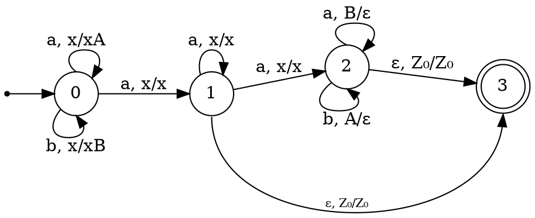

## $L = \Big\{wvw^R \Big| |v| > |w| \text{ \& } v \in \{a,b,c\}^* \text{ \& } w \in \{a,b\}^+ \Big\}$ 
$v$ всегда не пусто.
т.к. $w$ также не пусто, то слово начинается и заканчивается на одну и ту же букву.
т.к. $\{a,b\}^+ \subset\{a,b,c\}^*$, то языку принадлежат все слова вида $aw'a$ и $bw'b$, где $|w'| \geq 2$ (таким образом минимальная длина слова - 4 буквы), т.к. всё остальное мы можем "отправить" в $w'$

Получилась даже регулярка: $(a(a|b)^+(a|b)^+a)|(b(a|b)^+(a|b)^+b)$

---
## $L = \Big\{wv^Rcccw^Rv \Big| |w|_b = |v|_c \text{ \& } w \in \{a,b\}^* \text{ \& } v \in \{a,c\}^*\Big\}$ 
для удобства перенесём реверс подстроки $v$ вправо: $L = \Big\{wvcccw^Rv^R \Big| |w|_b = |v|_c \text{ \& } w \in \{a,b\}^* \text{ \& } v \in \{a,c\}^*\Big\}$ 
т.к. $w$ и $v$ могут быть простыми словами, то минимальное слово языка: $ccc$
обозначим алфавит слова $w$: $\Sigma_w$, для $v$ аналогично: $\Sigma_v$
$$
\begin{aligned}
\Sigma_v \cap \Sigma_w = \{a\}^*\\
\Sigma_v \setminus \Sigma_w = \{c\}^*\\
\Sigma_w \setminus \Sigma_v = \{b\}^*
\end{aligned}
$$
благодаря такому пересечению алфавитов хочется объединить подстроки $wv$ в одну подстроку, назовём её $z$, но так нельзя сделать, т.к., например, слово не должно начинаться с $c$ 
языку принадлежат все слова вида $a^nccca^n, \forall n \in \mathbb{N}$ 
Языку принадлежат все строки, у которых в середине подстрока $c^3$ до середины идут две подстроки, у первой количество букв $b$ равно количеству букв $c$ второй подстроки и в первой и второй подстроке нет букв $c$ и $b$ соответственно. В этих двух подстроках может быть любое количество букв $a$. А с правой стороны строки отзеркаленная первая часть, но подстроки поменяны местами.
Язык состоит из слов следующего вида 
$$
\begin{aligned}
& \quad \underset{w}{\underline{\text{подстрока с любыми вхождениями а, но с числом букв b = n}}} \\
& \quad \underset{v^R}{\underline{\text{подстрока с любыми вхождениями а, но с числом букв c = n}}} \\
& \quad ccc\\
& \quad \underset{w^R}{\underline{\text{отзеркаленная строка w}}} \\
& \quad \underset{v}{\underline{\text{отзеркаленная строка v}}}
\end{aligned}
$$

---
## $L = \Big\{wv \Big| w = z_1vz_2 \text{ \& } v = v^R \text{ \& } w,v \in \{a,b\}^+\Big\}$
язык не содержит пустое слово
подстрока $v$ содержит в себе палиндромную подстроку $v$.
Минимальное слово в языке состоит из двух одинаковых букв: $aa$ или $bb$
Это язык, который заканчивается на палиндромную подстроку и содержит её ещё где-то в первой части ($w$).
Т.к. $|v| \geq 1$ мы можем рассмотреть $|v|=1$, т.к. однобуквенные слова являются палиндромами, т.е. в язык входят слова, в которые последняя буква входит 2 раза

регулярка $((a|b)^*b(a|b)^*b)|((a|b)^*a(a|b)^*a)$ 

---
### $L = \Big\{wv \Big| w = z_1vz_2 \text{ \& } v = v^R \text{ \& } w,v \in \{a,b\}^+ \text{ \& } |v|=2k+1 \text{ \& } k \in \mathbb{N} \Big\}$
Как и в предыдущем языке, язык не содержит пустое слово и подстрока $v$ содержит в себе палиндромную подстроку $v$.
Но в этом языке нельзя выбрать однобуквенный палиндром и так легко разбить на $w$ и $u$.
условие про нечётную длину палиндрома не сильно влияет на свойства языка.
языку принадлежат слова вида: $x = z_1vz_2v$, где $z_i$ - любое слово, а $u$ - палиндром нечётной длинны.

---

## $L = \Big\{wv \Big| |v| = |w| \text{ \& } |v|_{ab}=|w|_{b} \text{ \& } v, w \in \{a,b\}^+ \Big\}$ 
Это язык слов чётной длинны, в котором количество подстрок $ab$ в первой половине равно количеству букв $b$ во второй половине.
Немного про слова языка: $\varepsilon \notin L; a^{2n} \in L \forall n \in \mathbb{N}$ .
Во второй половине слова букв $b$ не больше половины (в случае половины, первая половина слова $=(ab)^{\frac{|w|}{2}}$).

---
### $L = \Big\{w_1w_2w_3\Big| w_1 \in ab^+ \text{ \& } w_2 \in (abb^+)^* \text{ \& } |w_1|+|w_2|=|w_3| \text{ \& } w_i \in \{a,b\}^* \Big\}$
Это слова не начинающиеся на $ab$ и пустое слово не принадлежит языку.
рассмотрим регулярку $(abb^+)^*$ - она принимает либо пустое слово, либо несколько повторяющихся строк, в которых подстрока $ab(b^+)$ встречается 1 или более раз (в каждой строке одинаковое количество вхождений подстроки $ab(b^+)$)
Получаются слова следующего вида: (больше одной подстроки $ab$) ++ (либо ни одной либо несколько подстрок $(abb) b^*$) ++ ($(a|b)^n$, где ($n=$ число букв в первых 2 частях))
То есть слова вида:
$$(ab)^n(abb)^m(a|b)^{n*2+m*3}, \forall n \in \mathbb{N} \text{, }\forall m \in \mathbb{N}_0$$
---
### 2. $L = \Big\{wvw^R \Big| v = h(w) \text{ \& } h=h_1\circ h_1' \circ h_2 \circ h_2' \text{ \& } v, w \in \{a,b\}^* \Big\}$ 
$$
\begin{aligned}
h_1: ab \to \$b\\
h_1': $b \to b\\
h_2: ba \to b\#\\
h_2': b\#\to b
\end{aligned}
$$

Морфизм в данном случае убирает по 1 букве $a$ с каждой стороны от буквы $b$ 
слова ледащие в языке: $\varepsilon, a^{3n}, b^{3n} \in L$ .
Если есть хотя бы 1 $a$ и $b$ в слове, то в слове букв $b$ явно больше чем букв $a$ .
Таким образом язык состоит из строк следующего вида
$$
\begin{aligned}
& \quad \underset{w}{\underline{\text{первая часть слова}}} \\
& \quad \underset{v}{\underline{\text{гомоморфный образ строки w, где удалены по 1 букве a с каждой стороны от b}}} \\
& \quad \underset{w^R}{\underline{\text{отзеркаленная строка w}}} 
\end{aligned}
$$

---

### 2.3 $aba \to b$
для преобразования всех строк $aba$ в $b$ рассмотрим композицию морфизмов $h = h_1 \circ h_2 = h_2(h_1)$ , где
$h_1(aba) = \$$, он действует на подстроку $aba$ только 1 раз и не удаляет любое одинаковое количество букв $a$ справа и слева, получаем $aba \to \$$
$h_2(\$)=b$ заканчивает преобразование подстроки $aba$ в $b$

---

### 4. $L = \Big\{wa^+v \Big| v = h(w) \text{ \& } h(b) = a \text{ \& } h(a) = b \text{ \& } v, w \in \{a,b\}^* \Big\}$ 
$w$ и $v$ могут уходить в пустое слово (т.к. их длина необязательно $>0$)
в язык входят слова вида $a^+$, т.е. минимальное слово языка - $a$
гомоморфизм $h$ преобразует слово $w$ "отрицая" его (как в бинарной арифметике $\bar{1}=0, \bar{0}=1,$ в случае с буквами получаем аналогию $\bar{a}=b, \bar{b}=a$)
заметим, что $|w|=|v|; |w|_a=|v|_b; |w|_b=|v|_a$ 
языку принадлежат слова вида
$$
\begin{aligned}
& \quad \underset{w}{\underline{\text{первая часть слова}}} \\
& \quad \underline{a}^+ - \text{сколько-то букв a} \\
& \quad \underset{v}{\underline{h(w)}} 
\end{aligned}
$$
Языку принадлежит например слово $\underset{w}{\underline{a^n b^m ab}} \text{ } a^k \text{ } \underset{v}{\underline{b^n a^m ba}}$ 
$ab$  и $ba$ без степеней, т.к. они всегда имеют в этом слове степень 1 проигнорируем их для блоков ограниченного языка $L \subset \underset{a}{w_1^*}\underset{b}{w_2^*}ab\underset{a}{w_3^*}\underset{b}{w_4^*}\underset{a}{w_5^*}ba$
Зависимость в ограниченном языке: расставим коэффициенты $n_i$: $a^{n_1} b^{n_2} ab \text{ } a^{n_3} \text{ } b^{n_1} a^{n_2} ba$, 
у нас получаются векторы вида:
$$
\begin{aligned}
& (n_1,0,0,n_1,0) & \to & \quad (1,0,0,1,0) \\
& (0,n_2,0,0,n_2) & \to & \quad (0,1,0,0,1)\\
& (0,0,n_3,0,0) & \to & \quad (0,0,1,0,0)
\end{aligned}
$$

---
### 4.1  $L = \Big\{wa^+v \Big| v = h(w)^R \text{ \& } h(b) = a \text{ \& } h(a) = b \text{ \& } v, w \in \{a,b\}^* \Big\}$ 
Про минимальное слово и гомоморфизм рассуждение как в предыдущей задаче.
языку принадлежат слова вида
$$\
\begin{aligned}
& \quad \underset{w}{\underline{\text{первая часть слова}}} \\
& \quad \underline{a}^+ - \text{сколько-то букв a} \\
& \quad \underset{v}{\underline{\text{отзеркаленная строка }h(w)}} 
\end{aligned}
$$

в 0 состоянии обрабатываем первую часть слова, запоминая её, потом как минимум через 1 $a$ можем либо завершиться по строке из букв $a$ (по пустому стеку), либо проверять вторую половину слова

---
### 5. $L = \Big\{wa^nv \Big| |v|_b+|w|_b = n \text{ \& } w \neq vz \text{ \& } v, w \in \{a,b\}^* \Big\}$ 
Это язык, в который не входит пустое слово, т.к. тогда $w$ и $v$ пусты, но пустое слово тоже начинается с пустого слова.
Язык состоит из 2 подстрок, разделённых $a^n$, при этом он не может начинаться со второго подслова.
Количество букв $a$ разделяющих две подстроки равно количеству всех букв $b$ в слове.
Подстрока $v$ не пустая

> КС ли язык?

Это не выглядит как КС язык, т.к. это объединение двух КС языков, для первого условия нужен отдельный стек для проверки количества букв $a$ и $b$ (сначала кладём по  $b$ потом по $a$ снимаем и при достижении дна кладём снова и потом снимаем по $b$), для второго условия нужно контролировать начало языка, чтобы оно не включало подстроку из конца. 
Также из-за фиксированного количества букв $a$, осложняется разбиения слова, т.е. это можно перефразировать, что максимальная подстрока из букв  $a$ длиннее чем количество букв $b$ в слове и слово не начинается на подстроку после этого блока букв $a$.

так  как $w \neq vz$  рассмотрим $w = b^n; v=b^m, m > n \Rightarrow b^na^{n+m}b^{m}$  
рассмотрим слово $b^na^{n+m}b^m$ пересечём с регуляркой $b^*a^*b^*$
- если накачивать отдельно отрицательно любую букву, то мы выходим из языка, нарушая баланс суммы $b$ и длинны максимальной подстроки из $a$
- рассмотрим накачку `ab`, но она уходит при нулевой накачке, т.к. слово $v$ становиться пустым, а следовательно любым префиксом. Также слово выходит из языка при достаточной отрицательной накачке, т.к. слово $v$ становиться префиксом $w$
- рассмотрим накачку `ba`, при достаточно большой накачке $v$ также становиться префиксом $w$

Не обязательно, ведь $i$ - длина накачиваемого блока, и она всегда $<n$. Тогда при $m=2*n$ получится слово $b^n a^{n+2*n-i} b^{2*n-i}$, в котором второй блок всё ещё не префикс первого

Можно зафиксировать m:  $b^na^{2n+1} b^{n+1}$, т.к. при длине накачки в $1$ также выходим из языка.

Язык не КС.

---
### 6.
$$
\begin{aligned}
L = \Big\{w_1v^+w_2w_3 \Big| |v|_a > 0 \text{ \& } |v|_b=|w_1|_a \text{ \& } w_2=w_1aw_1\text{ \& }
w_3=vw_1^R\text{ \& } v, w_i \in \{a,b\}^* \Big\}
\end{aligned}
$$
Этот язык не содержит пустое слово.
Его слова начинаются на подстроку $w_1$ и заканчиваются на её зеркальное отражение.
больше на $w_1$ ограничений не наложено ($w_1$ может быть пустым словом)
подстрока $v$ ненулевой длинны, в ней есть хотя бы одна буква $a$, а количество букв $b$ совпадает с количеством букв $a$ в первой подстроке. Данная подстрока повторяется как минимум один раз в слове.
$w_2$ состоит из "склейки"  двух подстрок $w_1$ через букву $a$. 
$w_3$ завершает слова и состоит из части $v$ и реверса подстроки $w_1$
### 6.1  $L = \Big\{w_1vw_2w_3 \Big| w_2 = w_1aw_4 \text{ \& } w_3=vw_1^R \text{ \& }  v, w_i \in \{a,b\}^* \Big\}$ 
перенесём условия: $w_1vw_2w_3 \to w_1 vw_1aw_4vw_1^R$ 
заметим, что у нас осталось 3 разных подстроки, которые могут быть пустыми, т.е. минимальное слово - одна буква $a$
языку принадлежат все слова начинающиеся с буквы $a$, всё остальное отправляем в $w_4$

> КС ли язык?

рассмотрим слово $\underset{w_1}{\underline{b^n}}\text{ }\underset{v}{\underline{b}}\text{ }\underset{w_1}{\underline{b^n}}\text{ }a\text{ }\underset{w_4}{\underline{\varepsilon}}\text{ }\underset{v}{\underline{b}}\text{ }\underset{w_1^R}{\underline{b^n}}$ $= b^{2n+1}ab^{n}$ , заметим, что это единственное разбиение данного слова. Его можно распознать с помощью PDA(
Язык не выглядит как КС, нужно помнить одновременно два слова, одно из которых проверять 3 раза, с другой стороны подстроки могут уходить в $\varepsilon$, и иногда можно очень удобно переразбить строки.

сделаем $w_1$ пустым:
 $$L = \Big\{vaw_4v\Big| |v|=0 ∨ |v|>1 \& v =z_1z_2z_3 \& z_1\neq z_3 \& |z_1|=|z_3|=1\& v, w_4 \in \{a,b\}^*\Big\}$$
Зафиксируем $w_4$ в пустое слово
слово не должно начинаться с $a$ для этого, т.е. $v = b...a$, т.к. нас не интересуют конечные слова рассмотрим $b^n a a b^n a$ 
пока имеем только КС-зависимость
расширим пример и построим v с двумя параметрами в степенях
$b^n a^m a b^n a^m$
