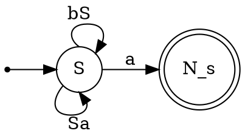
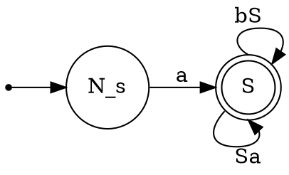
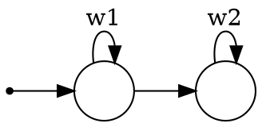

# 2 часть
## 23.11.2024
### Лемма Ардена

![[Лемма Ардена]]

----
 ![[Прямая левая рекурсия]]
![[косвенная левая рекурсия]]
$S_i \to S_i \psi | \varphi \leadsto S_i \to S_i(\psi_1|\psi_2|\dots|\psi_{k_1})\Big|(\varphi_1|\varphi_2|\dots|\varphi_{k_2})$, где $\varphi \neq S_i \varphi'$
$\Delta_1 = (\psi_1|\psi_2|\dots|\psi_{k_1})$
$\Delta_2 = (\varphi_1|\varphi_2|\dots|\varphi_{k_2})$
$S_i \to S_i \Delta_1 + \Delta2 \Rightarrow$ по [[Лемма Ардена|Лемме Ардена]] $S_i = \Delta_2 \Delta1^*$, $\varepsilon \cancel{\in} \mathcal{L} (\Delta_1)$  

$$\begin{aligned}
S_i \to \Delta_2 | \Delta_2 S_i'\\
S_i' \to \Delta_1 | \Delta_1 S_i'
\end{aligned}$$

*Рассмотрим пример:*
$$\begin{aligned}
S\to aSb\\
S \to c
\end{aligned}$$
из грамматики уравнения 
$$S = aSb + c$$
---
рассмотрим $<|, \cdot>$, где "$| \sim +$ " коммутативно, но "$\cdot \sim *$" не коммутативно
$S = \underline{a}S\underline{b} + c \to S = abS + c \to S = (ab)^*c$ 
---
## Теорема Пиллинга
![[Теорема Пиллинга (Pilling)]]
$$\begin{aligned}
S \to SbS\\
S \to SSa \overset{\text{ст. до К.О.}}{\leadsto} S \to SaS\\
S \to a
\end{aligned}$$
 Заметим что
$$\begin{aligned}
S \to SbS\\
S \to SaS\\
S \to a\\
S \to S'\\
S' \to aaS'|abS'|a
\end{aligned}$$
Получаем
$$\begin{aligned}
S \to aSSb|c\\
S = abSS + c\\
S = (abc)^*c
\end{aligned}$$
___
![[Теорема Шютценберже (Shutzenberger)]]

Рассмотрим $\{a^nba^{n!}|n\in\mathbb{N}\}$   
Т.к. $\{a^{n!+n}b|n\in\mathbb{N}\}$  не [[Регулярный язык|регулярный]] $\Rightarrow$ исходный язык не [[КС-язык|КС]]

---
![[Коммутативный образ]]

![[Свойство коммутативного образа]]

---

Отступление про [[Регулярный язык|регулярные языки]]:
$$\{v_1a^{n^2}v_2|v_i\in \{a,b\}^* \& n >0\}$$
рассмотрим $n=1 \Rightarrow$  [[Регулярный язык|язык регулярен]]

---

![[Нормальная форма Грейбах]]

---
$$
\begin{aligned}
\boxed{S} &\to  \boxed{S}bS\\
\boxed{S} &\to \boxed{S}Sa\\
\boxed{S} &\to \overset{\curvearrowleft}{a N}_s 
\end{aligned}
$$

reverse

$$
\begin{aligned}
N_s &\to a\boxed{S} |a\\
\boxed{S} &\to bS\boxed{S} |\underline{S}a\boxed{S}\\
&\Rightarrow\\
N_s &\to a\boxed{S} | a\\
\boxed{S} &\to bN_s\boxed{S} |a\boxed{S}a\boxed{S}|bN_s|a\boxed{S}a|aa\boxed{S}
\end{aligned}
$$
---
![[Алгоритм приведения к ГНФ]]

---
Пусть $G$ - КС грамматика в ГНФ ($N_i \to \gamma \Phi, \Phi \in N^*$)
Рассмотрим последовательности сентенциальных форм (С.Ф. из нетерминалов) в выводах слов на $G$
![[Pasted image 20250126174615.png]]

$xy'z$ в нетерминальной части $\rightarrow z_1w_1^{i}z_2w_2^iz_3$ в выводимом слове

![[Pasted image 20250126175141.png]]

---
## Анализ языков на базе поведения стека
$w_1$ читаем $\alpha_1$, имеем  $\alpha_2$, $|\alpha_2|\geq|\alpha_1|$ 
$w_2$ на базе стека наком в $L_1$

---

![[LL(k)-языки]]
![[LL(k)-грамматика]]

![[Pasted image 20250126181337.png]]
$$\{a^nb^n|n\in \mathbb{N}\}\cup\{a^nc^n|n\in\mathbb{N}\}$$
![[Pasted image 20250126182306.png]]

