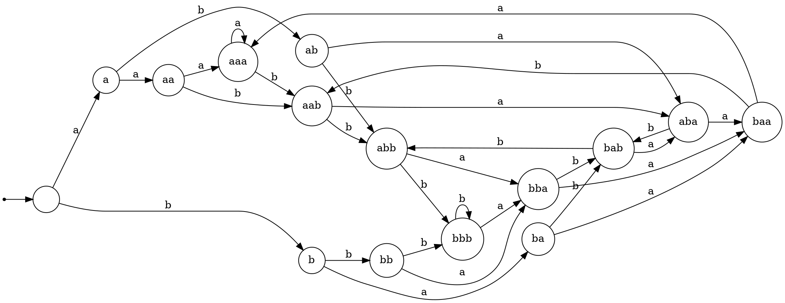

### 3. Является ли VPL язык слов, в котором число подстрок $aba$ и число подстрок $bab$ совпадают?
Пусть $\mathscr{L}$ - рассматриваемый язык. Рассмотрим разные разбиения множества символов

Если $\Sigma_{int} = \{a,b\}$, тогда язык должен быть регулярным. Докажем, что рассматриваемый язык не является регулярным с помощью леммы о накачке для регулярных языков. Ограничим регулярную структуру как $(aba)^*aabb(bab^*)$. Пусть $n$ - длина накачки. Рассмотрим слово 
$$w_n = (aba)^{n} aabb(bab)^n$$
Данное слово принадлежит языку. Например, $abaabaaabbbabbab$, имеет 2 вхождения $aba$ и 2 вхождения $bab$. Так как накачка для регулярных языков имеет ограничения в виде возможности накачивать только префикс длины $n$, то накачка посдлова $(aba)^n$ с сохранением регулярной структуры приведет к нарушению соотношения между количествами подстрок. Значит язык не регулярный.

Если один из символов является внутренним, а другой вызывающим или завершающим, то тогда не будет получена выразительность больше, чем у регулярных языков. Аналогично для случая только вызывающих или только возвращающих символов.

Рассмотрим $\Sigma_{call}=\{a\}, \Sigma_{ret}=\{b\}$(случай $\Sigma_{call}=\{b\}, \Sigma_{ret} =\{a\}$ требует симметричного построения). В качестве основы для автомата рассмотрим ДКА, у которого состояния кодируются последними тремя прочитанными символами. На вид страшно, но так надо.

