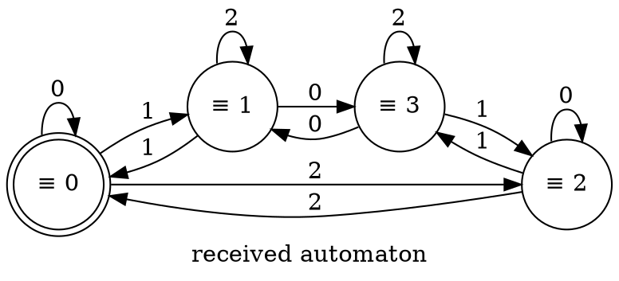

### The Language of Ternary Numbers Divisible by 4

The language of ternary numbers obviously has the alphabet {0,1,2}. Since we read the number from the most significant digit, it is necessary to monitor the divisibility of the number by adding each new digit to the right.

#### Example for Understanding

$$1_3 = 1_{10} \equiv 1 \ (\text{mod} \ 4)$$
$$10_3 = (1 \cdot 3 + 0)_{10} = 3 \equiv 3 \ (\text{mod} \ 4)$$
$$11_3 = (1 \cdot 3 + 1)_{10} = 4 \equiv 0 \ (\text{mod} \ 4)$$
$$102_3 = (10_3 \cdot 3 + 2)_{10} = (3 \cdot 3 + 2)_{10} = 11_{10} \equiv 3 \ (\text{mod} \ 4)$$
$$(102_3 = (10_3 \cdot 3 + 2)_{10} \equiv (10_3 \ (\text{mod} \ 4)) \cdot 3 + 2)$$
$$1021_3 = (102_3 \cdot 3 + 1)_{10} \equiv (102_3 \ (\text{mod} \ 4)) \cdot 3 + 1 \ (\text{mod} \ 4) \equiv 3 \cdot 3 + 1 \equiv 2 \ (\text{mod} \ 4)$$

Since when adding a digit to a ternary number, the old number is multiplied by 3 and a new digit is added, then the same thing happens with the remainder modulo four: the old remainder is multiplied by 3 plus the new digit.

In the tables below, the columns are transition symbols, and the rows are states.

#### Table: Remainders from Division Modulo 4 (with Explanations)

|       | 0   | 1   | 2   |
|-------|-----|-----|-----|
| $\equiv 0$ | 0   | 1   | 2   |
| $\equiv 1$ | $1 \cdot 3 + 0 \equiv 3$ | $1 \cdot 3 + 1 \equiv 0$ | $1 \cdot 3 + 2 \equiv 1$ |
| $\equiv 2$ | $2 \cdot 3 + 0 \equiv 2$ | $2 \cdot 3 + 1 \equiv 3$ | $2 \cdot 3 + 2 \equiv 0$ |
| $\equiv 3$ | $3 \cdot 3 + 0 \equiv 1$ | $3 \cdot 3 + 1 \equiv 2$ | $3 \cdot 3 + 2 \equiv 3$ |

#### Table: Remainders from Division Modulo 4 (Result)

|       | 0   | 1   | 2   |
|-------|-----|-----|-----|
| $\equiv 0$ | 0   | 1   | 2   |
| $\equiv 1$ | $\equiv 3$ | $\equiv 0$ | $\equiv 1$ |
| $\equiv 2$ | $\equiv 2$ | $\equiv 3$ | $\equiv 0$ |
| $\equiv 3$ | $\equiv 1$ | $\equiv 2$ | $\equiv 3$ |

We write down the transition table: state - 0 remainder from dividing the read number by 4, when assigning a symbol we go to the state with a zero remainder. We will get a deterministic finite automaton. We note that it will be minimal.

- State $\equiv 0$ differs by $\varepsilon$
- $\equiv 1$ differs by '1'
- $\equiv 2$ differs by '2'
- $\equiv 3$ differs by '12' (or '01')

