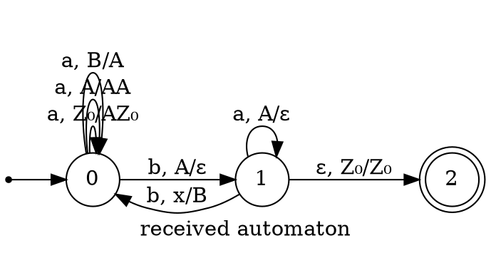
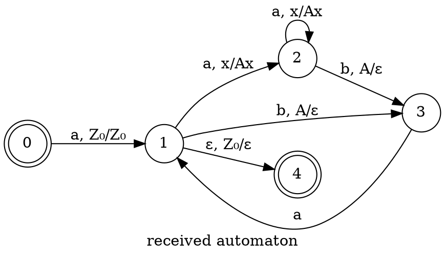

### Language of Grammar

$$S \to SbS|aSa|abT$$
$$T \to TbS| \varepsilon$$

Note that through equivalent formations the second rule collapses into $$T \to (bS)^*$$ which can be applied to the first rule $$S \to SbS|aSa|ab(bS)^*$$. Note also that it is possible to simplify: $$S \to SbS|aSa|ab$$ because $$\underline{ab}(bS)^* \to SbSbS \dots$$ (since the first occurrence of S is expanded as ab). As a result, we come to the following rule:
$$S \to SbS|aSa|ab$$

Let's build an automaton based on it.

### Language of Grammar

$$
S \to aSbS\\
S \to a
$$

Note that
$$
S \to \underline{a} S \underline{ba}
$$
we can get
$$
S \to aSbS|\varepsilon
$$
we get the correct bracket sequence.

Thus, we will build an automaton for this grammar.

