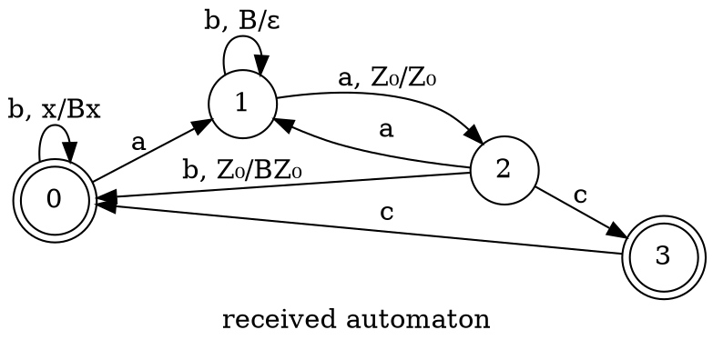

### Language of Grammar

$$
S \to TaS|ScS|c\\
T \to bTb|a
$$

We will make several transformations and simplifications:

$$
S \to (Ta)^* c(cS)^*\\
\mathcal{L}(T) = b^n a b^n\\
(Ta^*)c \leftrightarrow \underline{(b^n a b^n a)^* c}
$$

$$
S \to TaS \to TaSaS\\
S \to SaS \to TaSaS\\
(Sc)^* S \to SaS \to TaSaS
$$

Above is a commutative diagram.

$$
S \to S'aS|S'\\
S' \to c|TaS'
$$

Because of:

$$
S \to \underline{S}aS|S'\\
\underline{S} \to (Ta)^* c \Leftrightarrow S'
$$

