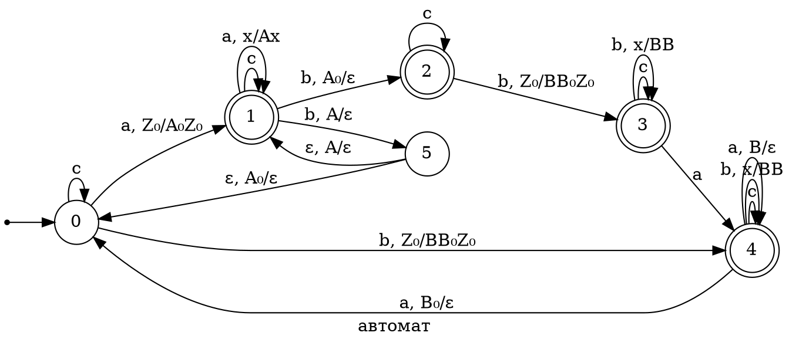

$$mathcal{L} = \{w \Big| |w|_a \neq 2 \cdot |w|_b \& w \in \{a,b,c\}^* \}$$

The language $\mathcal{L}$ is not regular because the complement of the language $\mathcal{L}$, $\mathcal{L'} = \{w \Big| |w|_a = 2 \cdot |w|_b \& w \in \{a,b,c\}^* \}$ must also be regular.

Let's prove that it is irregular. Let's intersect the complement of the language with a regular language: $\{a^{2n}b^n | n \geq 1\}$. Let's consider prefixes $a^{2n}$ and suffixes $b^n$. For different $n$, they will have different rows in the equivalence table, since they are not limited, then the number of equivalence classes will not be finite. It follows from this that the complement of the language is irregular. Therefore, the language $\mathcal{L}$ is irregular.

Here the starting state corresponds to the moment when exactly twice as many letters (a) as letters (b) have been read in the line. The cases when an odd number of letters (a) has been read and the number of letters (b) has become greater than the threshold of (1/2) of the number of (a) are processed in one way. We understand zero by the stack symbols (A₀) and (B₀) when we count with the letter (a), when with the letter (b). When we reach balancing, we find ourselves in the starting state and can re-calculate the balance of (a) and (b).