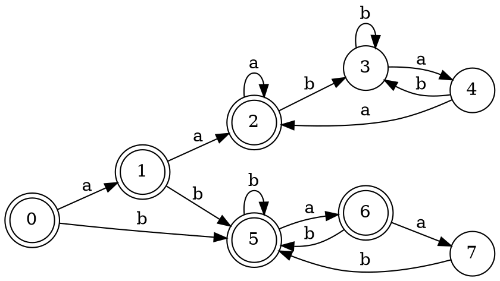

$$\mathcal{L} = \{w \Big| |w|_{aab} = |w|_{baa} \& ('aabaa' \in \mathcal{L}) \}$$

```dot
digraph finite_state_machine {
    rankdir=LR;
    node [shape = circle];
    q0 [label="0", shape=doublecircle];
    q1 [label="1", shape=doublecircle];
    q2 [label="2", shape=doublecircle];
    q3 [label="3"];
    q4 [label="4"];
    q5 [label="5", shape=doublecircle];
    q6 [label="6", shape=doublecircle];
    q7 [label="7"];

    q0 -> q1 [label="a"];
    q1 -> q2 [label="a"];
    q2 -> q2 [label="a"];
    q2 -> q3 [label="b"];
    q3 -> q3 [label="b"];
    q3 -> q4 [label="a"];
    q4 -> q3 [label="b"];
    q4 -> q2 [label="a"];
    q0 -> q5 [label="b"];
    q1 -> q5 [label="b"];
    q5 -> q5 [label="b"];
    q5 -> q6 [label="a"];
    q6 -> q7 [label="a"];
    q6 -> q5 [label="b"];
    q7 -> q5 [label="b"];
}
```

