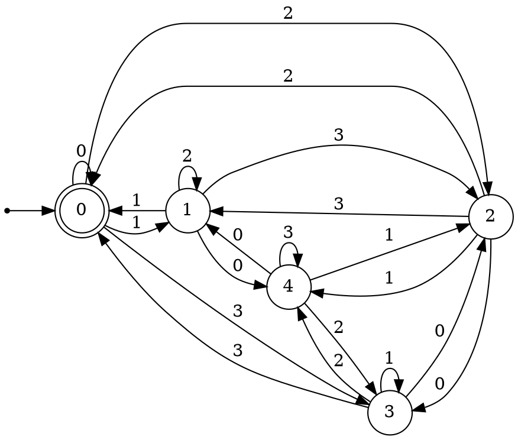
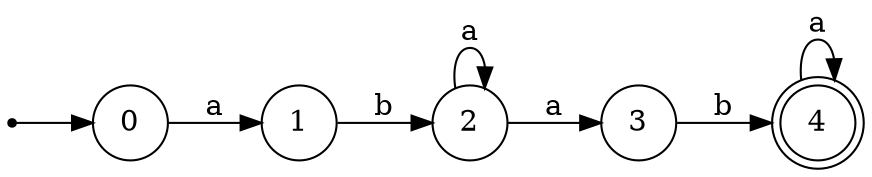
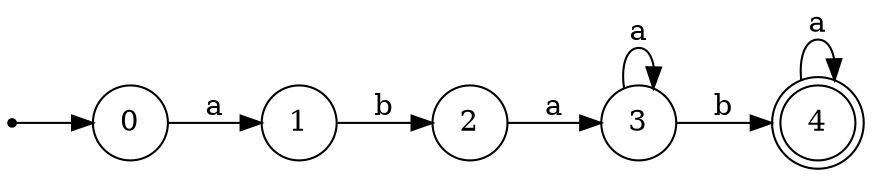
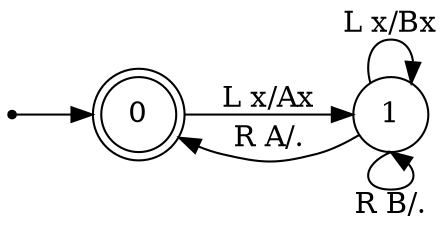
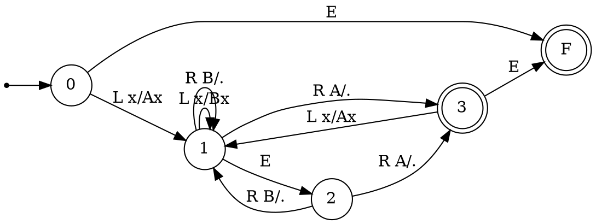
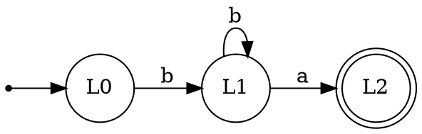
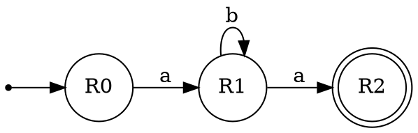
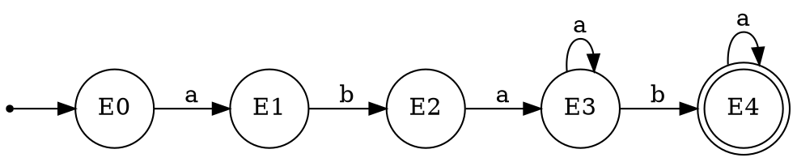
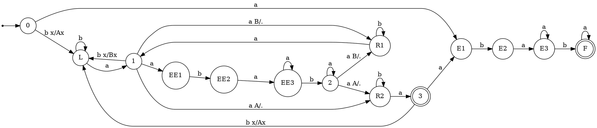
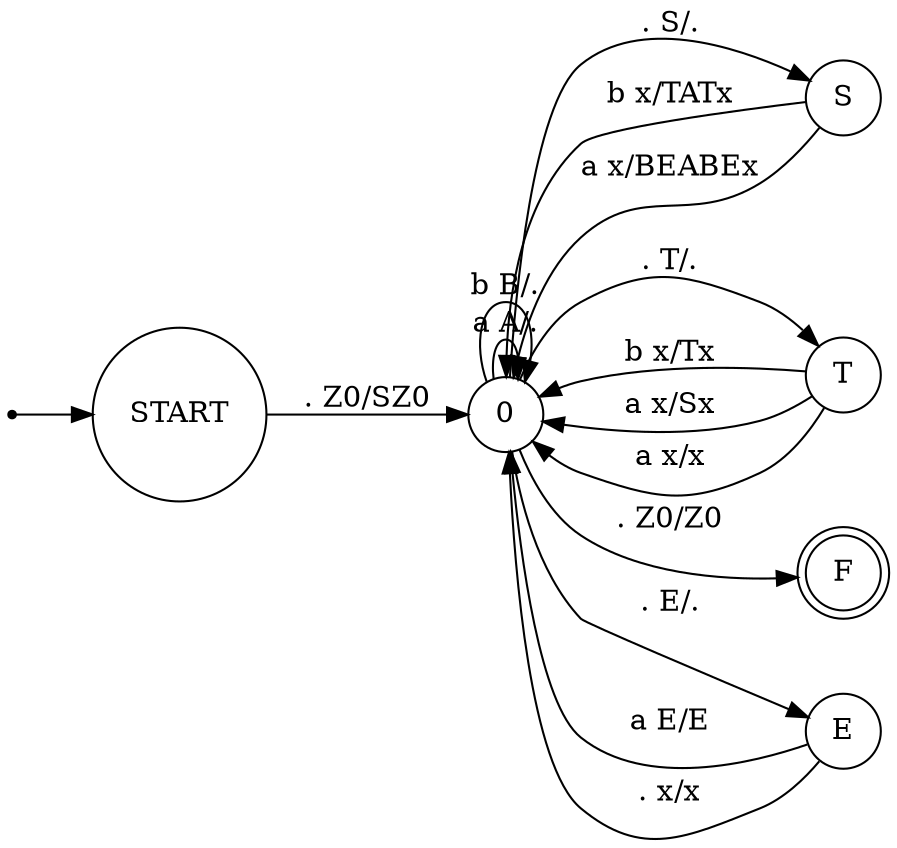

### 1. Язык чисел в системе счисления с основанием 4, делящихся на 5. 
Входной алфавит: $\{0,1,2,3\}$
Состояния: остатки от 0 до 4.

**Идея @BaldiSlayer**
> Пусть A - основание системы счисления, B - остаток от деления на который мы смотрим.
> Состояния описывают текущий остаток от деления на B(для произвольной задачи такого вида)
> Переходы по k для состояния q определяются следующей формулой:
> $$q' = (q * A + k) \mod B$$
> Выделяем финальными состояниями те, которые необходимы принимающими в языке(в зависимости от того, какой требуется остаток от деления):
> - Если требуется, чтобы числа делились выделяем финальным только состояние 0
> - Если требуется, чтобы числа **не** делились, выделяем финальным все, кроме 0
> - В остальных случаях выделяем те остатки, которые нам необходимы
> В качестве стартового выделяем состояние 0.
> Построение ДКА для произвольных параметров на Python для задач "числа, (не)делящиеся на B"(выводит на языке Graphviz): <https://gist.github.com/BaldiSlayer/bb901381fe8b4f992060d94aa664ef34>

ДКА для данной задачи:

### 2. Грамматика  
$$  
\begin{aligned}  
S \to bTaT \\  
T \to aS \\  
T \to bT \\  
S \to BB \\  
T \to a \\  
B \to Ba \\  
B \to ab \\  
\end{aligned}  
$$  Перепишем в более компактный вид
$$\begin{aligned}
S &\to bTaT \mid BB \\
T &\to bT \mid aS \mid a \\
B &\to Ba \mid ab 
\end{aligned}$$

# Первый вариант решения
Еще раз запишем грамматику в ее компактном виде.
$$\begin{aligned}
S &\to bTaT \mid BB \\
T &\to bT \mid aS \mid a \\
B &\to Ba \mid ab 
\end{aligned}$$
Заметим, что нетерминал B порождает регулярный язык $aba^*$, что не сложно увидеть, если рассмотреть порождаемые слова, или заметить, что нетерминал B задает леворекурсивный вывод и поэтому можно воспользоваться правилом преобразования леворекурсивного вывода. Таким образом
$$B = aba^*$$
Нетерминал T - праворекурсивный, таким образом нетерминал T порождает язык:
$$T = b^*a?(S)$$
Теперь нам нужно рассмотреть язык, порождаемый нетерминалом S. Раскроем по ранее полученным замечаниям нетерминалы B и T в правилах переписывания S.
$$S \to bTaT \mid BB;$$
$$S \to b\underbrace{b^*a?(S)}_Ta\underbrace{b^*a?(S)}_T \mid \underbrace{aba^*}_B\underbrace{aba^*}_B$$
Таким образом, мы получили, что наш язык можно записать в форме расширенной грамматики с одним нетерминалом:
$$S \to bb^*a?(S)ab^*a?(S)\mid aba^*aba^*$$
Теперь построим по расширенной грамматике NPDA.
Построим его по методу ограничения правил раскрытия%%не знаю, можно ли его прям считать методом и работает ли он в всех случаях%%.
Сначала построим НКА для языка $S \to aba^*aba^*$.

Данный НКА можно детерминировать, если произвести комутативную замену грамматики $S \to ab\underbrace{aa^*}_{\text{поменялись местами}}ba^*$  и теперь мы получим ДКА:

Несложно понять, что язык при этой замене не поменялся. Допустимо произвести такую замену, так как $a^*$ и $a$ состоят из одного и того же символа $a$.

Теперь вернемся к первому правилу промежуточной грамматики. Раскрытие по второму правилу всегда будет финальным. Первое же правило порождают язык схожий по структуре с языков правильных скобочных последовательностей. Пусть $L \to bb^*a, R \to ab^*a$, тогда 
$$S \to L?(S)R?(S)$$
порождает язык правильных скобочных последовательностей. Для этого языка можно построить следующий NPDA:

Теперь расширим язык возможностью присутствия E внутри правильных скобочных последовательностей или после.
$$S \to L?(S)R?(S) \mid E$$
Для построения PDA заметим следующее правило: в слове после символа E либо ничего не стоит, либо стоит закрывающая скобка. Докажем это. Пусть мы прочитали суффикс $\varphi$ и находимся на глубине вложенности $n$. После суффикса идет $E$. Пусть мы раскрылись в E через первую S в первом правиле раскрытия. Тогда после должно идти R без исключений. Пусть мы раскрылись по второй S в E. Тогда после E могут идти символы, которые могут идти после S, а для данной грамматики это либо R либо конец слова. Что и требовалось доказать.
Из полученного нами утверждения построим PDA для этой промежуточной грамматики.

Поясним, как был построен PDA. Состояния 0 и 3 - состояния, когда мы прочитали правильную скобочную последовательность, в том числе пустую. Но почему мы не можем объединить их? Если бы мы объединили два этих состояния, то наш PDA допускал бы пустое слово, а по грамматики видно, что этого не должно происходить.
Состояние F отвечает за прочитанную в конце слова символ E. Мы можем прочитать его как в самом начале, так и после правильной скобочной последовательности. 
Состояние 1 отвечает за накопление в стеке глубины раскрытия скобок и раскрытие в ПСП без внутренних символов. Для понимания того, прочитали мы ПСП или нет, используем классический прием и в стеке оперируем двумя разными стековыми символами. Стековый символ A отвечает за глубину вложенности 1, символ B - за все остальные. Если мы прочитали закрывающую скобку и сняли символ A, то мы понимаем, что мы находимся после правильной скобочной последовательности, иначе - внутри.
Если в состоянии 1 мы встретили внутренний символ E, то переходим в состояние 2, из которого мы обязаны прочитать закрывающую скобку, по ранее доказанному утверждению.

Теперь несложно заметить, что требуемый от нас язык можно получить из промежуточного применив регулярный морфизм - в данном случае, так обозначаю морфизм, который заменяет каждое вхождение символа на какое-то слово из регулярного языка. 
$$L \to bb^*a \quad R \to ab^*a \quad E \to abaa^*ba$$
Эти языки расбирают соответственно следующие ДКА:




Теперь вставим в PDA участки построенных автоматов вместо разбора L, R и E соответственно.


Полученный автомат недетерминирован, так как есть переходы, в одних случаях мы кладем что-то на стек, а в других - нет. 
%%Предполагаю, что язык недетерминированный, но пока без доказательства.%%
#### Второй вариант решения
Перепишем в более компактный вид 
$$\begin{aligned}
S &\to bTaT \mid BB \\
T &\to bT \mid aS \mid a \\
B &\to Ba \mid ab 
\end{aligned}$$
Стоит сказать, что $B = aba^*$ в регулярном смысле(см. левая рекурсия), поэтому можно переписать грамматику следующим образом:
$$\begin{aligned}
S &\to bTaT \mid abEabE \\
T &\to bT \mid aS \mid a \\
E &\to aE \mid \varepsilon
\end{aligned}$$
Заметим, что грамматика красиво преобразовывается в **ослабленную нормальную форму Грейбах**
$$\begin{aligned}
S &\to bTAT \mid aBEABE \\
T &\to bT \mid aS \mid a \\
E &\to aE \mid \varepsilon \\
A &\to a \\
B &\to b 
\end{aligned}$$
Для нее можно построить NPDA, который будет ее разбирать(чуть модифицированный вариант тривиального PDA по грамматике) - приводится в текстовом виде, так как graphviz не может нормально визуализировать этот автомат
```d
digraph{
	rankdir=LR
	node[shape=circle]
	point[shap=point]
	f [shape=doublecircle]

	point -> S

	S -> 0 [label="e Z0/SZ0"]
	0 -> f [label="e Z0/Z0"]

	0 -> 0 [label="b S/TAT"]
	0 -> 0 [label="a S/BEABE"]
	
	0 -> 0 [label="b T/T"]
	0 -> 0 [label="a T/S"]
	0 -> 0 [label="a T/."]

	0 -> 0 [label="a E/E"]
	0 -> 0 [label="epsilon E/."]

	0 -> 0 [label="a A/."]
	0 -> 0 [label="b B/."]
}
```


Эквивалентный ему NPDA


### 3. Язык lookahead-регулярных выражений, не описывающих пустые языки. lookahead-ы не используются под итерацией и не могут быть вложенными. Алфавит $\{a, b, \$\}$ (причём $\$$ допустим только в конце выражения и в конце lookahead-блоков), допустимые операции - альтернатива, конкатенация и итерация, скобки допускаются.
**Первый способ(решить задачу в лоб)**
Язык не КС. Докажем с помощью Леммы о накачке
Пусть p - длинна накачки, рассмотрим слово $w = (?= \underbrace{a^p}_{p_1}\underbrace{b^p}_{p_2}) \underbrace{a^p}_{p_3} \underbrace{b^p}_{p_4}$
При накачке отдельно $p_i$ выйдем из языка, так как образец lookahead не будет совпадать с регуляркой:
- Для $p_1, p_2$ при положительной накачке выйдем из языка, так как lookahead станет больше чем регулярка, с которой сравниваем, то есть даст пустое слово.
- для $p_3, p_4$ отрицательная накачка выводит из языка, так как образец lookahead становится больше чем регулярка

При накачке $p_1p_2$ или $p_3p_4$ аналогично
При накачке $p_2p_3$ мы получаем не симметричное изменение образца и регулярки(в образце изменяются b а в регулярке a), поэтому также выйдем из языка.
Следовательно, слово нельзя накачать — не КС.

**Второй способ(свести к более простому языку)**
Произведем сначала преобразования языка
1) Пересечем язык с регуляркой $(?=a^*b^*)a^*b^*$
2) Используем морфизм $h: h('(') = \varepsilon, h(')')=c, h('?') = \varepsilon, h('=')=\varepsilon, h(a)=a,h(b)=b$

После преобразований, мы получаем язык $L' =\{wcwv \mid w \in a^*b^*, v \in b^*\}$
Докажем, что он не КС с помощью леммы о накачке для КС языков. Пусть p - длинна накачки. Рассмотрим слово $\omega = a^pb^pca^pb^p$. Докажем, что это слово нельзя накачать в КС смысле.
Разобъем слово на участки с одинаковым поведением при накачке $$\omega = \underbrace{a^p}_{p_1}\underbrace{b^p}_{p_2}c\underbrace{a^p}_{p_3}\underbrace{b^p}_{p_4}$$
При накачке отдельно $p_1, p_3$ мы получим, что слово до и после c не равны.
При положительной накачке $p_2$ мы получим, что слово до c больше чем слово после.
При отрицательной накачке $p_4$ мы получим тот же случай, когда слово до с длиннее чем после.
Теперь рассмотрим перекрестные накачки. При перекрестной положительной накачке $p_1p_2$ мы получим ситуацию, когда подслово до разделителя больше чем после. При накачке $p_2p_3$ получим рассинхрон в количестве букв a до и после разделителя c. При отрицательной накачке $p_3p_4$ мы получим, что букв a больше до разделителя с, чем после. Таким образом мы получили, что слово нельзя накачать язык не КС.

**Третий способ(через стратифицированные периоды)**
Произведем начальные преобразования как в втором способе. Докажем, что язык $L' =\{wcwv \mid w \in a^*b^*, v \in b^*\}$ не КС с помощью анализа стратифицированных периодов.
Для начала затрем $c$ с помощью морфизма 
$$\varphi(x) = \begin{cases}
\varepsilon, x = c \\
x, x\neq c
\end{cases}$$
Таким образом мы получим язык $L'' =\{wwv \mid w \in a^*b^*, v \in b^*\}$ ограниченный регуляркой $a^*b^*a^*b^*$

Рассмотрим соотношения количеств между промежутками
$$a^{k_1}b^{k_2}a^{k_1}b^{k_2 + k_3}$$
Получаем три вектора
$$\begin{aligned}
k_1 = (1,0,1,0)\\
k_2 = (0,1,0,1)\\
k_3 = (0,0,0,1)
\end{aligned}$$
Как видно, вектора $k_1, k_2$ не удовлетворяют условию теоремы, поэтому язык не КС.