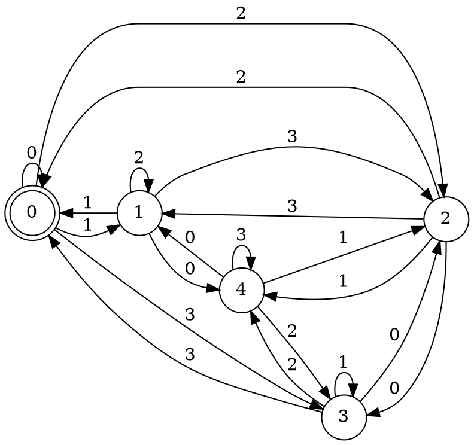
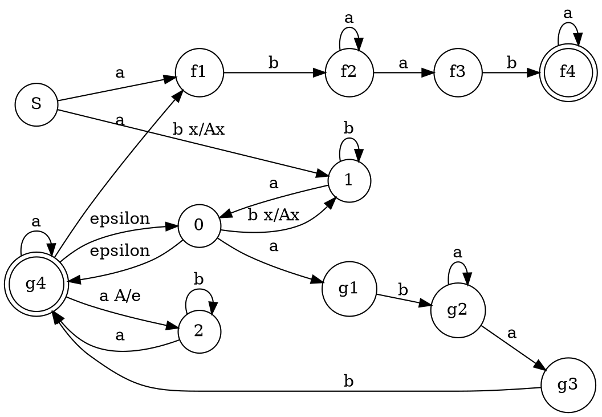

### 1. Язык чисел в системе счисления с основанием 4, делящихся на 5. 
Входной алфавит: $\{0,1,2,3\}$
Состояния: остатки от 0 до 4.

**Идея @BaldiSlayer**
> Пусть A - основание системы счисления, B - остаток от деления на который мы смотрим.
> Состояния описывают текущий остаток от деления на B(для произвольной задачи такого вида)
> Переходы по k для состояния q определяются следующей формулой:
> $$q' = (q * A + k) \mod B$$
> Если в задаче необходима делимость, то отмечаем как финальное состояние 0. Если необходимо, чтобы число *не* делилось, то отмечаем все, кроме 0, финальными. 
> 
> Построение ДКА для произвольных параметров на Python(выводит на языке Graphviz): <https://gist.github.com/BaldiSlayer/bb901381fe8b4f992060d94aa664ef34>

ДКА для данной задачи:



### 2. Грамматика  
$$  
\begin{aligned}  
S \to bTaT \\  
T \to aS \\  
T \to bT \\  
S \to BB \\  
T \to a \\  
B \to Ba \\  
B \to ab \\  
\end{aligned}  
$$  Перепишем в более компактный вид
$$\begin{aligned}
S &\to bTaT \mid BB \\
T &\to bT \mid aS \mid a \\
B &\to Ba \mid ab 
\end{aligned}$$

Первый вариант решения==(не до конца рабочий)==

$$\begin{aligned}
B &= aba^* \\
T &= b^*a ?(S) \\
S &= bTaT \mid BB = bTaT \mid aba^*aba^* = \\
&= bb^*a ?(S) ab^*a?(S) \mid aba^* aba^* 
\end{aligned}$$

Получили не регулярную грамматику(записана в форме расширенной грамматики, чтобы было удобнее преобразовывать в PDA)
$$\begin{aligned}
S &\to bb^*aE ab^*aE \mid aba^*aba^* \\
E &\to S \mid \varepsilon \\
&\Rightarrow \\
S &\to bb^*aE ab^*aE \mid aba^*aba^* \\
E &\to bb^*aE ab^*aE \mid aba^*aba^* \mid \varepsilon
\end{aligned} $$
NPDA


#### Второй вариант решения
Перепишем в более компактный вид 
$$\begin{aligned}
S &\to bTaT \mid BB \\
T &\to bT \mid aS \mid a \\
B &\to Ba \mid ab 
\end{aligned}$$
Стоит сказать, что $B = aba^*$ в регулярном смысле(см. левая рекурсия), поэтому можно переписать грамматику следующим образом:
$$\begin{aligned}
S &\to bTaT \mid abEabE \\
T &\to bT \mid aS \mid a \\
E &\to aE \mid \varepsilon
\end{aligned}$$
Заметим, что грамматика красиво преобразовывается в **ослабленную нормальную форму Грейбах**
$$\begin{aligned}
S &\to bTAT \mid aBEABE \\
T &\to bT \mid aS \mid a \\
E &\to aE \mid \varepsilon \\
A &\to a \\
B &\to b 
\end{aligned}$$
Для нее можно построить NPDA, который будет ее разбирать(чуть модифицированный вариант тривиального PDA по грамматике) - приводится в текстовом виде, так как graphviz не может нормально визуализировать этот автомат
```d
digraph{
	rankdir=LR
	node[shape=circle]
	f [shape=doublecircle]

	S -> 0 [label="e Z0/SZ0"]
	0 -> f [label="e Z0/Z0"]

	0 -> 0 [label="b S/TAT"]
	0 -> 0 [label="a S/BEABE"]
	
	0 -> 0 [label="b T/T"]
	0 -> 0 [label="a T/S"]
	0 -> 0 [label="a T/."]

	0 -> 0 [label="a E/E"]
	0 -> 0 [label="epsilon E/."]

	0 -> 0 [label="a A/."]
	0 -> 0 [label="b B/."]
}
```

### 3. Язык lookahead-регулярных выражений, не описывающих пустые языки. lookahead-ы не используются под итерацией и не могут быть вложенными. Алфавит $\{a, b, \$\}$ (причём $\$$ допустим только в конце выражения и в конце lookahead-блоков), допустимые операции - альтернатива, конкатенация и итерация, скобки допускаются.
Язык не КС. Докажем с помощью Леммы о накачке
Пусть p - длинна накачки, рассмотрим слово $w = (?= \underbrace{a^p}_{p_1}\underbrace{b^p}_{p_2}) \underbrace{a^p}_{p_3} \underbrace{b^p}_{p_4}$
При накачке отдельно $p_i$ выйдем из языка, так как образец lookahead не будет совпадать с регуляркой.
При накачке $p_1p_2$ или $p_3p_4$ аналогично
При накачке $p_2p_3$ мы получаем не симметричное изменение образца и регулярки(в образце изменяются b а в регулярке a), поэтому также выйдем из языка.
Следовательно, слово нельзя накачать — не КС.