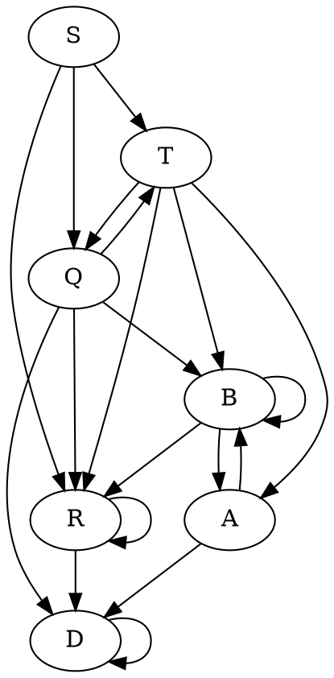

# 1. Выражение $(?= ba^*(bb\mid aa)^* (?<= a^* ba^*) aa^*ba)(aba \mid ba^*bb)^*$

Рассмотрим сначала выражение внутри lookbehind проверки. Эту проверку очевидно можно упростить:
$$ba^*(bb\mid aa)^* (?<= \cancel{a^*}ba^*) = ba^*(bb\mid aa)^* (?<= ba^*)$$
Так как при переписывании по определению [[lookbehind]] эту часть можно жадно съесть с помощью $.^*$
Поэтому мы получим следующее раскрытие:
$$\begin{aligned}
ba^*(bb\mid aa)^* (?<= ba^*) \to \underbrace{ba^*}_{T_1}\mid b a^*(bb|aa)^*b\underbrace{b(aa^*)}_{T_2}
\end{aligned}$$

Области $T_1, T_2$ - те области, которые подошли для подстановки в lookbehind. В $T_1$ мы взяли случай, когда все слово подставляется в lookbehind. В $T_2$ мы взяли минимальное подслово, чтобы оно удовлетворяло lookbehind. 
Теперь упростим полученную регулярку
$$ba^*\mid b a^*(bb|aa)^*bb(aa^*) =$$
Упростим мы из следующего соображения. Пусть мы прочитали часть слова, удовлетворяющую $ba^*$. Если после мы прочитаем a, то мы можем также его отнести к уже прочитанной регулярке. Если после мы читаем b, то после обязательно должно следовать b. И после прочитанной bb мы можем читать только четные количества a и b, причем сколько угодно раз. Таким образом мы получаем следующее регулярное выражение
$$= ba^*(bb(aa)^*)^*$$

Рассмотрим теперь lookahead подстановку.
$$(?= \underbrace{ba^*(bb(aa)^*)^*}_{lookbehind} aa^*ba)(aba \mid ba^*bb)^*$$
Очевидно, что 0 итераций регулярного выражения $(aba \mid ba^*bb)^*$ не входит в язык, так как нам требуются слова, состоящие как минимум из 4 букв(см. минимальное слово из образца lookahead).
Поэтому раскроем одну итерацию
$$(?= ba^*(bb(aa)^*)^* aa^*ba)(aba \mid ba^*bb)(aba \mid ba^*bb)^*$$
Очевидно, что первая итерация не может раскрыться в $aba$, так как образец начинается с $b$. Поэтому получаем
$$(?= ba^*(bb(aa)^*)^* aa^*ba)ba^*bb(aba \mid ba^*bb)^*$$
Сразу можно упростить наше выражение, заметив, что первая b всегда будет совпадать. Поэтому
$$b(?= a^*(bb(aa)^*)^* aa^*ba)a^*bb(aba \mid ba^*bb)^*$$
Также очевидна возможность следующей перестановки
$$b(?= a^*(bb(aa)^*)^* \underbrace{a^*a}_{swap}ba)a^*bb(aba \mid ba^*bb)^*$$
Теперь нам необходимо перебрать различные случаи lookahead образцов.
Пусть итерация $(bb(aa)^*)^*$ раскроется 0 раз. Тогда мы получим:
$$b(?= a^*aba)a^*bb(aba \mid ba^*bb)^*$$
Очевидно, что в таком случае, мы не сможем никак подставить, так как нам необходимо встретить $aba$ после некоторого количества a, а мы можем получить только bb. Поэтому эта итерация раскроется как минимум 1 раз. Тогда мы получаем:
$$b(?= a^*bb(aa)^*(bb(aa)^*)^*a^*aba)a^*bb(aba \mid ba^*bb)^*$$
И теперь совпадающий префикс $a^*bb$ мы можем выделить в начало, за пределы lookahead
$$ba^*bb(?= (aa)^*(bb(aa)^*)^*a^*aba)(aba \mid ba^*bb)^*$$
Если первая итерация в этом lookahead раскроется хотя бы 1 раз, то мы не сможем составить слово, поэтому:
$$ba^*bb(?= \cancel{(aa)^*}(bb(aa)^*)^*a^*aba)(aba \mid ba^*bb)^*$$

Далее мы будем рассматривать только lookahead, без префикса языка $ba^*bb$, просто в конце при поиске ответа сконкатенируем с ним.

---
Пусть вторая итерация в образце раскроется n раз, тогда
$$(?= \underbrace{bb(aa)^* bb(aa)^* ... bb(aa)^*}_{\text{n раз}}(bb(aa)^*)^*a^*aba)(aba \mid ba^*bb)^*$$
1)Тогда итерацию самого слова мы должны раскрывать по второй альтернативе.
$$(?= \underbrace{bb(aa)^* bb(aa)^* ... bb(aa)^*}_{\text{n раз}}(bb(aa)^*)^*a^*aba)b \textcolor{red}{a^*} bb(aba \mid ba^*bb)^*$$
2)Очевидно, что по $a^*$ слова(отмечено красным) мы не можем итерироваться. Поэтому получаем
$$(?= \underbrace{bb(aa)^* bb(aa)^* ... bb(aa)^*}_{\text{n раз}}(bb(aa)^*)^*a^*aba)bbb(aba \mid ba^*bb)^*$$
3)Теперь по первой итерации в образце не можем итерироваться, тогда
$$(?= bb\underbrace{bb(aa)^* ... bb(aa)^*}_{\text{n-1 раз}}(bb(aa)^*)^*a^*aba)bbb(aba \mid ba^*bb)^*$$
4)Выносим за пределы образца bb и там и там
$$bb(?= \underbrace{bb(aa)^* ... bb(aa)^*}_{\text{n-1 раз}}(bb(aa)^*)^*a^*aba)b(aba \mid ba^*bb)^*$$
5)Теперь при раскрытии по второму правилу мы получим
$$bb(?= \underbrace{\textcolor{red}{bb(aa)^*}bb(aa)^* ... bb(aa)^*}_{\text{n-1 раз}}(bb(aa)^*)^*a^*aba)\textcolor{red}{bba^*}bb(aba \mid ba^*bb)^*$$
6)Красную часть, совпадающую и там и там, можем вынести.
$$bbbb(aa)^*(?= \underbrace{bb(aa)^* ... bb(aa)^*}_{\text{n-2 раз}}(bb(aa)^*)^*a^*aba)bb(aba \mid ba^*bb)^*$$
7)По первому правилу мы все еще не можем раскрыться, поэтому раскрываемся по второму
$$bbbb(aa)^*(?= \underbrace{\textcolor{red}{bb(aa)^*bb(aa)^*}bb(aa)^* ... bb(aa)^*}_{\text{n-2 раз}}(bb(aa)^*)^*a^*aba)\textcolor{red}{bbba^*b}b(aba \mid ba^*bb)^*$$
8)Если не раскрывать итерации, то получится вынести еще блок из b.
$$bbbb(aa)^*bbbb(?= \underbrace{bb(aa)^* ... bb(aa)^*}_{\text{n-4 раз}}(bb(aa)^*)^*a^*aba)b(aba \mid ba^*bb)^*$$
И мы снова вернулись к шагу 4, с разросшимся префиксом. Из этого можно понять, что итерация $(bb(aa)^*)^*$ может раскрыться или 0 раз, или если больше, то мы получаем 1 или 2 b между lookahead и итерацией самого слова.
$$\begin{cases}
(?= a^*aba)(aba \mid ba^*bb)^* &n=0 \\
\varphi_n(?= a^*aba)(b|bb)(aba \mid ba^*bb)^*&n>0\\
\end{cases}$$
Но при $n>0$ мы не сможем дальше дораскрыть lookahead, значит допустимо только раскрытие 0 раз.

---
Так мы получили итерацию 0 раз. И значит рассмотрим:
$$(?= a^*aba)(aba \mid ba^*bb)^*$$
Раскрытие итерации в образце сколько нибудь раз, не даст нам сопоставить с словом, поэтому
$$(?= aba)(aba \mid ba^*bb)^*$$
А такой lookahead раскрывается тривиально в:
$$aba(aba|ba^*bb)^*$$
Теперь результат нужно сконкатенировать с опущенными ранее префиксами и мы получим **ответ**:
$$ba^*bbaba(aba|ba^*bb)^*$$
# 2. Грамматика
$$\begin{aligned}
&S \to TaQ &S \to RT \\
&T \to QbA &T \to BR \\
&Q \to BcD &Q \to TR \\
&R \to aR &R \to baR & \quad R \to bbD \\
&B \to cB &B \to dRA \\
&A \to DqB &A \to aDd \\
&D \to Dca &D \to b
\end{aligned}$$
Перепишем граматику с альтернативами
$$\begin{aligned}
&S \to TaQ \mid RT \\
&T \to QbA \mid BR \\
&Q \to BcD \mid TR \\
&R \to aR \mid baR \mid bbD \\
&B \to cB \mid dRA \\
&A \to DqB \mid aDd \\
&D \to Dca \mid b
\end{aligned}$$
Проанализируем структуру грамматики - какие нетерминалы в какие переписываются. Построим граф

По графу видно, что вырисовывается иерархия между нетерминалами. Так D рекурсивно зависит только от себя, R зависит от себя и от D. Начнем анализировать язык от "листьев" к "корню"
Рассмотрим нетерминал $D \to Dca \mid b$. Этот нетерминал раскрывается леворекурсивно и его язык можно описать регулярным выражением.
$$D = b(ca)^*$$
Рассмотрим нетерминал $R \to aR \mid baR \mid bbD$. Он в свою очередь является праворекурсивным, и его также можно выразить в виде регулярного выражения:
$$R = (a\mid ba)^*bbD = (a\mid ba)^*bbb(ca)^*$$
Теперь нам нужно вместе рассмотреть нетерминалы A и B.
$$A \to DqB \mid aDb \qquad B \to cB \mid dRA$$
Они оба содержат праворекурсивный вывод относительно A и B каждый раз меняясь друг с другом. 
$$B = c^*dRA$$
$$A = Dq\underbrace{B}_{c^*dRA} \mid aDb = Dqc^*dRA \mid aDb = (Dqc^*dR)^*aDb$$
Таким образом для нетерминалов A и В получаем:
$$A = (Dqc^*dR)^*aDb = (b(ca)^*qc^*d(a\mid ba)^*bbb(ca)^*)ab(ca)^*b$$
$$B = c^*dR(Dqc^*dR)^*aDb$$
Языки нетерминалов D,R заменим позже.

Теперь рассмотрим пару нетерминалов Q,T.
$$T \to QbA \mid BR \qquad Q \to BcD\mid TR$$
Эти нетерминалы действуют также как и A и B, только подвыводы леворекурсивные. Чтобы увидеть наглядно, подставим в первое правило раскрытия T правила раскрытия Q.
$$T \to BcDbA \mid TRbA \mid BR$$
И поэтому очевиден переход к регулярному
$$T = (BcDbA\mid BR) (RbA)^*$$
И произведем аналогичную замену для Q
$$Q = BcD \mid (BcDbA\mid BR) (RbA)^*R$$
И теперь рассмотрим нетерминал S. Он иерархически не саморекурсивен, и раскрывается в "регулярные" нетерминалы, поэтому S порождает регулярный язык.
$$S \to TaQ \mid RT$$
%%Уже пытаюсь третий раз расписать регулярку, но короткой она не выйдет. Только если не использовать группы захвата какие-нибудь%%
# 3. Язык $\{wz^Rvz \mid w,v,z \in \{a,b\}^* \space \& \space |w|>1 \space \& \space |z|>1 \space \&\space (v=w^R \vee v \in (ab^*)^+)\}$
Перед анализом языка заметим, что регулярное условие в нем можно упростить:
$$(ab^*)^+ = ab^*(ab^*)^* = a(a|b)^*$$
Таким образом $v$ - это либо обращение $w$, либо любое слово начинающееся с $a$.

Очевидно, что язык не является VPL, так как нельзя предъявить разбиение алфавита на вызывающие и возвращающие символы.
И точно можно получить, что язык не регулярный, так как $ab a^2b^{n} a b^n a^2$ нельзя накачать в регулярном смысле.

> [!tip] Док-во, что язык не регулярный, с помощью леммы о накачке.
> Пусть язык регулярный. тогда пересечем его с регулярным языков $aba^2b^*ab^*a^2$, и получим новый регулярный язык. Так как новый также регулярный, значит он накачивается и  предположим длинна накачки n. Рассмотрим слово $\omega = ab a^2\underbrace{b^{n}}_{p} a b^n a^2$. По условию леммы о накачке для регулярных языков, мы должны выбрать подслово не далее чем на n символов от начала слова, которое можно накачать. Из-за ограничения регуляркой, это подслово находится только в $p$.
> Рассмотрим почему, если мы попытаемся накачать подслово из $p$, то выйдем из языка. Для данного слова допустимо следующее разбиение на подслова из определения:
> $$w = ab, \quad z = a^2b^n, \quad v = a$$
> Почему не допустимо другое разбиение? Суффикс z однозначно определяет, что он состоит как минимум из двух букв $a$, тем самым он заякоривает две буквы $a$ в середине слова. Тем самым на подслово $w$ остаются только первые 2 буквы слова.
> $$\underbrace{ab}_w \underbrace{a^2}_{z^R} b^nab^n \underbrace{a^2}_{z}$$
> Из ограничения на $v$ следует, что так мы не можем разбить слово, так как $v$ в таком случае не начинается на $a$ и не является обращением $w$. Единственное изменение в разбиении, которое мы можем внести, - это расширять $z$. И таким образом мы получим предъявленное нами в начале разбиение слова.
> Теперь вернемся к накачке. Пусть мы можем накачать подслово $b^i$ из $p$, где $i < n-4$. Рассмотрим положительную накачку. Тогда накачанное слово будет иметь вид
> $$aba^2b^nb^{ik}ab^na^2$$
> Произведем попытку разбить слово на подслова. Первые наши шаги будут аналогичны и при последовательном расширении $z$ мы получим следующее разбиение:
> $$\underbrace{ab}_w\underbrace{a^2b^n}_{a^R}b^{ik}a\underbrace{b^na^2}_{z}$$
> очевидно, что оставшуюся часть слова мы не можем отнести в $v$, так как оно не удовлетворяет регулярному ограничению и не является оборотом $w$(оно может являться оборотом только при $ik = 1$, а так как $k$ - произвольное, то это условие не выполняется ни для какого $i$) и в то же время мы уже не можем продолжить наращивать $z$. Поэтому мы не можем разбить это слово, и следовательно оно не принадлежит языку. Поэтому делаем вывод, что это слово нельзя накачать, и язык, полученный после пересечения с регулярным, не является регулярным. А из этого следует, что и исходный язык тоже не регулярный, так как класс регулярных языков замкнут по операции пересечения.

Необходимо проверить, является ли язык КС. Для этого воспользуемся леммой о накачке для КС языков.

Очевидно, что если язык не КС, то нам нужно рассмотреть случай, когда при накачках будет справедливо только первое условие, то есть $v = w^R$. Для построения контрпримера проанализируем слово из рассуждения о нерегулярности языка.
В слове $ab a^2 b^{n} a b^n a^2$ двойная $a$ заякоривала начало подслова $z^R$, что мы можем использовать в построении контрпримера. Также используем явление, что при увеличении  количества $b$ мы их не можем переместить в подслово $z^R$. 
Чтобы из контрпримера для регулярности построить контрпример для контекстной свободы увеличим число $b$ в подслове $w$.
Хорошо подойдет слово $\omega = \underbrace{ab^n}_w \underbrace{a^2 b^n}_{z^R} \underbrace{b^n a}_v \underbrace{b^n a^2}_{z}$
Рассуждение почему не допустимы другие разбиения будет почти полностью повторять рассуждение из док-ва нерегулярности языка, поэтому мы его опустим. Кроме того, для ограничения количество накачек нам необходимо ограничить регулярную структуру языка. 

>[!fail] Наивное неверное доказательство не контекстной свободы
> Пусть язык КС, тогда при пересечении его с регулярным языком $ab^*a^2b^* a b^* a^2$ мы также получим КС язык. Поэтому для полученного языка должна быть справедлива лемма о накачке для КС языков.
> Пусть длинна накачки $n$. Тогда рассмотрим слово $\omega = a\underbrace{b^n}_{p_1} a^2 \underbrace{b^{2n}}_{p_2} a \underbrace{b^n}_{p_3} a^2$
> Подслово $p_1$ нельзя положительно накачать, так как тогда нам не хватит букв $b$ внутри $v$ чтобы сохранить ограничение $v = w^R$.
> Подслово $p_3$ нельзя положительно накачать, так как тогда не хватит букв b, чтобы произвести соответствие $z^R$.
> И точно также нельзя накачать подслово $p_2$, иначе получим дисбаланс.
> Теперь нужно подумать, что делать с перекрестными симметричными накачками, так как такой контрпример они рушат.
> Почему контрпример не подходит для такой ситуации?
> Из-за того, что участки $b$ внутри $p_2$ представляются одной и той же буквой их можно комутативно переставить и мы получим структуру
> $$a b^n a^2 b^n b^k a b^k a^2$$
> Из-за чего язык окажется более чем КС. А нам нужно, чтобы после пересечения с регуляркой он оказался контекстно зависимым. Поэтому такой контрпример не работает.

Проблема такого контрпримера также в том, что этот язык ближе к $\{b^n a b^{n+k} a b^k\}$, который является КС, чем к языку $\{wzw^Rz^R\}$, который КС уже не является. Поэтому контрпример необходимо доработать.
Чтобы не допустить перекрестные накачки заменим $w' = ab^nab$. Такие замены будут пояснены ниже в корректном рассуждении. Таким образом контрпримером к лемме о накачке выступит слово $$\underbrace{ab^nab}_w\underbrace{a^2b^n}_{z^R} \underbrace{bab^na}_v \underbrace{b^n a^2}_z$$
>[!check] Док-во не контекстной свободы языка с помощью Леммы о накачке.
> Пусть язык КС, тогда при пересечении его с регулярным языком $ab^*aba^2b^*bab^*ab^*a^2$ мы также получим КС язык. Поэтому для полученного языка должна быть справедлива лемма о накачке для КС языков.
> Пусть длинна накачки $n$. Тогда рассмотрим слово
> $$\omega = \underbrace{ab^nab}_w\underbrace{a^2b^n}_{z^R} \underbrace{bab^na}_v \underbrace{b^n a^2}_z$$
> Почему допустимо только такое разбиение слова на подслова?
> Сначала в конце $a^2$ делает заякоривание в $a^2$. Тогда все что до $a^2$ отходит в $w$. После чего мы получаем следующую структуру разбиения
> $$\omega = \underbrace{ab^nab}_w\underbrace{a^2}_{z^R}b^nbab^na b^n \underbrace{a^2}_z$$
> После чего мы пытаемся соотнести оставшееся в v. Это у нас не получается, так как это выражение не начинается с $a$ и не является обращением $w$. Поэтому мы расширяем $z$ на букву $b$, до того как не получится соотнести. Последовательно расширяем $v$ на $b^n$. Получаем следующее разбиение. 
> $$\omega = \underbrace{ab^nab}_w\underbrace{a^2b^n}_{z^R}bab^na\underbrace{b^na^2}_z$$ 
> Получившийся остаток слова мы можем обработать только как обращение $w$. У нас получилось разбить все слово на подслова, поэтому оно принадлежит языку. 
> Теперь рассмотрим накачки. Чтобы не нарушить регулярную структуру мы можем накачивать только следующие области:
> $$a\underbrace{b^n}_{p_1} a b a^2 \underbrace{b^{n}}_{p_2} ba \underbrace{b^n}_{p_3} a \underbrace{b^n}_{p_4} a^2$$
> Теперь нужно перебрать накачки каждой области и накачки всех пересечений областей. 
> Если мы накачиваем положительно отдельно $p_1$, то мы не сможем в второй части слова найти соответсвующее обращение слова.
> Если мы накачиваем отдельно $p_3$, то не получится найти соответствующее количество символов в начале слова. 
> Если мы накачиваем $p_4$, то мы не сможем найти достаточного количества символов в обращении, и аналогично происходит с $p_2$.
> Теперь рассмотрим перекрестные накачки.
> Накачка $p_1p_2$ аналогично накачкам отдельно $p_1$ и $p_2$, так как мы при накачке не сможем найти необходимое количество символов в второй части слова.
> Накачка $p_2,p_3$ дает нам разбалансировку по количествам с $p_1,p_4$.
> И аналогично для $p_3,p_4$. Таким образом мы показали, что данное слово нельзя накачать в КС смысле. Поэтому язык не КС.

Таким образом мы показали, что язык не КС.
Рассмотрим теперь как мы могли с нуля построить контрпример и проанализируем какие контрпримеры еще возможны.
Для начала нужно проанализировать какой вид может иметь $z$, так как оно может давать заякоривания.
По условию $z$ имеет как минимум 2 символа. То есть мы получаем 4 возможных комбинаций.
Теперь рассмотрим случаи, которые идут после этого заякоривания.
Если там идет $b$, то мы не сможем его поглотить с помощью $v$. А если после нам попадется $a$ то мы посчитаем, что это начало $v$ и сможем прочитать, что угодно после прочитанной a.

Таким образом, самое экономное представление подслова z будет иметь следующий вид $b^n (a|b)^2$, а слово будет принимать вид
$$w \underbrace{(a|b)^2 b^n}_{z^R} v \underbrace{b^n (a|b)^2}_z$$
Теперь необходимо посмотреть на то, как выбор заякоривания влияет на остальные подслова.
Пусть заякоривание $ab$.
Тогда вероятнее всего, что минимальное подслово $w$ будет иметь вид $b^*a^*$, так как он убирает возможность нахождения $ab$. Аналогично получаем регулярные структуры для остальных заякориваний.
$$\begin{cases}
z=aa \implies w= b^*(ab+)^*?a\\
z= ba \implies w= b^*a^*\\
z= ab \implies w= a^* b^*\\
z= bb \implies w= a^*(ba+)^*?b
\end{cases}$$
Кроме этих случаев, конечно, возможны и случаи включающие заякоривания, но их мы опустим, так как для построения контрпримера оптимальнее рассматривать простые минимальные случаи, чтобы продемонстрировать не КС свойства.

Как было отмечено выше, если после подслова $z^R$ мы встречаем букву $a$, то подслово v мы можем распарсить без контекстно-зависимых ограничений с w, что для построение контрпримера нам не подойдет.

Поэтому для построения контпримера к накачке наилучшим образом подходят заякоривания $aa,ab$. Заякоривание $ba$, при обращении $w$ не даст нам контекстно зависимых ограничений. У заякоривания $bb$ проблема другая - так как $z^R = b^2 b^n$ то мы получаем очень большое количество кандидатов для заякоривания, тем самым мы сильно усложним доказательство, поэтому такой вариант рассматривать крайне не рекомендуется.

Теперь рассмотрим каждый случай заякоривания.
Для заякоривания $aa$, имеем
$$b^*(ab^+)^* ?a a^2 b^n \underbrace{...}_v b^n a$$
Очевидно, что мы не можем ставить $?a$ в слово, так как тогда мы не получим контекстных зависимостей на $v$.
Теперь нам нужно рассмотреть разные структуры подслова w, с условием, чтобы не допустить возможность перекрестной накачки.
Рассмотрим 0 итераций $ab^+$, тогда имеем слово
$$b^k a^2 b^n b^k b^n a$$
Очевидно, что оно нам не дает контекстной зависимости.

Поэтому $ab^+$ должно иметь как минимум 1 итерацию. При желании можно показать, что случаи при количестве итераций больших 1 можно свести к случаю одной итерации.

Тогда получаем слово
$$b^{k_1} ab^{k_2}  a^2 b^n b^{k_2} a b^{k_1} b^{n} a^2$$
Если мы возьмем $k_2$ фиксированным, например $k_2 = 1$, тогда получим слово
$$b^{k_1} ab  a^2 b^n b a b^{k_1} b^{n} a^2$$
Которое имеет структуру схожей с структуро
$$a^{n} b a^{k} b a^n b a^{k}$$
А это нам уже дает контестную зависимость, что и требовалось найти.

Кроме этого можно было занулить $k_1$ и сделать несколько итераций $ab^+$ получив случай, который мы рассматривали в доказательстве контексной-зависимости.

Теперь рассмотрим заякоривание $ab$.
$$  a^* b^* ba b^n \underbrace{...}_v b^n ab$$
Для данного случая намного проще построить возможное слово
$$a^{k_1} b^{k_2} ba b^n b^{k_2} a^{k_1} b^n ab$$
Для данного слова, чтобы получить контекстную зависимость, мы должны потребовать, что $k_2=const$, иначе мы получим комутативную накачку $b^{k_2}$ и $b^n b^{k_2}$.
Но если мы возьмум такой случай, то тогда мы опять получим отсутсвие контекстных зависимостей на $v$, так как мы сможем взять второе вхождение подслова $ba$ внутри $b^na^k$ как заякоривание.
$$a^{k} ba b^n a^{k} b^n ab$$

Тем самым мы получили, что для доказательства контексной зависимости языка подходит только 2 контрпримера с одинаковой структурой $w z w^R z^R$.