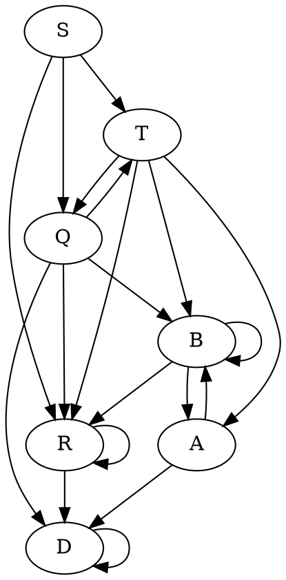

# 1. Выражение $(?= ba^*(bb\mid aa)^* (?<= a^* ba^*) aa^*ba)(aba \mid ba^*bb)^*$

Рассмотрим сначала выражение внутри lookbehind проверки. Эту проверку очевидно можно упростить:
$$ba^*(bb\mid aa)^* (?<= \cancel{a^*}ba^*) = ba^*(bb\mid aa)^* (?<= ba^*)$$
Так как при переписывании по определению [[lookbehind]] эту часть можно жадно съесть с помощью $.^*$
Поэтому мы получим следующее раскрытие:
$$\begin{aligned}
ba^*(bb\mid aa)^* (?<= ba^*) \to \underbrace{ba^*}_{T_1}\mid b a^*(bb|aa)^*b\underbrace{b(aa^*)}_{T_2}
\end{aligned}$$

Области $T_1, T_2$ - те области, которые подошли для подстановки в lookbehind. В $T_1$ мы взяли случай, когда все слово подставляется в lookbehind. В $T_2$ мы взяли минимальное подслово, чтобы оно удовлетворяло lookbehind. 
Теперь упростим полученную регулярку
$$ba^*\mid b a^*(bb|aa)^*bb(aa^*) =$$
Упростим мы из следующего соображения. Пусть мы прочитали часть слова, удовлетворяющую $ba^*$. Если после мы прочитаем a, то мы можем также его отнести к уже прочитанной регулярке. Если после мы читаем b, то после обязательно должно следовать b. И после прочитанной bb мы можем читать только четные количества a и b, причем сколько угодно раз. Таким образом мы получаем следующее регулярное выражение
$$= ba^*(bb(aa)^*)^*$$

Рассмотрим теперь lookahead подстановку.
$$(?= \underbrace{ba^*(bb(aa)^*)^*}_{lookbehind} aa^*ba)(aba \mid ba^*bb)^*$$
Очевидно, что 0 итераций регулярного выражения $(aba \mid ba^*bb)^*$ не входит в язык, так как нам требуются слова, состоящие как минимум из 4 букв(см. минимальное слово из образца lookahead).
Поэтому раскроем одну итерацию
$$(?= ba^*(bb(aa)^*)^* aa^*ba)(aba \mid ba^*bb)(aba \mid ba^*bb)^*$$
Очевидно, что первая итерация не может раскрыться в $aba$, так как образец начинается с $b$. Поэтому получаем
$$(?= ba^*(bb(aa)^*)^* aa^*ba)ba^*bb(aba \mid ba^*bb)^*$$
Сразу можно упростить наше выражение, заметив, что первая b всегда будет совпадать. Поэтому
$$b(?= a^*(bb(aa)^*)^* aa^*ba)a^*bb(aba \mid ba^*bb)^*$$
Также очевидна возможность следующей перестановки
$$b(?= a^*(bb(aa)^*)^* \underbrace{a^*a}_{swap}ba)a^*bb(aba \mid ba^*bb)^*$$
Теперь нам необходимо перебрать различные случаи lookahead образцов.
Пусть итерация $(bb(aa)^*)^*$ раскроется 0 раз. Тогда мы получим:
$$b(?= a^*aba)a^*bb(aba \mid ba^*bb)^*$$
Очевидно, что в таком случае, мы не сможем никак подставить, так как нам необходимо встретить $aba$ после некоторого количества a, а мы можем получить только bb. Поэтому эта итерация раскроется как минимум 1 раз. Тогда мы получаем:
$$b(?= a^*bb(aa)^*(bb(aa)^*)^*a^*aba)a^*bb(aba \mid ba^*bb)^*$$
И теперь совпадающий префикс $a^*bb$ мы можем выделить в начало, за пределы lookahead
$$ba^*bb(?= (aa)^*(bb(aa)^*)^*a^*aba)(aba \mid ba^*bb)^*$$
Если первая итерация в этом lookahead раскроется хотя бы 1 раз, то мы не сможем составить слово, поэтому:
$$ba^*bb(?= \cancel{(aa)^*}(bb(aa)^*)^*a^*aba)(aba \mid ba^*bb)^*$$

Далее мы будем рассматривать только lookahead, без префикса языка $ba^*bb$, просто в конце при поиске ответа сконкатенируем с ним.

---
Пусть вторая итерация в образце раскроется n раз, тогда
$$(?= \underbrace{bba^* bba^* ... bba^*}_{\text{n раз}}(bb(aa)^*)^*a^*aba)(aba \mid ba^*bb)^*$$
1)Тогда итерацию самого слова мы должны раскрывать по второй альтернативе.
$$(?= \underbrace{bba^* bba^* ... bba^*}_{\text{n раз}}(bb(aa)^*)^*a^*aba)b \color{red}{a^*} \color{black}bb(aba \mid ba^*bb)^*$$
2)Очевидно, что по $a^*$ слова(отмечено красным) мы не можем итерироваться. Поэтому получаем
$$(?= \underbrace{bba^* bba^* ... bba^*}_{\text{n раз}}(bb(aa)^*)^*a^*aba)bbb(aba \mid ba^*bb)^*$$
3)Теперь по первой итерации в образце не можем итерироваться, тогда
$$(?= bb\underbrace{bba^* ... bba^*}_{\text{n-1 раз}}(bb(aa)^*)^*a^*aba)bbb(aba \mid ba^*bb)^*$$
4)Выносим за пределы образца bb и там и там
$$bb(?= \underbrace{bba^* ... bba^*}_{\text{n-1 раз}}(bb(aa)^*)^*a^*aba)b(aba \mid ba^*bb)^*$$
5)Теперь при раскрытии по второму правилу мы получим
$$bb(?= \underbrace{\color{red}bba^*\color{black}bba^* ... bba^*}_{\text{n-1 раз}}(bb(aa)^*)^*a^*aba)\color{red}bba^*\color{black}bb(aba \mid ba^*bb)^*$$
6)Красную часть, совпадающую и там и там, можем вынести.
$$bbbba^*(?= \underbrace{bba^* ... bba^*}_{\text{n-2 раз}}(bb(aa)^*)^*a^*aba)bb(aba \mid ba^*bb)^*$$
7)По первому правилу мы все еще не можем раскрыться, поэтому раскрываемся по второму
$$bbbba^*(?= \underbrace{\color{red}bba^*bba^*\color{black}bba^* ... bba^*}_{\text{n-2 раз}}(bb(aa)^*)^*a^*aba)\color{red}bbba^*b\color{black}b(aba \mid ba^*bb)^*$$
8)Если не раскрывать итерации, то получится вынести еще блок из b.
$$bbbba^*bbbb(?= \underbrace{bba^* ... bba^*}_{\text{n-4 раз}}(bb(aa)^*)^*a^*aba)b(aba \mid ba^*bb)^*$$
И мы снова вернулись к шагу 4, с разросшимся префиксом. Из этого можно понять, что итерация $(bb(aa)^*)^*$ может раскрыться или 0 раз, или если больше, то мы получаем 1 или 2 b между lookahead и итерацией самого слова.
$$\begin{cases}
(?= a^*aba)(aba \mid ba^*bb)^* &n=0 \\
\varphi_n(?= a^*aba)(b|bb)(aba \mid ba^*bb)^*&n>0\\
\end{cases}$$
Но при $n>0$ мы не сможем дальше дораскрыть lookahead, значит допустимо только раскрытие 0 раз.

---
Так мы получили итерацию 0 раз. И значит рассмотрим:
$$(?= a^*aba)(aba \mid ba^*bb)^*$$
Раскрытие итерации в образце сколько нибудь раз, не даст нам сопоставить с словом, поэтому
$$(?= aba)(aba \mid ba^*bb)^*$$
А такой lookahead раскрывается тривиально в:
$$aba(aba|ba^*bb)^*$$
Теперь результат нужно сконкатенировать с опущенными ранее префиксами и мы получим **ответ**:
$$ba^*bbaba(aba|ba^*bb)^*$$
# 2. Грамматика
$$\begin{aligned}
&S \to TaQ &S \to RT \\
&T \to QbA &T \to BR \\
&Q \to BcD &Q \to TR \\
&R \to aR &R \to baR & \quad R \to bbD \\
&B \to cB &B \to dRA \\
&A \to DqB &A \to aDd \\
&D \to Dca &D \to b
\end{aligned}$$
Перепишем граматику с альтернативами
$$\begin{aligned}
&S \to TaQ \mid RT \\
&T \to QbA \mid BR \\
&Q \to BcD \mid TR \\
&R \to aR \mid baR \mid bbD \\
&B \to cB \mid dRA \\
&A \to DqB \mid aDd \\
&D \to Dca \mid b
\end{aligned}$$
Проанализируем структуру грамматики - какие нетерминалы в какие переписываются. Построим граф

По графу видно, что вырисовывается иерархия между нетерминалами. Так D рекурсивно зависит только от себя, R зависит от себя и от D. Начнем анализировать язык от "листьев" к "корню"
Рассмотрим нетерминал $D \to Dca \mid b$. Этот нетерминал раскрывается леворекурсивно и его язык можно описать регулярным выражением.
$$D = b(ca)^*$$
Рассмотрим нетерминал $R \to aR \mid baR \mid bbD$. Он в свою очередь является праворекурсивным, и его также можно выразить в виде регулярного выражения:
$$R = (a\mid ba)^*bbD = (a\mid ba)^*bbb(ca)^*$$
Теперь нам нужно вместе рассмотреть нетерминалы A и B.
$$A \to DqB \mid aDb \qquad B \to cB \mid dRA$$
Они оба содержат праворекурсивный вывод относительно A и B каждый раз меняясь друг с другом. 
$$B = c^*dRA$$
$$A = Dq\underbrace{B}_{c^*dRA} \mid aDb = Dqc^*dRA \mid aDb = (Dqc^*dR)^*aDb$$
Таким образом для нетерминалов A и В получаем:
$$A = (Dqc^*dR)^*aDb = (b(ca)^*qc^*d(a\mid ba)^*bbb(ca)^*)ab(ca)^*b$$
$$B = c^*dR(Dqc^*dR)^*aDb$$
Языки нетерминалов D,R заменим позже.

Теперь рассмотрим пару нетерминалов Q,T.
$$T \to QbA \mid BR \qquad Q \to BcD\mid TR$$
Эти нетерминалы действуют также как и A и B, только подвыводы леворекурсивные. Чтобы увидеть наглядно, подставим в первое правило раскрытия T правила раскрытия Q.
$$T \to BcDbA \mid TRbA \mid BR$$
И поэтому очевиден переход к регулярному
$$T = (BcDbA\mid BR) (RbA)^*$$
И произведем аналогичную замену для Q
$$Q = BcD \mid (BcDbA\mid BR) (RbA)^*R$$
И теперь рассмотрим нетерминал S. Он иерархически не саморекурсивен, и раскрывается в "регулярные" нетерминалы, поэтому S порождает регулярный язык.
$$S \to TaQ \mid RT$$
%%Уже пытаюсь третий раз расписать регулярку, но короткой она не выйдет. Только если не использовать группы захвата какие-нибудь%%
# 3. Язык $\{wz^Rvz \mid w,v,z \in \{a,b\}^* \space \& \space |w|>1 \space \& \space |z|>1 \space \&\space (v=w^R \vee v \in (ab^*)^+)\}$
Очевидно, что язык не является VPL, так как нельзя предъявить разбиение алфавита на вызывающие и возвращающие символы.
И точно можно получить, что язык не регулярный, ~~так как $ab a^2b^{n} a b^n a^2$ нельзя накачать в регулярном смысле.~~

Необходимо проверить, является ли язык КС. Для этого воспользуемся леммой о накачке для КС языков.
Перед непосредственным использованием леммы заметим, что $(ab^*)^+ = ab^*(ab^*)^* = a(a|b)^*$
То есть, одно из условий переписывается как $v = w^R \vee v \in a (a|b)^*$
Очевидно, что если язык не КС, то нам нужно рассмотреть случай, когда при накачках будет справедливо только первое условие, то есть $v = w^R$.

==Пусть p - длинна накачки,  рассмотрим слово $w = \underbrace{(ab)^p}_{p_1} \underbrace{a^{2p}}_{p_2} \underbrace{(ba)^p}_{p_3}\underbrace{a^{2p}}_{p_4}$==
==Рассмотрим, почему допустимо только такое разбиение. Пусть z захватывает $p_3p_4$ полностью или частично.==

==При накачке только $p_i$ ломается соотношение между словами==
==При накачке перемычек также ломается соотношений палиндромов. Соответсвенно накачать слово нельзя => язык не КС==