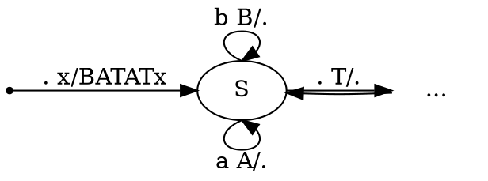
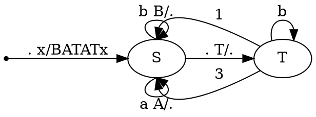
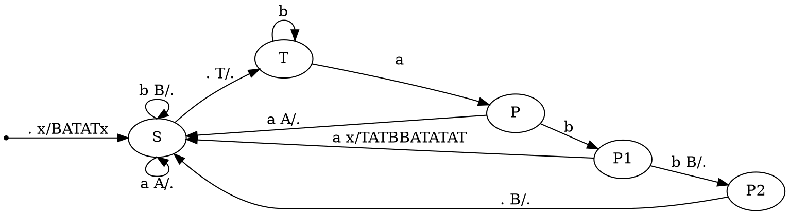
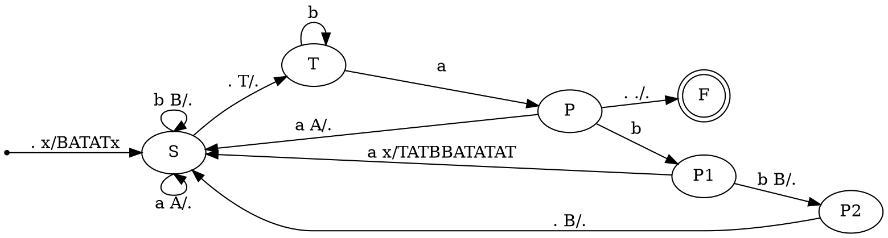

# 1. Язык слов в алфавите $a,b$, у которых совпадает число подвыражений, удовлетворяющих условиям $ab^+ab^+$ и $b^+ab^+a$
язык регулярный.
Рассуждение классическое для похожих языков.
В-первых, подходят все слова, для которых эти количества равны 0, то есть слова не содержащие подслова соответсвующего вида. 

# 2. Грамматика
$$\begin{matrix} 
S \to baTaT \quad T \to aSbS \quad T \to bT\\
T \to a
\end{matrix}$$
В втором задании РК был дан КС язык в виде грамматики. Для него нужно либо построить PDA, либо регулярное выражение(или автомат) с доказательством регулярности языка. 

## Нулевой вариант(aka полный недетерминизм)
==!!!АХТУНГ - Так делать на РК нельзя!!!==

Для любой КС грамматики всегда есть способ построить максимально недетерминированный PDA, по следующему принципу
- с помощью переходов по пустому символу недетерминированно порождаем на стеке строку по правилам переписывания
- После недетерминированно выбираем, что мы остановились и начинаем разбирать стек и читать слово

Но такой метод дает самый неэффективный автомат, поэтому мы его пропускаем.

## Первый вариант(aka попытка в смысловой анализ языка)
Для анализа этого языка мы можем сначала рассмотреть некоторые ограниченные его варианты. 
Если ограничить язык двумя правилами $\boxed{T \to bT \mid a}$, то мы получаем регулярный язык $b^*a$, что не требует особых пояснений.
Для наглядности выделим его в отдельный нетерминал R, тогда грамматика примет вид
$$\begin{matrix}
S \to baTaT\\
T \to aSbS \mid R \\
R \to bR \mid a
\end{matrix}$$
Преобразуем правила переписывания внутри S таким образом, чтобы исключить из грамматики нетерминал T. Для этого мы заменим внутри правила переписывания S нетерминал T на его варианты раскрытия. Таким образом получим
$$\begin{matrix}
S \to baRaR \mid baaSbSaR \mid baRaaSbS \mid baaSbSaaSbS\\
R \to bR \mid a
\end{matrix}$$
Отрежем одинаковый префикс от S
$$\begin{matrix}
S \to baP \\
P \to RaR \mid aSbSaR \mid RaaSbS \mid aSbSaaSbS\\
R \to bR \mid a
\end{matrix}$$

## Второй вариант(aka LL разбор)
Воспользуемся идеями построения стекового автомата для LL разбора.
Рассмотрим нетерминал S
$$S \to baTaT$$
Перед чтением слова мы кладем на стек $BATAT$, после чего последовательно снимаем стековые символы. Принимаем слово только по пустому стеку из начального состояния. Стековые символы $A,B$ соответствуют единственному символу слова $a,b$ соответственно и являются служебными. Стековый символ $T$ соответствует нетерминалу T. Здесь приведен черновик PDA разбирающий язык. 

Теперь нужнно рассмотреть нетерминал $T$. Как было доказано в разделе "теоретический анализ языка" его правила имеют вид:
$$T \to abaTaTbbaTaTaT \mid bT \mid a$$
Здесь основная проблема в том, что на первый взгляд, мы не можем сказать, когда мы прочитали нетерминал полностью, а когда мы его еще продолжаем читать. Очевидно, что сначала мы пытаемся прочитать какое-то количество символов $b$, после чего начинаем читать нетерминал по правилу 1 или 3. Таким образом мы получаем следующий PDA. 1 и 3 помечены переходы по правилу 1 или по правилу 3.

Теперь необходимо понять, что нужно делать в случае когда при разборе $T$ мы видим букву $a$. Один из способов - это добавить дополнительное состояние, которое также будет соответстовать дополнительному символу грамматики.
$$\begin{matrix}
T \to bT \mid aP \\
P \to baTaTbbaTaTaT \mid \varepsilon
\end{matrix}$$
На данный момент нами уже рассмотрены префиксы $T$, начинающиеся с b. По таблице разбора и по грамматике видно, что если при разборе P мы видим $a$ то нужно раскрываться в пустое правило, и(так как мы уже прочитали этот символ, то нужно его снять с стека) Если мы видим $b$, то необходимо прочитать еще один символ, от которого зависит:
- если мы видим, что следующий символ $a$, то мы раскрываемся по длинному правилу P;
- если мы видим, что следующий символ $b$, то значит мы уже прочитали 2 символа с стека $BB$.

Описанные выводы теперь интегрируем в PDA.

Теперь нужно аккуратно добавить финальные состояния. В финальное состояние мы можем перейти только по пустому стеку. Перейти в него из состояния $S$ нельзя, так как последним символом на стеке всегда будет $T$, которое мы разбираем в всех остальных состояниях. Из состояния T мы также не можем перейти по пустому стеку, так как оно соответствует рекурсивному правилу $T \to bT$. Если в состоянии P мы оказались в конце слова и при этом с пустым стеком, то тогда мы имеем полное право закончить разбор и принять слово, поэтому добавляем переход. Из состояний $P1, P2$ мы не можем добавить такой переход, так как он будет противоречить разбору. Поэтому наш автомат примет следующий вид:

Этот PDA не идеален, так как, например, его можно дополнить состоянием ловушкой, чтобы все переходы по всем символам языка и стека были явно прописаны, но идейно уже в этом виде он описывает разбор.

%%## Третий вариант(aka LR разбор)
Так как мы получили, что описываемый нами язык является LR(0) язком, то для него возможно построить грамматику и соответственно позиционный автомат, разбирающий язык.%%

## Теоретический анализ языка
Язык очевидно КС, так как задается грамматикой. Приведенная грамматика является недетерминированной, что ничего не говорит о детерминированности самого языка. 

Язык не является регулярным, что можно доказать с помощью отрицания леммы о накачке для регулярных языков.
Пусть n - длинна накачки, тогда
$$\omega = (baa)^n S (bSaT)^n$$
Раскроем S
$$\omega = (baa)^n baTaT (baTaTaT)^n$$
Раскроем T по самому маленькому правилу
$$\omega = (baa)^n baaaa (baaaaaa)^n$$
Слово гарантировано лежит в языке, так как мы его породили по правилам грамматики. По лемме о накачке для регулярных языков, у любого слова есть подслово не дальше чем на $n$ символов от начала строки, которое можно накачать и не выйти из языка. Применяя отрицательную накачку, на первых n символах(дополнительно можно ограничить регулярную структуру $(baa)^* ba^3 (ba^5)^*$) мы выходим из языка. Значит язык нельзя накачать и поэтому язык не регулярный.

Доказав, что язык не является регулярным(язык также очевидно не VPL, можно использовать тот же контрпример), мы можем задаться вопросом является ли он детерминированным КС. 

На наше счастье мы можем произвести преобразование грамматики к следующему виду
$$\begin{matrix}
S \to baTaT\\
T \to abaTaTbbaTaTaT \mid bT \mid a
\end{matrix}$$
И уже по этой грамматике видно, что она является $LL(3)$.

| нетерминал/префикс | aaa | aab | aba | abb | baa | bab | bba | bbb |
| ------------------ | --- | --- | --- | --- | --- | --- | --- | --- |
| $S$                | -   | -   | -   | -   | 1   | 1   | -   | -   |
| $T$                | 3   | 3   | 1   | 3   | 2   | 2   | 2   | 2   |

Таблица $LL(3)$ разбора не содержит противоречий, поэтому мы получили, что рассматриваемый нами язык является $LL$-языком, а соответственно является детерминированным КС языком.

Более того, мы можем говорить, что язык является LR(0) так как для данного языка возможно построить распознаватель, принимающий язык только по пустому символу. 

# 3. Язык всех палиндромов в $\{a,b\}$ таких, что они являются конкатенацией префикса некоторого палиндрома $v_1$ длинны больше $\frac{2|v_1|}{3}$ и суффикса некоторого палиндрома $v_2$ длинны больше $\frac{2|v_2|}{3}$
Здесь сначала приведены попытки доказательства, что язык является контекстно зависимым. В конце приведен вывод о истинном виде языка, но данные рассуждения все равно оставлены в обучающих целях.

Данный язык можно описать иначе, как палиндром, к которому присоединен непалиндромный префикс или суффикс, который меньше по длине чем половина. Такое описание получается, если рассматривать язык только как конкатенацию префикса и суффикса палиндромов.
Таким образом все слова описываются как 
$$\{v xx^R yy^Ru \mid |v| < |x| \space \& \space |u| < |y|\}$$
Но также эти слова сами по себе должны быть палиндромными, то есть 
$$vxx^Ryy^R u = ww^R$$
Также стоит учесть, что все подслова $v,x,y,u$ могут быть также пустыми.
На этом этапе нужно четко оценить место в слове, на которое выпадают переходы между левыми и правыми частями палиндрома. 
Всего возможны , которые можно дополнить симметричными случаями путем обращения языка(также стоит заметить, что при обращении языка мы получим тот же язык, так как все слова - палиндромы):
1) центр слова внутри $v$ нельзя предъявить, так как тогда мы получим противоречие: $|v| > 2|x|+2|y|+|u| \space\&\space |v| < |x|$
2) центр слова находится между $v$ и $x$ также невозможен, по тем же причинам(вместо знака ">" знак равенства)
3) центр слова находится внутри $x$. Разобьем подслово еще на 3(с двумя случаями) $x=aa^Rb$ или $x = baa^R$(центр слова между $aa^R$)
   3.1. $x=aa^Rb$, тогда $$\underbrace{va}\underbrace{a^Rbb^Raa^Ryy^Ru}$$
   получаем противоречие между длинами подслов
   3.2. $x=baa^R$, тогда
   $$\underbrace{vba}\underbrace{a^Raa^Rb^Ryy^Ru}$$
   также получаем противоречие между длинами подслов.
4) центр слова находится на перемычке $xx^R$. Тогда мы имеем, что $v^R = yy^Ru \implies v = u^Ryy^R$, тогда
   $$\underbrace{u^Ryy^R x}\underbrace{x^Ryy^Ru}$$
   и дополнительное ограничение $|u^Ryy^R| < |x|$. Здесь можно в всех случаях накачать перемычки $xx^R$ и $yy^R$.
5) центр слова находится внутри $x^R$ также приводит к двум вариантам: $x^R=aa^Rb$ или $x^R = baa^R$
   5.1 $x^R = aa^Rb$($x=b^Raa^R$), тогда
   $$\underbrace{vb^Raa^Ra} \underbrace{a^Rb yy^Ru}$$
   и получаем дополнительное ограничение
   $$\begin{cases}
   |v| < |b| + 2|a|\\
   |v| + |b| + 2|a| = |b| + 2|y| + |u|
   \end{cases}$$
   5.2 $x^R=baa^R(x=aa^Rb^R)$, тогда
   $$\underbrace{vaa^Rb^Rba} \underbrace{a^Ryy^Ru}$$
   и получаем дополнительное ограничение
   $$\begin{cases}
   |v| < |b| + 2|a|\\
   |v| + 2|b| + 2|a| = 2|y| + |u|
   \end{cases}$$
6) центр слова находится на перемычке $x^Ry$ приводит к ситуации, когда $x^R=y \& u=v$. И мы получаем $vxx^Rxx^Rv^R$ без дополнительных ограничений кроме $|v| < |x|$. Эта ситуация полностью валидна, но при этом всегда допустимы накачки(полложительные без ограничений) в центр слова, что не поможет в нашем доказательстве.

Из наших рассуждений получили, что для слов из языка допустимы только следующие ситуации
1) центр слова находится по середине $xx^R$(или $yy^R$)
2) центр слова находится в $x^R$(или $y$)
3) центр слова находится по середине $x^Ry$ - накачивается

Здесь дальнейшие рассуждения прекращаются, потому что было замечено, какой именно вид имеет рассматриваемый язык. 

---

%%Меня терзают смутные сомнения%% Заметим, что этот язык полностью совпадает с языком палиндромов над $\{a,b\}$, так как мы любое слово из языка можем представить как конкатенацию префикса, который совпадает с всем словом, и суффиксом пустого палиндрома. Собственно поэтому представленные выше рассуждения, по доказательству контекстной зависимости приводили в тупик. 

Итак, описываемый в задаче язык, является языком палиндромов над алфавитом $\{a,b\}$, без пустого слова, так как оно не подходит по определению($|\varepsilon|\not>\frac23|\varepsilon|$). Описывается классической грамматикой
$$\begin{matrix}
S \to aSa \mid bSb \mid a \mid b \mid aa \mid bb
\end{matrix}$$
Как известно, является недетерминированным КС языком. 
