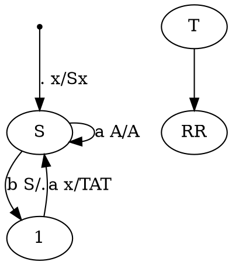

# 1. Язык слов в алфавите $a,b$, у которых совпадает число подвыражений, удовлетворяющих условиям $ab^+ab^+$ и $b^+ab^+a$
язык регулярный.
Рассуждение классическое для похожих языков.
В-первых, подходят все слова, для которых эти количества равны 0, то есть слова не содержащие подслова соответсвующего вида. 

# 2. Грамматика
$$\begin{matrix} 
S \to baTaT \quad T \to aSbS \quad T \to bT\\
T \to a
\end{matrix}$$
В втором задании РК был дан КС язык в виде грамматики. Для него нужно либо построить PDA, либо регулярное выражение(или автомат) с доказательством регулярности языка. 

## Нулевой вариант(aka полный недетерминизм)
==!!!АХТУНГ - Так делать на РК нельзя!!!==

Для любой КС грамматики всегда есть способ построить максимально недетерминированный PDA, по следующему принципу
- с помощью переходов по пустому символу недетерминированно порождаем на стеке строку по правилам переписывания
- После недетерминированно выбираем, что мы остановились и начинаем разбирать стек и читать слово

Но такой метод дает самый неэффективный автомат, поэтому мы его пропускаем.

## Первый вариант(aka попытка в смысловой анализ языка)
Для анализа этого языка мы можем сначала рассмотреть некоторые ограниченные его варианты. 
Если ограничить язык двумя правилами $\boxed{T \to bT \mid a}$, то мы получаем регулярный язык $b^*a$, что не требует особых пояснений.
Для наглядности выделим его в отдельный нетерминал R, тогда грамматика примет вид
$$\begin{matrix}
S \to baTaT\\
T \to aSbS \mid R \\
R \to bR \mid a
\end{matrix}$$
Преобразуем правила переписывания внутри S таким образом, чтобы исключить из грамматики нетерминал T. Для этого мы заменим внутри правила переписывания S нетерминал T на его варианты раскрытия. Таким образом получим
$$\begin{matrix}
S \to baRaR \mid baaSbSaR \mid baRaaSbS \mid baaSbSaaSbS\\
R \to bR \mid a
\end{matrix}$$
Отрежем одинаковый префикс от S
$$\begin{matrix}
S \to baP \\
P \to RaR \mid aSbSaR \mid RaaSbS \mid aSbSaaSbS\\
R \to bR \mid a
\end{matrix}$$

## Второй вариант(aka LL разбор)
Воспользуемся идеями построения стекового автомата для LL разбора.
Рассмотрим нетерминал S
$$S \to baTaT$$
Перед чтением слова мы кладем на стек $S$, после чего снимаем

## Теоретический анализ языка
Язык очевидно КС, так как задается грамматикой. Приведенная грамматика является недетерминированной, что ничего не говорит о детерминированности самого языка. 

Язык не является регулярным, что можно доказать с помощью отрицания леммы о накачке для регулярных языков.
Пусть n - длинна накачки, тогда
$$\omega = (baa)^n S (bSaT)^n$$
Раскроем S
$$\omega = (baa)^n baTaT (baTaTaT)^n$$
Раскроем T по самому маленькому правилу
$$\omega = (baa)^n baaaa (baaaaaa)^n$$
Слово гарантировано лежит в языке, так как мы его породили по правилам грамматики. По лемме о накачке для регулярных языков, у любого слова есть подслово не дальше чем на $n$ символов от начала строки, которое можно накачать и не выйти из языка. Применяя отрицательную накачку, на первых n символах(дополнительно можно ограничить регулярную структуру $(baa)^* ba^3 (ba^5)^*$) мы выходим из языка. Значит язык нельзя накачать и поэтому язык не регулярный.

Доказав, что язык не является регулярным(язык также очевидно не VPL, можно использовать тот же контрпример), мы можем задаться вопросом является ли он детерминированным КС. 
%%Для этого применим лемму о накачке для детерминированных КС языков.

>[!note] Отрицание леммы о накачке для детерминированных КС
> Для любого n - длинны накачки, существует 2 словf $\omega_1, \omega_2$ с общим префиксом, но разными суффиксами для которых выполнены оба условия
> 1) префикс не накачивается в КС смысле
> 2) не накачиваются префикс + суффикс в кс смысле
> тогда язык не детерминированный КС.

Здесь подозрение на недетрминизм вызывает правила $T \to aSbS \mid a$
%%
На наше счастье мы можем произвести преобразование грамматики к следующему виду
$$\begin{matrix}
S \to baTaT\\
T \to abaTaTbbaTaTaT \mid bT \mid a
\end{matrix}$$
И уже по этой грамматике видно, что она является $LL(3)$.

| нетерминал/префикс | aaa | aab | aba | abb | baa | bab | bba | bbb |
| ------------------ | --- | --- | --- | --- | --- | --- | --- | --- |
| $S$                | -   | -   | -   | -   | 1   | 1   | -   | -   |
| $T$                | 3   | 3   | 1   | 3   | 2   | 2   | 2   | 2   |

Таблица $LL(3)$ разбора не содержит противоречий, поэтому мы получили, что рассматриваемый нами язык является $LL$-языком.

# 3. Язык всех палиндромов в $\{a,b\}$ таких, что они являются конкатенацией префикса некоторого палиндрома $v_1$ длинны больше $\frac{2|v_1|}{3}$ и суффикса некоторого палиндрома $v_2$ длинны больше $\frac{2|v_2|}{3}$
%%Используя оракул, мы можем получить за $O(1)$, что язык не является КС, но для этого нам нужно выделить подмножество слов, которые не накачиваются.%%

Данный язык можно описать иначе, как палиндром, к которому присоединен непалиндромный префикс или суффикс, который меньше по длине чем половина.
Таким образом все слова описываются как 
$$\{v xx^R yy^Ru \mid |v| < |x| \space \& \space |u| < |y|\}$$
Но также эти слова сами по себе должны быть палиндромными, то есть 
$$vxx^Ryy^R u = ww^R$$
Также стоит учесть, что все подслова $v,x,y,u$ могут быть также пустыми.
На этом этапе нужно четко оценить место в слове, на которое выпадают переходы между левыми и правыми частями палиндрома. 
Всего возможны , которые можно дополнить симметричными случаями путем обращения языка(также стоит заметить, что при обращении языка мы получим тот же язык, так как все слова - палиндромы):
1) центр слова внутри $v$ нельзя предъявить, так как тогда мы получим противоречие: $|v| > 2|x|+2|y|+|u| \space\&\space |v| < |x|$
2) центр слова находится между $v$ и $x$ также невозможен, по тем же причинам(вместо знака ">" знак равенства)
3) центр слова находится внутри $x$. Разобьем подслово еще на 3(с двумя случаями) $x=aa^Rb$ или $x = baa^R$(центр слова между $aa^R$)
   3.1. $x=aa^Rb$, тогда $$\underbrace{va}\underbrace{a^Rbb^Raa^Ryy^Ru}$$
   получаем противоречие между длинами подслов
   3.2. $x=baa^R$, тогда
   $$\underbrace{vba}\underbrace{a^Raa^Rb^Ryy^Ru}$$
   также получаем противоречие между длинами подслов.
4) центр слова находится на перемычке $xx^R$. Тогда мы имеем, что $v^R = yy^Ru \implies v = u^Ryy^R$, тогда
   $$\underbrace{u^Ryy^R x}\underbrace{x^Ryy^Ru}$$
   и дополнительное ограничение $|u^Ryy^R| < |x|$. Здесь можно в всех случаях накачать перемычки $xx^R$ и $yy^R$.
5) центр слова находится внутри $x^R$ также приводит к двум вариантам: $x^R=aa^Rb$ или $x^R = baa^R$
   5.1 $x^R = aa^Rb$($x=b^Raa^R$), тогда
   $$\underbrace{vb^Raa^Ra} \underbrace{a^Rb yy^Ru}$$
   и получаем дополнительное ограничение
   $$\begin{cases}
   |v| < |b| + 2|a|\\
   |v| + |b| + 2|a| = |b| + 2|y| + |u|
   \end{cases}$$
   5.2 $x^R=baa^R(x=aa^Rb^R)$, тогда
   $$\underbrace{vaa^Rb^Rba} \underbrace{a^Ryy^Ru}$$
   и получаем дополнительное ограничение
   $$\begin{cases}
   |v| < |b| + 2|a|\\
   |v| + 2|b| + 2|a| = 2|y| + |u|
   \end{cases}$$
6) центр слова находится на перемычке $x^Ry$ приводит к ситуации, когда $x^R=y \& u=v$. И мы получаем $vxx^Rxx^Rv^R$ без дополнительных ограничений кроме $|v| < |x|$. Эта ситуация полностью валидна, но при этом всегда допустимы накачки(полложительные без ограничений) в центр слова, что не поможет в нашем доказательстве.

Из наших рассуждений получили, что для слов из языка допустимы только следующие ситуации
1) центр слова находится по середине $xx^R$(или $yy^R$)
2) центр слова находится в $x^R$(или $y$)
3) центр слова находится по середине $x^Ry$ - накачивается

%%дописать%%

---

Меня терзают смутные сомнения, что этот язык в целом полностью совпадает с языком палиндромов над $\{a,b\}$, так как мы любое слово из языка можем представить как конкатенацию префикса, который совпадает с всем словом, и суффиксом пустого палиндрома.

%%
Язык не КС, так как в нем наблюдаются перекрестные зависимости между подсловами, которую нельзя выразить с помощью стека.
Для доказательства, что язык не КС, используем лемму о накачке. 
Пусть $n$ - длинна накачки. Рассмотрим тогда слово
$$\omega = \underbrace{ba^{2n}ba^n}_{v_1}\underbrace{a^nba^{2n}b}_{v_2}$$

Пусть n - длинна накачки. Рассмотрим тогда слово из языка
$$\omega = \underbrace{a^nb^nab^n}_{v_1}\underbrace{b^nab^na^n}_{v_2}$$
Очевидно, что это слово лежит в языке, соответствующее разбиение на подслова обозначено в примере.
Возможно ли произвести другое разбиение этого слова на подслова $v_1,v_2$? Рассмотрим расширение $v_1$.
Пусть $v_1$ расширено только на некоторое количество $b$, тогда мы имеем
$$\omega = \underbrace{a^nb^nab^{n+k}}_{v_1} \underbrace{b^{n-k} ab^na^n}_{v_2}$$
Но в таком случае, мы получаем, что центр суффикса палиндрома $v_2$ должен сместиться в область $b^n$, чтобы удовлетворять ограничению на длинну. Но для любых k мы имеем структуру, которая не соответствует структуре суффикса палиндрома, тем самым получаем противоречие. 
Аналогичную ситуацию мы имеем при попытке расширить $v_1$ до $b^n$. 
Пусть мы расширили $v_1$ так, что $v_2$ состоит только из букв $a$, тогда
$$\omega = \underbrace{a^nb^nab^{2n}ab^na^k}_{v_1} \underbrace{a^{n-k}}_{v_2}$$

Так как данный язык симметричен относительно разворота(при развороте слова, мы получаем слово из того же языка), то мы можем ограничиться рассотрением только случая расширения $v_1$.

Теперь мы должны рассмотреть накачки. Для простоты доказательства ограничим язык регулярной структурой(пересечем с регулярным выражением - при пересечении КС языка мы должны получить КС язык)
$$a^*b^*ab^*ab^*a^*$$
Рассмотрим возможные области накачки
$$\omega = \underbrace{a^n}_{p_1}\underbrace{b^n}_{p_2}a\underbrace{b^{2n}}_{p_3}a\underbrace{b^n}_{p_4}\underbrace{a^n}_{p_5}$$
> Если говорить в общих словах, то ограничения языка задают строгие соотношения между количествами в областях $p_1p_5, p_2p_3p_4$, тем самым мы не можем накачать ни одну из областей и не можем накачать перекрестно соседние области. 

%%
