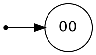

### 1. Язык тождественно истинных логических формул без скобок, со связками только V, & и ¬ (с обычным приоритетом операций) и константами Т, F.
Язык действительно регулярный, так как не рассматривает вложенных структур.
Язык можно описать следующим образом:
- слова - конкатенация через $\vee$ логических формул, среди которых есть хотя бы одна истинная
- Истинная логическая формула - конкатенация истин через &
- Истина - T или четное число отрицаний
- Логическая формула - конкатенация через & логических единиц = T или F перед которыми произвольное число отрицаний

Таким образом можно рекурсивно определить регулярное выражение
$$\begin{aligned}
&L = (\text{<any>} V)^* \text{<true>} (V\text{<any>})^*\\
&\text{<any>} = \text{<term>} (\& \text{<term>})^* \\
&\text{<term>} = ¬^* (T|F) \\
\implies\\
&\text{<any>} = ¬^* (T|F) (\& ¬^* (T|F)) \\
&\text{<true>} = \text{<trueterm>} (\& \text{<trueterm>})^*\\
&\text{<trueterm>} = T | (¬¬)^+ F 
\end{aligned}$$
$$L = (¬^* (T|F) (\& ¬^* (T|F))\space  V)^*
(T | (¬¬)^+ F) (\& (T | (¬¬)^+ F))^* (V \space ¬^* (T|F) (\& ¬^* (T|F)))^*$$
### 2. Язык $\{w \mid |w|_{ab} = |w|_{baa} \space\&\space |w|_{abb} \neq |w|_{bba} \space \&\space w \in \{a, b\}^+\}$.
Распишем отдельно языки $L_1$ и $L_2$, которые удовлетворяют первому и второму правилу соответсвенно.
Язык $L_1 = \{w \mid |w|_{ab} = |w|_{baa}\}$
Внутри этого языка лежат все слова состоящие только из $a$ или только из $b$.
Также внутри лежит $ba$. 
Если нам встретилась $ab$, тогда после должна идти baa, причем она может как включать b из ab, так и нет, то есть $a^*abb^*aa$ будет лежать в языке. Более того, итерация произвольного числа раз этого слова будет лежать в языке 
$$(a^*abb^*aa)^* \subset L_1$$
Если у нас встретилась сначала $baa$, то после должно идти $ab$. То есть мы получим слова 
$$(b^*baaa^*b)^* \subset L_1$$
Теперь получим общее выражение для языке $L_1$.
$$L_1 = a^*(abb^*aaa^*)^* \mid b^* (baaa^*bb^*)^*$$
Как видно, в этой формуле были перемещены a с начала в конец, что сделано только для сокращения выражения. Тем самым, мы показали, что язык $L_1$ - регулярный.

Теперь рассмотрим язык $L_2 = \{w \mid |w|_{abb} \neq |w|_{bba}\}$

Дополнение к нему можно легко построить, и оно будет регулярным. 
$$\overline{L_2} = \left\{\omega \mid |\omega|_{abb} = |\omega|_{bba}\right\}$$
Здесь подойдет последовательный анализ. В-первых, в языке лежат все слова состоящие либо только из букв $a$, либо только из букв $b$, так как они будут соответсвовать нулевому количеству искомых подслов. Также подходят слова, в которых нет двух подряд идущих букв $b$.
Пусть в слове первое входит подслово $abb$, тогда после него может быть либо $b$ либо $a$, либо конец строки. Так как мы требуем одинаковое количество вхождений $abb$ и $bba$, то после подслова $abb$ мы требуем, что может идти сколько угодно букв b и обязательно буква a, что соответсвует регулярному выражению $\rho abb b^* a$
после буквы a мы также можем ожидать какие-угодно символы, до первого вхождения $abb$. И кроме этого возможен перекрестный случай, который мы также должны учесть в регулярном выражении.
$$\underbrace{a\textcolor{red}{bb}}\underbrace{\textcolor{red}{a}bb}$$
Таким образом получаем
$$\rho a bbb^*a ((\rho a \mid \varepsilon)bbb^*a)^*$$
где $\rho \in (a \mid ba)^* (b \mid \varepsilon)$ - слова, в которых нет двух подряд идущих b.
Теперь рассмотрим, что первое в слово входит подслово $bba$.

==случай 2==

Таким образом мы нашли регулярное задание языка $\overline{L_2}$, из чего следует что и $L_2$ - также регулярный язык. Поэтому и $L = L_1 \cap L_2$ также будет регулярным языком.
Теперь нужно построить регулярное выражение для этого языка.

Попробуем рассмотреть классы эквивалентности по Майхиллу-Нероде для регулярного языка $L$.

Очевидно, из анализа языков $L_1$ и $L_2$, что для всевозможных слов, максимальная разница между количествами подслов может быть только 1. Поэтому в отдельные классы эквивалентности можно будет выделить префиксы, в которых
- $|w|_{ab} = |w|_{baa}$ и $|w|_{abb}=|w|_{bba}$
- $|w|_{ab} = |w|_{baa}$ и $|w|_{abb}>|w|_{bba}$
- $|w|_{ab} = |w|_{baa}$ и $|w|_{abb}<|w|_{bba}$
- $|w|_{ab} > |w|_{baa}$ и $|w|_{abb}=|w|_{bba}$
- $|w|_{ab} > |w|_{baa}$ и $|w|_{abb}>|w|_{bba}$
- $|w|_{ab} > |w|_{baa}$ и $|w|_{abb}<|w|_{bba}$
- $|w|_{ab} < |w|_{baa}$ и $|w|_{abb}=|w|_{bba}$
- $|w|_{ab} < |w|_{baa}$ и $|w|_{abb}>|w|_{bba}$
- $|w|_{ab} < |w|_{baa}$ и $|w|_{abb}<|w|_{bba}$

Обозначим эти состояния в троичной системе счисления от $00$ до $22$.

Кроме этих префиксов, в отдельные классы эквивалентности нужно будет выделить и их префиксы, как промежуточные состояния.

| КЭ/Суффикс    | $\varepsilon$ | $a$ | $b$ | $bb$ |
| ------------- | ------------- | --- | --- | ---- |
| $\varepsilon$ | +             |     |     |      |
| $a$           | +             | +   | -   | -    |
| $b$           | +             | +   | +   |      |
|               |               |     |     |      |

Построенные классы эквивалентности, соответсвуют минимальному ДКА, распознающему язык $L$, поэтому построим его в явном виде.

### 3. Язык всех не завершающихся систем переписывания строк из одного правила. Алфавит: ${f,g, \to}$.

Для длинны накачки n рассмотрим $w = f^ng^n \to f^ng^n$.
В общем случае не завершается, так как либо нельзя применить правило, либо можно применять сколько угодно раз.
При накачке левой части отдельно от правой, система становится завершающейся
При отрицательной накачке правой части, также завершается, так как число нетерминалов уменьшается.
При отрицательной накачке перекрестной, число f уменьшается, поэтому система переписывания рано или поздно закончится.
Следовательно, по лемме о накачке язык не КС.
