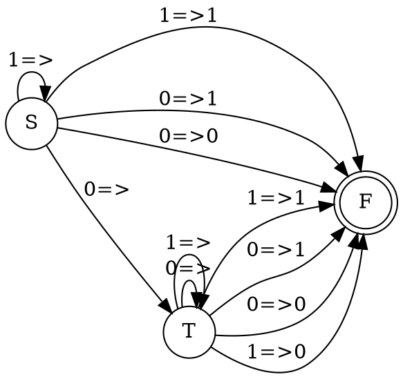

### 1. Язык логических формул с $\Rightarrow$ и без скобок, содержащих только константы $0$ и $1$, таких что их значение равно $1$. Считаем следование правоассоциативным, т.е. $1 \Rightarrow 0 \Rightarrow 0$ понимаем как $1 \Rightarrow (0 \Rightarrow 0)$.

Если справа 1, то слева может быть все что угодно.
Если справа 0, то слева только 0.

Соответственно, можно регулярку строить рекурсивно, относительно правого выражения.
- Если справа $0\Rightarrow0$, $0\Rightarrow1$, $1\Rightarrow1$, то слева может быть любое регулярное выражение
- Если справа стоит $1\Rightarrow0$, то слева должно быть $0\Rightarrow X$, где X - это ложное выражение

Регулярка делает вывод о разборе по первому символу. Если символ 0, то формула будет истинной при любом суффиксе. Если 1, то истина только если истин суффикс.
Выведем регулярку через грамматику
```
S -> 0 => T | 1 => S | 1 => 1 | 0 => 0 | 0 => 1 // верное логическое выражение
T -> 0 => T | 1 => 1 | 1 => 1 | 0 => 0 | 0 => 1 | 1 => 0 // любое логическое выражение
```

Таким образом можно построить НКА, разбирающий язык(приведен без промежуточных состояний):


Далее при необходимости можно добавить промежуточные состояния и детерминизирвать.

### 2. Язык $\{w_1 v w_2 \big{|} w_2 = h (w_1)h(w_1) \& w_i \in \{a, b\}^* \& v \in b^*a^*\}$, где h -  гомоморфизм, определённый правилами $h(a) = aa, h(b) = a$.

Грамматика
```
S -> aSaaaa | bSaa | T
T -> BA
A -> aA | ε
B -> bB | ε
```
Так допустимо, так как образы гомоморфизма комутативны, то есть можно спокойно перемещать так как необходимо и нужно учитывать только количество. Поэтому структуру последовательных слов преобразуем в комутативную ей скобочную структуру.
$$S \to aS\underbrace{aa}_{h(a)}\underbrace{aa}_{h(a)} \mid bS\underbrace{a}_{h(b)}\underbrace{a}_{h(b)} \mid T$$


### 3. Язык деревьев арифметических выражений с операциями бинарного сложения и умножения, а также одноразрядными числами, таких, что они вычисляют простое число.
В-первых, определим как задается язык деревьев арифметических выражений, вычисляющих простое число $p$.
В листьях может быть одноразрядные числа $0,1,2,3,4,5,6,7,8,9$.
В ветвях может быть только $+(T1, T2)$ и $*(T1, T2)$.

Очевидно, что на поддеревьях естественно возникает отношение эквивалентности по равенству значений, которые они вычисляют. Это соответствует определению эквивалентности, так как мы можем поменять любые поддеревья, вычисляющие одинаковое число местами и общий результат арифметического выражения не изменится. Более того, такое отношение эквивалентности возникает для любых вычисляющих деревьев: будь то деревья булевой алгебры или другие. 

В соответствии с этим, мы получаем счетное число классов эквивалентности, поэтому по теореме Майхилла-Нероуда этот язык **не будет древесно-автоматным.**

Почему нельзя задать другое отношение эквивалентности? Полученное нами отношение эквивалентности естественно возникает из того, что деревья являются вычисляющими. Так рассмотрим операции, и проверим, когда они будут равны.
$$+(X,Y) = +(Z, Y) \Leftrightarrow X = Z$$
$$*(X,Y) = *(Z,Y) \Leftrightarrow X = Z$$

>[!note] Излишнее рассуждение о том, что мы не можем ввести другое отношение эквивалентности на вычисляющих деревьях
>Пусть мы задали какое-то другое отношение эквивалентности, отличное от построенного ранее. Обозначим как $\operatorname{eqv}$, тогда существуют такие X,Y, что
>$$\begin{matrix}
X \neq Y \text{ и } X \operatorname{eqv} Y\space (1)\\
\text{ или }\\
X = Y \text{ и не } X \operatorname{eqv} Y \space (2)
\end{matrix}$$
> Случай 2 не может быть, так как если $X = Y$, то тогда нарушается определение эквивалентности, что $X \operatorname{eqv} X$. и мы получаем противоречие.
> Случай 1 означает, что общее число классов эквивалентности уменьшается, поэтому мы не можем просто отбросить этот случай. Из определения эквивалентности имеем
> $$X \operatorname{eqv} Y \Leftrightarrow +(X, Z) = +(Y,Z)$$
> А это вновь нас сводит к тому, что построенное нами отношение эквивалентности соответствует отношению равенства. Поэтому даже если мы очень захотим построить другое отношение эквивалентности на вычисляющих деревьях в полугруппах, то у нас это не получится =(.
> Почему важно требование, что мы работаем в группе? Потому что наше рассуждение целиком опирается на факт, что $+(X,Y) = +(Z, Y) \Leftrightarrow X = Z$. Слева направо факт следует в всех случаях, но обратно следует не всегда. Докажем его.
> $$f(x,z) = f(y,z) \text{, но } x \neq y$$
> $$f(f(x,z),a) = f(f(y,z), a)$$
> ассоциативность
> $$f(x, f(z,a)) = f(y, f(z,a))$$
> $$f(x,b) = f(y,b)$$
> Причем, мы так можем сделать для любого a, таким образом мы получаем, что все множество значений разбивается на 2 класса эквивалентности(так как $x\neq y$): для которых $f(x,z) = f(y,z)$ и для которых не выполнено это равенство. Но если это равенство не выполнено, то не выполнено определение эквивалентных поддеревьев. Соответственно для любых элементов выполено равенство, из чего следует равенство x,y. Так как мы воспользовались только свойством ассоциативности бинарной операции, то это свойство будет выполняться для любых вычисляющих деревьев в полугруппах.
