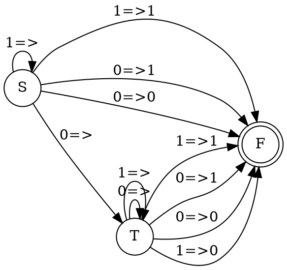

### 1. Язык логических формул с $\Rightarrow$ и без скобок, содержащих только константы $0$ и $1$, таких что их значение равно $1$. Считаем следование правоассоциативным, т.е. $1 \Rightarrow 0 \Rightarrow 0$ понимаем как $1 \Rightarrow (0 \Rightarrow 0)$.

Если справа 1, то слева может быть все что угодно.
Если справа 0, то слева только 0.

Соответственно, можно регулярку строить рекурсивно, относительно правого выражения.
- Если справа $0\Rightarrow0$, $0\Rightarrow1$, $1\Rightarrow1$, то слева может быть любое регулярное выражение
- Если справа стоит $1\Rightarrow0$, то слева должно быть $0\Rightarrow X$, где X - это ложное выражение

Регулярка делает вывод о разборе по первому символу. Если символ 0, то формула будет истинной при любом суффиксе. Если 1, то истина только если истин суффикс.
Выведем регулярку через грамматику
```
S -> 0 => T | 1 => S | 1 => 1 | 0 => 0 | 0 => 1 // верное логическое выражение
T -> 0 => T | 1 => 1 | 1 => 1 | 0 => 0 | 0 => 1 | 1 => 0 // любое логическое выражение
```

Таким образом можно построить НКА, разбирающий язык(приведен без промежуточных состояний):


Далее при необходимости можно добавить промежуточные состояния и детерминизирвать.

### 2. Язык $\{w_1 v w_2 \big{|} w_2 = h (w_1)h(w_1) \& w_i \in \{a, b\}^* \& v \in b^*a^*\}$, где h -  гомоморфизм, определённый правилами $h(a) = aa, h(b) = a$.

Грамматика
```
S -> aSaaaa | bSaa | T
T -> BA
A -> aA | ε
B -> bB | ε
```
Так допустимо, так как образы гомоморфизма комутативны, то есть можно спокойно перемещать так как необходимо и нужно учитывать только количество. Поэтому структуру последовательных слов преобразуем в комутативную ей скобочную структуру.
$$S \to aS\underbrace{aa}_{h(a)}\underbrace{aa}_{h(a)} \mid bS\underbrace{a}_{h(b)}\underbrace{a}_{h(b)} \mid T$$


### 3. Язык деревьев арифметических выражений с операциями бинарного сложения и умножения, а также одноразрядными числами, таких, что они вычисляют простое число.
#пустой 
В-первых, определим как задается язык деревьев арифметических выражений, вычисляющих простое число $p$.
В листьях может быть одноразрядные числа $0,1,2,3,4,5,6,7,8,9$.
В ветвях может быть только $+(T1, T2)$ и $*(T1, T2)$.


Что мы знаем про вычисления простых чисел?
- Простое число не может иметь делителей $\implies$ в корне дерева не может быть операции умножения