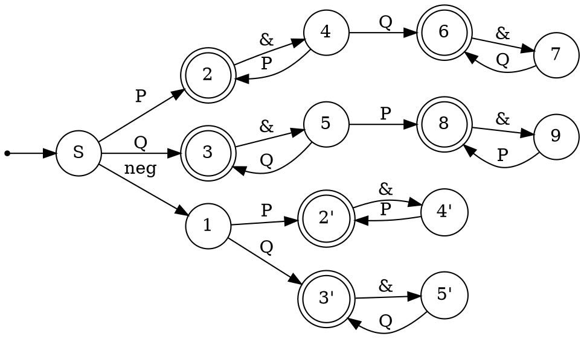
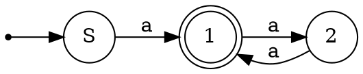
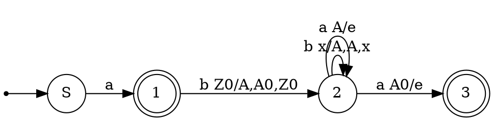
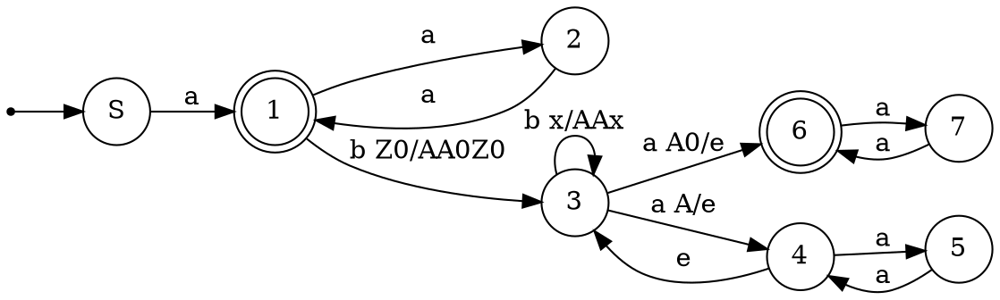

### 1. Язык правильно построенных логических формул над алфавитом $\{(,),P, Q, \land, \neg\}$, таких что в их каждом подслове длинны 3, кроме, возможно, единственного, первая и последняя буквы совпадают
Решение:
Рассмотрим сначала возможные "правильные" подслова(P или Q буду обозначать за X)
+ X&X - правильное
+ &X& - правильное(при условии, что до и после будет идти выражение)
+ ((( - правильное, при условии, что после все скобки будут закрыты
+ ))) - аналогично
Других правильных подслов нет, что нетрудно вывести.
Теперь рассмотрим возможные единственные "неправильные" подслова:
+ $\neg X\&X$ - может быть
+ $X\&\neg X\&X$ - не может быть, так как аж 3 подслова будут неправильные
+ с скобками неправильные подслова будут порождаться как открывающей так и закрывающей скобкой
+ $P\&P\&Q\&Q\&Q$ - также подходит, так как только одно слово неправильное

Соответственно, условие задает язык слов, либо конкатенаций P, либо конкатенаций Q, либо отрицание и последующие одинаковые конкатенации, либо конкатенации с единственным переходом к другой букве.

Построим автомат:

### 2. Грамматика 
$S \to SSa$
$S\to SbSS$
$S \to a$
Решение:
Сначала Рассмотрим ограниченные грамматики
1)$S \to SSa|a$
Эта грамматика задает язык нечетных количеств букв а

2)$S->SbSS|a$
Эта грамматика задает язык слов, начинающихся с a, после которого могут быть слова, начинающиеся с b и количество букв a в 2 раза больше количества букв b.

Cоответсвенно, можно объединить обе грамматики, и тогда получим нужный нам автомат

Данный недетерминированный автомат в свою очередь разбирает все слова из языка
### 3. Язык $\{w_1 w_2 w_3 | w_1 w_3 = h(w_2) \& w_2 \in \{a,b\}^*\}$, где h - это гомоморфизм, определяемый как $h(a) = aa$, $h(b)=ab$
Решение:
Гипотеза - язык не КС. Будем доказывать, через противоречие по [[Лемма о накачке для КС-языков|лемме о накачке]].
Пусть p - длинна накачки.
Рассмотрим слово $w=a^{4p}(ab)^{2p}a^{2p}b^{2p}a^{2p}b^{2p}a^{4p}(ab)^{2p}$. Это слово имеет ровно одно разбиение на $w_1, w_2, w_3$.
При попытке накачать какое-либо из этих подслов, ломается баланс между словами.
При попытке накачать w1 и w2 ломается баланс между началом w1 и началом w2. При попытке накачать w2 и w3 ломается баланс между концом w2 и концом w3. $\implies$ Слово нельзя накачать $\implies$ по лемме о накачке язык не КС. $\square$ 