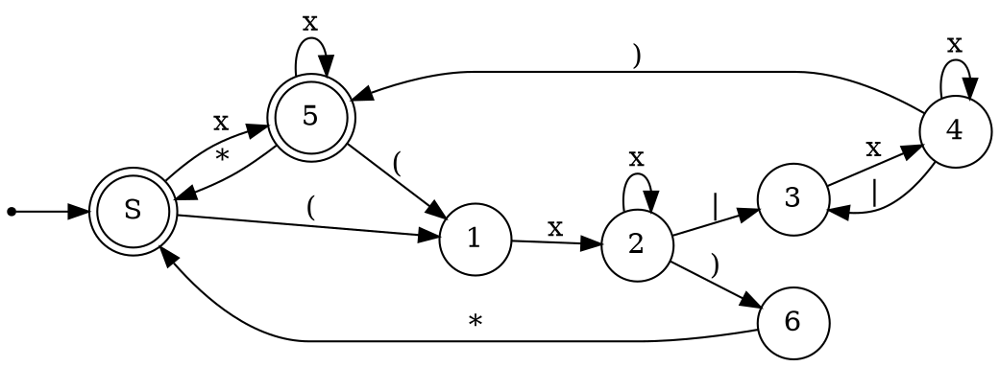

### 1. Язык, описывающий регулярные выражения не больше чем с одним уровнем вложенности скобок, причем без избыточных скобок, с учетом ассоциативности конкатенации и альтернативы (т.е., например, (ab) - недопустимо, (a|b)b или (ab)$^*$ - допустимо). Входное регулярное выражение может содержать $*$, | и латинские буквы.
Ограничу количество переходов: x - переход по латинской букве. 

### 2. Язык слов $\{w v u_1 w v a^* | [w \in a^*b] \& [v \in ba^*] \& u_i \in \{a,b\}^*\}$
На первый взгляд может показаться, что язык является регулярным и задается регуляркой
$a^*bba^*.^*a^*bba^*a^*$
Но это не так. В словах языка требуется повторение фрагментов $wv$.

### 3. Древесный язык арифметических выражений с бинарными операциями $+, -$, а также константой 1, вычисляющий положительные числа