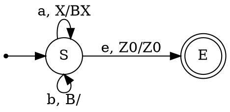
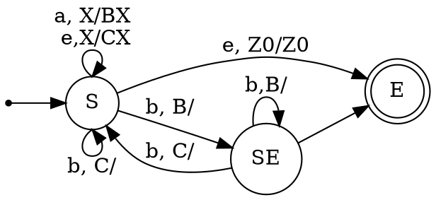

Напомним теорему Шютценберже о контекстно-свободных языках.

> [!example] Теорема Хомского-Шютценберже о представлении КС-языков
> Каждый контекстно-свободный язык является гомоморфным образом пересечения языка Дика с регулярным языком.

Эта теорема может быть применимой при построении магазинных автоматов по грамматикам. Действительно:
1. язык Дика с $n$ скобками легко представить магазинным автоматом.
2. регулярный язык определяет структуру переходов в автомате, не влияя на стек.
3. построить гомоморфный образ МП-автомата также можно алгоритмически.
Чтобы понять идею метода, рассмотрим для начала собственно язык Дика в алфавите $\{a,b\}$ и самую простую грамматику для него.
$$\begin{array}{lll}
S \rightarrow \underbrace{a}_{PUSH\;B} \overbrace{S}^{\text{после }a} \underbrace{b}_{POP\;B} \overbrace{S}^{\text{после }b} & \qquad\qquad & \underbrace{S\rightarrow \varepsilon}_{\text{можно завершиться сразу в }S}
\end{array}
$$
Если увидеть, что пара $a$, $b$ определяет поведение стека, а нетерминальные символы - состояния, куда следует перейти после определённых действий со стеком, то построить по этой грамматике МП-автомат не составляет труда.

Применим эту же идею для грамматики, содержащей правила $S\rightarrow a S b$, $S\rightarrow S b S$, $S\rightarrow \varepsilon$:
$$\begin{array}{lll}
S \rightarrow \underbrace{a}_{PUSH\;B} \overbrace{S}^{\text{после }a} \underbrace{b}_{POP\;B} &\qquad S \rightarrow \underbrace{\;}_{PUSH\;C} \overbrace{S}^{\text{после пустого шага}} \underbrace{b}_{POP\;C} \overbrace{S}^{\text{после }b} & \underbrace{S\rightarrow \varepsilon}_{\text{можно завершиться сразу в }S}
\end{array}
$$
Второе правило раскладывается по общей схеме, только видно, что открывающая скобка здесь отображается морфизмом в пустое слово. С первым чуть сложнее: если выписывать его полностью согласно отображению, оно должно было бы выглядеть примерно так: $S\rightarrow a S b S_E$, $S_E\rightarrow \varepsilon$. То есть после сбрасывания со стека символа $B$ мы должны перейти в "фантомное" состояние, в котором всё, что возможно сделать - это найти очередную "закрывающую скобку" (символ на вершине стека) и совершить переход согласно этой скобке.
