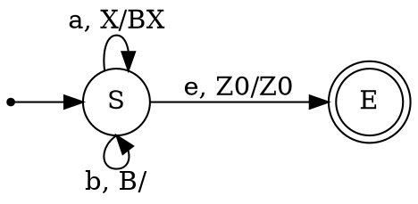
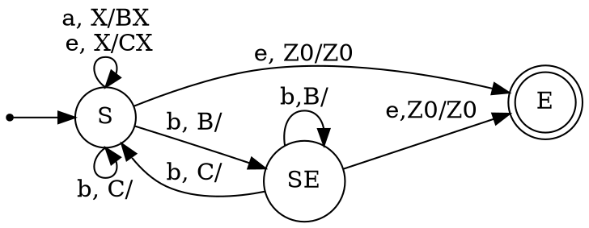
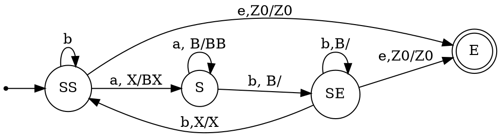
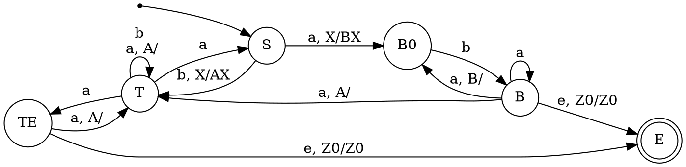

Напомним теорему Шютценберже о контекстно-свободных языках.

> [!theorem] Теорема Хомского-Шютценберже о представлении КС-языков
> Каждый контекстно-свободный язык является гомоморфным образом пересечения языка Дика с регулярным языком.

Эта теорема может быть применимой при построении магазинных автоматов по грамматикам. Действительно:
1. язык Дика с $n$ скобками легко представить магазинным автоматом.
2. регулярный язык определяет структуру переходов в автомате, не влияя на стек.
3. построить гомоморфный образ МП-автомата также можно алгоритмически.
Чтобы понять идею метода, рассмотрим для начала собственно язык Дика в алфавите $\{a,b\}$ и самую простую грамматику для него.
$$\begin{array}{lll}
S \rightarrow \underbrace{a}_{PUSH\;B} \overbrace{S}^{\text{после }a} \underbrace{b}_{POP\;B} \overbrace{S}^{\text{после }b} & \qquad\qquad & \underbrace{S\rightarrow \varepsilon}_{\text{можно завершиться сразу в }S}
\end{array}
$$
Если увидеть, что пара $a$, $b$ определяет поведение стека, а нетерминальные символы - состояния, куда следует перейти после определённых действий со стеком, то построить по этой грамматике МП-автомат не составляет труда.

Применим эту же идею для грамматики, содержащей правила $S\rightarrow a S b$, $S\rightarrow S b S$, $S\rightarrow \varepsilon$:
$$\begin{array}{lll}
S \rightarrow \underbrace{a}_{PUSH\;B} \overbrace{S}^{\text{после }a} \underbrace{b}_{POP\;B}\overbrace{\;}^{\text{после b?}} &\qquad S \rightarrow \underbrace{\;}_{PUSH\;C} \overbrace{S}^{\text{после пустого шага}} \underbrace{b}_{POP\;C} \overbrace{S}^{\text{после }b} & \underbrace{S\rightarrow \varepsilon}_{\text{можно завершиться сразу в }S}
\end{array}
$$
Второе правило раскладывается по общей схеме, только видно, что открывающая скобка здесь отображается морфизмом в пустое слово. С первым чуть сложнее: если выписывать его полностью согласно отображению, оно должно было бы выглядеть примерно так: $S\rightarrow a S b S_E$, $S_E\rightarrow \varepsilon$. То есть после сбрасывания со стека символа $B$ мы должны перейти в "фантомное" состояние, в котором всё, что возможно сделать - это найти очередную "закрывающую скобку" (символ на вершине стека) и совершить переход согласно этой скобке.

Итоговый МП-автомат содержит недетерминированный $\varepsilon$-переход, влияющий на стек: без него можно было бы обойтись, перенеся недетерминизм на обработку $b$-переходов. Ниже выделено состояние $SS$ - начало разбора нетерминала $S$, не манипулирующее со стеком.

:

> [!tip] Алгоритм построения PDA по КС-грамматике посредством отображения Хомского-Шютценберже
> Предполагаем, что в правой части каждого правила может быть не более двух нетерминалов (если их больше, то правила можно разбить, либо применить другую эвристику).
> Рассмотрим правило $N_1 \rightarrow \gamma_1 N_2 \gamma_2 N_3 \gamma_3$. Тогда:
> 1. Находясь в состоянии $N_1$ и прочитав $\gamma_1$, "открываем скобку" для $N_2$: закладываем на стек символ $B_{\gamma_1}$ и переходим в состояние $N_2$.
> 2. Находясь в конце состояния $N_2$ и прочитав $\gamma_2$, располагая символом $B_{\gamma_1}$ на вершине стека, "закрываем скобку" и переходим в состояние $N_3$.
> 3. Находясь в конце состояния $N_3$ и прочитав $\gamma_3$, переходим в конец состояния $N_1$.
> 
> Далее для каждого нетерминала $N_i$ определяем по грамматике множество "закрывающих скобок", которые могут после него следовать. Это множество определяется его $Follow$-множеством на линеаризованной исходной КС-грамматике и задаёт тот регулярный язык, с которым следует пересечь наше построение. 

Если правило короче (содержит только один нетерминал или не содержит их вовсе), можно пропустить соответствующие шаги. Например, правило вида $N_1\rightarrow N_2 \gamma_2$ определяет следующие шаги:
> 1. Находясь в состоянии $N_1$, можно перейти в состояние $N_2$.
> 2. Находясь в конце состояния $N_2$ и прочитав $\gamma_2$, переходим в конец состояния $N_1$.

Теперь применим описанный алгоритм по шагам к уже знакомой грамматике, которую заранее линеаризуем (только по терминальным символам):

$$\begin{array}{lll}
S \rightarrow \underbrace{a_1}_{PUSH\;B_a} \overbrace{S}^{\text{после }a_1} \underbrace{b_1}_{POP\;B_a}\overbrace{S_E}^{\text{после }b_1} &\qquad S \rightarrow \underbrace{\varepsilon}_{PUSH\;B_\varepsilon} \overbrace{S}^{\text{после пустого шага}} \underbrace{b_2}_{POP\;B_\varepsilon} \overbrace{S}^{\text{после }b_2} & \underbrace{S\rightarrow S_E}_{\text{можно завершиться сразу в }S}
\end{array}
$$
Заметим, что $follow(S)=follow(S_E)=\{b_1,b_2,\$\}$. При этом переход по $b_1$ возвращает автомат в состояние $S_E$, переход под $b_2$ переводит его в $S$, переход по $\$$ ведёт в финальное состояние, причём этот переход возможен лишь тогда, когда все скобки закрыты (стек пуст).

> [!example] Пример (Вариант 1, Задача 2)
> Вспомним грамматику и линеаризуем её.
> $$\begin{array}{lll}
S \rightarrow \underbrace{b_1}_{PUSH\;A_b} \overbrace{T}^{\text{после }b_1} \underbrace{a_1}_{POP\;A_b}\overbrace{T}^{\text{после }a_1} &\qquad S \rightarrow \underbrace{B}_{PUSH\;B_\varepsilon} B \overbrace{S_E}^{\text{завершение }S}\\  T\rightarrow \overbrace{b T}^{\text{регулярное условие}} & T\rightarrow \overbrace{a_2 S}^{\text{смена состояния}} & T\rightarrow a_3 \overbrace{T_E}^{\text{завершение }T} \\ B\rightarrow \overbrace{aba^*}^{\text{регулярный язык}}
\end{array}
> $$
>
 
 Теперь построим $follow$-множества:
 - $follow(T) = follow(S)=\{a_2, \$\}$
 И на основе всего перечисленного PDA:

Недетерминизм в данном PDA можно уменьшить, если более аккуратно обрабатывать разбор правила $S\rightarrow BB$ (добавить дополнительные состояния, учитывающие, какая часть регулярного выражения $aba^+ ba^*$ уже прочитана).  
