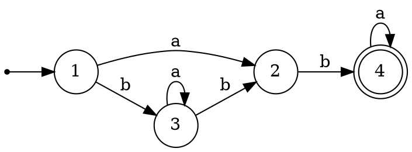
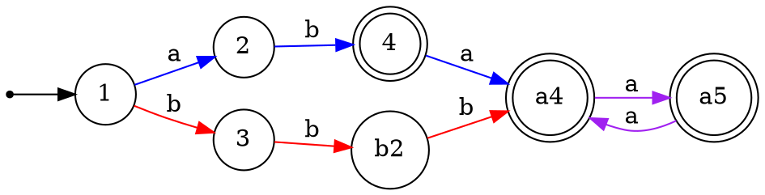
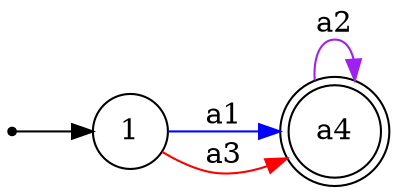

Относительно обратных морфизмов замкнуты не только регулярные и контекстно-свободные языки, но и детерминированные КС-языки. Поэтому было бы полезно научиться строить языки, связанные отношением обратного морфизма, с рассматриваемыми.

Напомним формальное определение $h^{-1}(\mathcal{L})$.

> [!definition] Обратно-гомоморфный образ языка
> Пусть $h$ - морфизм, описанный как отображение элементов $\Sigma'$ в $\Sigma^+$, и $\mathcal{L}\subseteq \Sigma^*$. Тогда $h^{-1}(\mathcal{L})=\bigl\{\omega\in\Sigma'^*\mid h(\omega)\in\mathcal{L}\bigr\}$.

Важно отметить, что в общем случае $h(h^{-1}(\mathcal{L}))\neq \mathcal{L}$. Можно лишь гарантировать, что $h(h^{-1}(\mathcal{L}))\subseteq \mathcal{L}$. Также выполняется отношение  $\mathcal{L}\subseteq h^{-1}(h(\mathcal{L}))$.

> [!example] Простейший пример
> Если $h(a)=a^2$, $h(b)=b^2$, то $h^{-1}(\{a,b,aba,abb,aabb\})=\{ab\}$. Никакое слово исходного множества, кроме последнего, не может получиться морфизмом $h$.
> 
> Если расширить морфизм $h$ для алфавита $\{a,b,c\}$ так: $h(c)=a$, то $h^{-1}(\{a,b,aba,abb,aabb\})=\{c,cb,ccb,ab\}$. Заметим, что слово $aabb$ является образом двух разных слов: $ccb$ и $ab$. 
> 

Отметим, что в определении выше рассматривается лишь случай нестирающего (*non-erasing*) морфизма $h$ - отображающего все буквы в непустые слова. Его можно легко расширить и на стирающий случай, более того, предъявить универсальную конструкцию, дополняющую $h^{-1}(\mathcal{L})$ до $h'^{-1}(\mathcal{L})$, где $h'$ есть расширение нестирающего морфизма на $\Sigma'\cup\mathcal{M}$ такое, что $\forall \gamma\in\mathcal{M}(h'(\gamma)=\varepsilon)$.
Действительно, $a_1 a_2 \dots a_n\in h^{-1}(\mathcal{L})\Leftrightarrow \omega_1 a_1 \omega_2 a_2 \dots \omega_n a_n \omega_{n+1}\in h'^{-1}(\mathcal{L})$, где все $\omega_i$ принадлежат $\mathcal{M}^*$. Таким образом, обратное отношение относительно образа по стирающему морфизму отличается от обратного отношения по его нестирающему сужению тем, что слова могут быть "разорваны" в произвольном количестве мест произвольными словами из букв, отображаемых в пустое слово.
Известно, что регулярные языки замкнуты относительно обратных морфизмов. Проще всего это увидеть, если рассмотреть детерминированный конечный автомат, распознающий язык. В нём будут отрезки путей, вдоль которых можно прочитать образы, порождаемые выбранным (нестирающим) морфизмом. Заменим эти отрезки путей на переходы по буквам, имеющим соответствующие образы, и получим автомат, распознающий требуемый язык.

Например, рассмотрим простой ДКА ниже:

Построим обратный образ его языка относительно морфизма $\begin{cases}h(a_1)=aba\\ h(a_2)=aa\\h(a_3)=bbb\end{cases}$. Для этого развернём все пути, достижимые по подсловам $\textcolor{blue}{aba}$, $\textcolor{violet}{aa}$, $\textcolor{red}{bbb}$. Сразу же видно, что в цикл внутри состояния $3$ войти не получится: для этого нужно прочитать ровно одну букву $b$, а вслед за ней букву $a$, что невозможно в рамках комбинации указанных строк.

Осталось заменить подслова их прообразами:

Теперь рассмотрим, как можно использовать переход к прообразам по обратному морфизму в решении задач на анализ языков. Простейший и самый удобный для использования случай таких переходов - переходы к прообразам морфизмов, представляющих собой однозначные коды, - такие, как морфизм $h$ в примере выше. Действительно, множество слов $F=\{aa, aba, bb\}$ представляет собой "инфиксный код" (*англ.* factor code): ни одно из этих слов не является подсловом другого, поэтому, если известно, что $\upsilon_1 \upsilon_2 \dots \upsilon_m = \omega_1 \dots \omega_n$ и $\forall i\in\{1,..,m\}\forall j\in\{1,..,n\}\bigl(\upsilon_i\in F\,\&\, \omega_j\in F\bigr)$, то $m=n$ и $\forall i(\omega_i=\upsilon_i)$.
Помимо инфиксных кодов, разумеется, удобно использовать префиксные и суффиксные коды - они обладают таким же свойством.

>[!example] Пример решения задачи на анализ языка через обратные морфизмы
>Разберёмся, является ли контекстно-свободным язык $\mathcal{L}=\bigl\{\omega\in (a|b)^*\mid |\omega|_{aab}=|\omega|_{aaa}\,\&\,|\omega|_{aa}=|\omega|_{bb}\bigr\}$ .
>Здесь $|\omega|_{\upsilon}$ - число вхождений слов $\upsilon$ в слове $\omega$. Напомним, что подслова считаются с перекрытиями, так в слове $aaaa$ есть два вхождения $aaa$ и три вхождения $aa$.  
>Поскольку зависимости здесь две, и они не совсем перекрывающиеся, логично предположить, что контекстно-свободным язык не будет. Но из-за подсчёта подслов с перекрытиями не ошибиться при построении контрпримера довольно сложно, и вот здесь может помочь переход к прообразам.
>Как построить удачный морфизм $h$? Во-вторых, удобно, чтобы множество образов букв $F$ было однозначным кодом. Видно, что двумя буквами в алфавите $h^{-1}(\mathcal{L})$ обойтись не удастся - между их кратностями получится только линейная зависимость, а её нетрудно смоделировать контекстно-свободным языком. Поэтому мощность $F$ должна быть не меньше $3$. 
>Поскольку подслов вида $ba$ в отслеживаемых инфиксах языка $\mathcal{L}$ нет, удобно рассмотреть код $F$, в котором все слова начинаются на $a$, а заканчиваются на $b$ - это гарантирует, что подсчёт будет осуществляться лишь в рамках указанных элементов кода, без захода на стыки между ними. Видно, что при этом не хватит длины слов $F$ три или меньше, мы же хотим, чтобы количество прообразов $aaa$ было ненулевым. Но код вида:
>$$\begin{cases}h(a_1) = aaab \\ h(a_2) = aabb \\ h(a_3) = abbb\end{cases}$$
>уже включает в себя все отслеживаемые слова и удовлетворяет условиям выше.
>Построим требуемые соотношения на число вхождений букв в $\omega\in h^{-1}(\mathcal{L})$. 
>$$\begin{cases}|h(\omega)|_{aaa} = |\omega|_{a_1} = |h(\omega)|_{aab} = |\omega|_{a_2} \\ |h(\omega)|_{aa} = 2\cdot|\omega|_{a_1}+|\omega|_{a_2} = |h(\omega)|_{bb} = |\omega|_{a_2} + 2\cdot|\omega|_{a_3}\end{cases}$$
>Очевидно, это уравнение эквивалентно условию $|\omega|_{a_1} = |\omega|_{a_2} = |\omega|_{a_3}$ на слова из $h^{-1}(\mathcal{L})$, которое является классическим примером условия, не выразимого в контекстно-свободном языке.

Регулярка $((ab|caa^*)^*a?bb)^*c$ морфизм $h(a)=aa$, $h(b)=bbc$, $h(c)=abb$, $h(d)=aab$ бессуффиксный. Результат $c?(bc|ba^*d|ba^+)^*b$
Регулярка $((aa)^*ab(aa)^*ab)^*$ морфизм $h(a)=aa$, $h(b)=aaab$, $h(c)=a^5$ и натуральные разложения