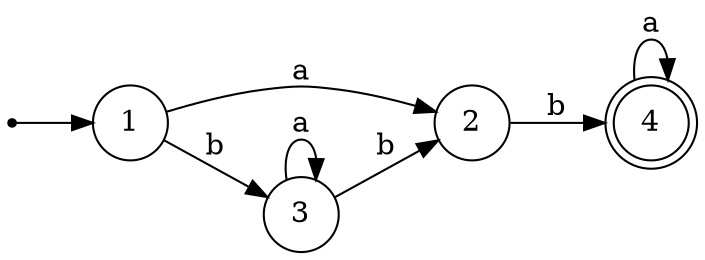
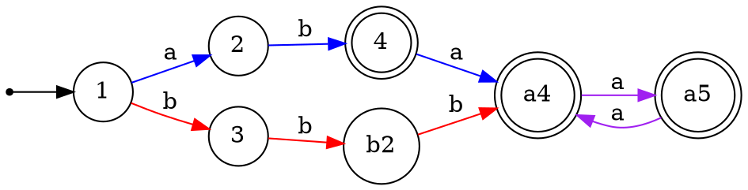
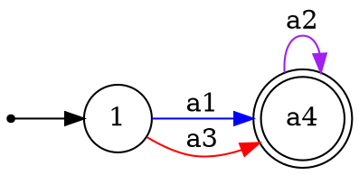

Относительно обратных морфизмов замкнуты не только регулярные и контекстно-свободные языки, но и детерминированные КС-языки. Поэтому было бы полезно научиться строить языки, связанные отношением обратного морфизма, с рассматриваемыми.

Напомним формальное определение $h^{-1}(\mathcal{L})$.

> [!definition] Обратно-гомоморфный образ языка
> Пусть $h$ - морфизм, описанный как отображение элементов $\Sigma'$ в $\Sigma^+$, и $\mathcal{L}\subseteq \Sigma^*$. Тогда $h^{-1}(\mathcal{L})=\bigl\{\omega\in\Sigma'^*\mid h(\omega)\in\mathcal{L}\bigr\}$.

Важно отметить, что в общем случае $h(h^{-1}(\mathcal{L}))\neq \mathcal{L}$. Можно лишь гарантировать, что $h(h^{-1}(\mathcal{L}))\subseteq \mathcal{L}$. Также выполняется отношение  $\mathcal{L}\subseteq h^{-1}(h(\mathcal{L}))$.

> [!example] Простейший пример
> Если $h(a)=a^2$, $h(b)=b^2$, то $h^{-1}(\{a,b,aba,abb,aabb\})=\{ab\}$. Никакое слово исходного множества, кроме последнего, не может получиться морфизмом $h$.
> 
> Если расширить морфизм $h$ для алфавита $\{a,b,c\}$ так: $h(c)=a$, то $h^{-1}(\{a,b,aba,abb,aabb\})=\{c,cb,ccb,ab\}$. Заметим, что слово $aabb$ является образом двух разных слов: $ccb$ и $ab$. 
> 

Отметим, что в определении выше рассматривается лишь случай нестирающего (*non-erasing*) морфизма $h$ - отображающего все буквы в непустые слова. Его можно легко расширить и на стирающий случай, более того, предъявить универсальную конструкцию, дополняющую $h^{-1}(\mathcal{L})$ до $h'^{-1}(\mathcal{L})$, где $h'$ есть расширение нестирающего морфизма на $\Sigma'\cup\mathcal{M}$ такое, что $\forall \gamma\in\mathcal{M}(h'(\gamma)=\varepsilon)$.
Действительно, $a_1 a_2 \dots a_n\in h^{-1}(\mathcal{L})\Leftrightarrow \omega_1 a_1 \omega_2 a_2 \dots \omega_n a_n \omega_{n+1}\in h'^{-1}(\mathcal{L})$, где все $\omega_i$ принадлежат $\mathcal{M}^*$. Таким образом, обратное отношение относительно образа по стирающему морфизму отличается от обратного отношения по его нестирающему сужению тем, что слова могут быть "разорваны" в произвольном количестве мест произвольными словами из букв, отображаемых в пустое слово.
Известно, что регулярные языки замкнуты относительно обратных морфизмов. Проще всего это увидеть, если рассмотреть детерминированный конечный автомат, распознающий язык. В нём будут отрезки путей, вдоль которых можно прочитать образы, порождаемые выбранным (нестирающим) морфизмом. Заменим эти отрезки путей на переходы по буквам, имеющим соответствующие образы, и получим автомат, распознающий требуемый язык.

Например, рассмотрим простой ДКА ниже:

Построим обратный образ его языка относительно морфизма $\begin{cases}h(a_1)=aba\\ h(a_2)=aa\\h(a_3)=bbb\end{cases}$. Для этого развернём все пути, достижимые по подсловам $\textcolor{blue}{aba}$, $\textcolor{violet}{aa}$, $\textcolor{red}{bbb}$. Сразу же видно, что в цикл внутри состояния $3$ войти не получится: для этого нужно прочитать ровно одну букву $b$, а вслед за ней букву $a$, что невозможно в рамках комбинации указанных строк.


Осталось заменить подслова их прообразами:

Теперь рассмотрим, как можно использовать переход к прообразам по обратному морфизму в решении задач на анализ языков. Простейший и самый удобный для использования случай таких переходов - переходы к прообразам морфизмов, представляющих собой однозначные коды, - такие, как морфизм $h$ в примере выше. Действительно, множество слов $F=\{aa, aba, bb\}$ представляет собой "инфиксный код" (*англ.* factor code): ни одно из этих слов не является подсловом другого, поэтому, если известно, что $\upsilon_1 \upsilon_2 \dots \upsilon_m = \omega_1 \dots \omega_n$ и $\forall i\in\{1,..,m\}\forall j\in\{1,..,n\}\bigl(\upsilon_i\in F\,\&\, \omega_j\in F\bigr)$, то $m=n$ и $\forall i(\omega_i=\upsilon_i)$.
Помимо инфиксных кодов, разумеется, удобно использовать префиксные и суффиксные коды - они обладают таким же свойством.

>[!example] Пример решения задачи на анализ языка через обратные морфизмы
>Разберёмся, является ли контекстно-свободным язык $\mathcal{L}=\bigl\{\omega\in (a|b)^*\mid 2\cdot |\omega|_{aab}=|\omega|_{aaa}\,\&\,|\omega|_{aa}=|\omega|_{bb}\bigr\}$ .
>Здесь $|\omega|_{\upsilon}$ - число вхождений слов $\upsilon$ в слове $\omega$. Напомним, что подслова считаются с перекрытиями, так в слове $aaaa$ есть два вхождения $aaa$ и три вхождения $aa$.  
>Поскольку зависимости здесь две, и они не совсем перекрывающиеся, логично предположить, что контекстно-свободным язык не будет. Но из-за подсчёта подслов с перекрытиями не ошибиться при построении контрпримера довольно сложно, и вот здесь может помочь переход к прообразам.
>Как построить удачный морфизм $h$? Во-вторых, удобно, чтобы множество образов букв $F$ было однозначным кодом. Видно, что двумя буквами в алфавите $h^{-1}(\mathcal{L})$ обойтись не удастся - между их кратностями получится только линейная зависимость, а её нетрудно смоделировать контекстно-свободным языком. Поэтому мощность $F$ должна быть не меньше $3$. 
>Поскольку подслов вида $ba$ в отслеживаемых инфиксах языка $\mathcal{L}$ нет, удобно рассмотреть код $F$, в котором все слова начинаются на $a$, а заканчиваются на $b$ - это гарантирует, что подсчёт будет осуществляться лишь в рамках указанных элементов кода, без захода на стыки между ними. Видно, что при этом не хватит длины слов $F$ три или меньше, мы же хотим, чтобы количество прообразов $aaa$ было ненулевым. Но код вида:
>$$\begin{cases}h(a_1) = aaab \\ h(a_2) = aabb \\ h(a_3) = abbb\end{cases}$$
>уже включает в себя все отслеживаемые слова и удовлетворяет условиям выше.
>Построим требуемые соотношения на число вхождений букв в $\omega\in h^{-1}(\mathcal{L})$. 
>$$\begin{cases}2\cdot|h(\omega)|_{aaa} = 2\cdot|\omega|_{a_1} = |h(\omega)|_{aab} = |\omega|_{a_1}+|\omega|_{a_2} \\ |h(\omega)|_{aa} = 2\cdot|\omega|_{a_1}+|\omega|_{a_2} = |h(\omega)|_{bb} = |\omega|_{a_2} + 2\cdot|\omega|_{a_3}\end{cases}$$
>Очевидно, это уравнение эквивалентно условию $|\omega|_{a_1} = |\omega|_{a_2} = |\omega|_{a_3}$ на слова из $h^{-1}(\mathcal{L})$, которое является классическим примером условия, не выразимого в контекстно-свободном языке.

Иногда удобно использовать и рассуждения в обратную сторону - например, в случае, когда по языку хорошо считывается недетерминированная конструкция распознающей машины, но детерминировать её неприятно. 

> [!example] Пример анализа языка на регулярность
> Разберёмся, является ли регулярным язык $\mathcal{L}_0 = \bigl\{(a^{k_i}b)^*\mid \forall i \exists m_i, n_i (2\cdot k_i = 5\cdot m_i + 7\cdot n_i +1)\bigr\}$.
> Проницательный читатель сразу же догадается, что язык регулярный: действительно, можно построить НКА, который случайным образом отсчитывает буквы $a$, формирующие блок $a^{5\cdot m_i}$, затем переключается на отсчёт букв, формирующих $a^{7\cdot n_i}$, и наконец считывает букву, не вошедшую в эти блоки. Правда, при этом ещё нужно учитывать, что каждая буква $a$ в таких блоках будет посчитана дважды. Если применить к $\mathcal{L}_0$ морфизм $\begin{cases} h_1(a)=a^2\\ h_1(b)=b\end{cases}$, то для $h_1(\mathcal{L}_0)$  описанная естественная конструкция НКА (см. диаграмму ниже), пересечённая с НКА для языка $((aa)^+b)^*$, уже сработает корректно:
>```dot
> digraph{
 > rankdir=LR
> node [shape=circle]
> start [shape=doublecircle]
> point [shape=point]
 > point -> start
 > start -> base [label="a", color=red]
> base -> c1 [label="a",color=blue]
>c1 -> c2 [label="a",color=blue]
>c2 -> c3 [label="a",color=blue]
>c3 -> c4 [label="a",color=blue]
>c4 -> base [label="a",color=blue]
>base -> cc1 [label="a",color=purple]
>cc1 -> cc2 [label="a",color=purple]
>cc2 -> cc3 [label="a",color=purple]
>cc3 -> cc4 [label="a",color=purple]
>cc4 -> cc5 [label="a",color=purple]
>cc5 -> cc6 [label="a",color=purple]
>cc6 -> base [label="a",color=purple]
>base -> start [label="b", color=red]
>}
>``` 
>Раз $h_1(\mathcal{L}_0)$ регулярен, то $h_1^{-1}\bigl(h_1(\mathcal{L}_0)\bigr)$ тоже регулярен. Чтобы применить это наблюдение к решению задачи, осталось заметить, что $h_1^{-1}\bigl(h_1(\mathcal{L}_0)\bigr)=\mathcal{L}_0$. Действительно, морфизм $h_1$ инъективен, поэтому у каждого слова в $h_1(\mathcal{L}_0)$ имеется ровно один прообраз.
>Можно дополнительно заметить, что если к $h_1(\mathcal{L}_0)$ применить морфизм, обратный к $\begin{cases}h_2(a_1) = \textcolor{red}{ab} \\ h_2(a_2) = \textcolor{blue}{a^5} \\ h_2(a_3) = \textcolor{violet}{a^7}\end{cases}$, то получится совсем простой регулярный язык $((a_2|a_3)^*a_1)^*$. И раскрутить цепочку зависимостей ещё дальше:
>$$\begin{split}h_2^{-1}(h_1(\mathcal{L}_0)) \text{ регулярен} \Rightarrow \begin{cases}(h_2\circ h^{-1}_2)((h_1(\mathcal{L}_0)))\text{ регулярен},\\ \text{ причём }(h_2\circ h^{-1}_2)((h_1(\mathcal{L}_0)))=h_1(\mathcal{L}_0),\\\text{ поскольку }h_2^{-1}(h_1(\mathcal{L}_0))\text{ содержит прообразы всех слов из }h_1(\mathcal{L}_0)\end{cases}\\\Rightarrow \begin{cases}(h_1^{-1}\circ h_1)(\mathcal{L}_0))\text{ регулярен},\\\text{ причём }(h_1^{-1}\circ h_1)(\mathcal{L}_0))=\mathcal{L}_0,\\\text{ поскольку }h_1\text{ инъективен}\end{cases}\end{split}$$
>Эта техника иногда значительно упрощает рассуждения, но требует аккуратности при переходе от $(h^{-1}\circ h)(\mathcal{L})$ или $(h\circ h^{-1})(\mathcal{L})$ к $\mathcal{L}$ - в первом случае нужно проверить, что не появляется никаких лишних слов в прообразе образа языка, а во втором случае необходимо гарантировать тот факт, что у каждого слова в $\mathcal{L}$ есть прообраз.

Интересен пример доказательства замкнутости контекстно-свободных языков относительно операции асинхронной конкатенации (*shuffle*) с регулярным языком посредством использования замкнутости контекстно-свободных и регулярных языков относительно обратных морфизмов. Причём морфизмы в этом доказательстве стирающие.

Операция асинхронной конкатенации $\#$ определяется следующим образом: 
$a_1 a_2 \dots a_k \# b_1 b_2 \dots b_m = \omega_0 a_1 \omega_1 a_2\dots \omega_{k-1} a_k \omega_k$, причём $\omega_0 \omega_1 \dots \omega_k = b_1 b_2 \dots b_m$. Проще говоря, буквы одного из слов произвольными блоками вставляются между буквами второго слова. Эта операция интересна тем, что в отличие от обычной конкатенации она коммутативна.

>[!theorem] Замкнутость КС-языков по асинхронной конкатенации с регулярным языком
> Пусть $\mathcal{L}$ - КС-язык в алфавите $\Sigma$, $\mathcal{L}'$ - регулярный язык в этом же алфавите. Тогда $\mathcal{L}\#\mathcal{L}'$ контекстно-свободен.
> *Доказательство:*
> Построим $\Sigma_1 = \bigl\{\langle \gamma, 1\rangle\mid \gamma\in\Sigma\bigr\}$, $\Sigma_2 = \bigl\{\langle \gamma, 2\rangle\mid \gamma\in\Sigma\bigr\}$, и морфизмы на $(\Sigma_1\cup \Sigma_2)^*\rightarrow \Sigma^*$: 
> $\begin{cases}h_1(\langle \gamma, 1\rangle) = \gamma \\ h_1(\langle \gamma, 2\rangle) = \varepsilon\end{cases}$ $\qquad$ $\begin{cases}h_2(\langle \gamma, 1\rangle) = \varepsilon \\ h_2(\langle \gamma, 2\rangle) = \gamma\end{cases}$ $\qquad$ $\begin{cases}h_0(\langle \gamma, 1\rangle) = \gamma \\ h_0(\langle \gamma, 2\rangle) = \gamma\end{cases}$ .
> По сути все три морфизма стирают разметку, которая накладывается в алфавитах $\Sigma_1$ и $\Sigma_2$ на элементы $\Sigma$, но первый игнорирует буквы, размеченные двойкой, второй - наоборот, а третий сохраняет все буквы, удаляя только разметку.
> Теперь посмотрим, что за язык $h_1^{-1}(\mathcal{L})$. Все буквы из исходного языка он размечает единицами, но может вставить между ними какие угодно слова из букв, размеченными двойками. Язык этот - КС, по свойствам замкнутости. Аналогично, в языке $h_2^{-1}(\mathcal{L}')$ между буквами исходного регулярного языка, размеченными двойками, добавлены произвольные слова из букв, размеченных единицами. И язык этот - регулярный. Пересечём их:
> $$\overbrace{\underbrace{h_1^{-1}(\mathcal{L})}_{\text{КС-язык}}\cap \underbrace{h_2^{-1}(\mathcal{L}')}_{\text{регулярный язык}}}^{\text{КС-язык}}$$
> Пересечение устроено почти как асинхронная композиция $\mathcal{L}$ и $\mathcal{L}'$, с той лишь разницей, что буквы размечены. Поэтому осталось применить к нему морфизм $h_0$ (также не выводящий результат из класса КС-языков), чтобы доказать требуемое утверждение. QED