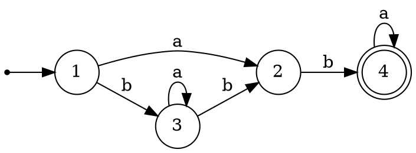
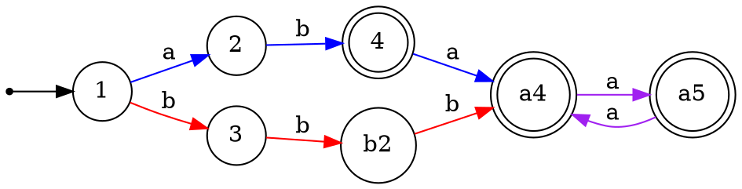
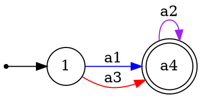

Относительно обратных морфизмов замкнуты не только регулярные и контекстно-свободные языки, но и детерминированные КС-языки. Поэтому было бы полезно научиться строить языки, связанные отношением обратного морфизма, с рассматриваемыми.

Напомним формальное определение $h^{-1}(\mathcal{L})$.

> [!definition] Обратно-гомоморфный образ языка
> Пусть $h$ - морфизм, описанный как отображение элементов $\Sigma'$ в $\Sigma^+$, и $\mathcal{L}\subseteq \Sigma^*$. Тогда $h^{-1}(\mathcal{L})=\bigl\{\omega\in\Sigma'^*\mid h(\omega)\in\mathcal{L}\bigr\}$.

Важно отметить, что в общем случае $h(h^{-1}(\mathcal{L}))\neq \mathcal{L}$. Можно лишь гарантировать, что $h(h^{-1}(\mathcal{L}))\subseteq \mathcal{L}$. Также выполняется отношение  $\mathcal{L}\subseteq h^{-1}(h(\mathcal{L}))$.

> [!example] Простейший пример
> Если $h(a)=a^2$, $h(b)=b^2$, то $h^{-1}(\{a,b,aba,abb,aabb\})=\{ab\}$. Никакое слово исходного множества, кроме последнего, не может получиться морфизмом $h$.
> 
> Если расширить морфизм $h$ для алфавита $\{a,b,c\}$ так: $h(c)=a$, то $h^{-1}(\{a,b,aba,abb,aabb\})=\{c,cb,ccb,ab\}$. Заметим, что слово $aabb$ является образом двух разных слов: $ccb$ и $ab$. 
> 

Отметим, что в определении выше рассматривается лишь случай нестирающего (*non-erasing*) морфизма $h$ - отображающего все буквы в непустые слова. Его можно легко расширить и на стирающий случай, более того, предъявить универсальную конструкцию, дополняющую $h^{-1}(\mathcal{L})$ до $h'^{-1}(\mathcal{L})$, где $h'$ есть расширение нестирающего морфизма на $\Sigma'\cup\mathcal{M}$ такое, что $\forall \gamma\in\mathcal{M}(h'(\gamma)=\varepsilon)$.
Действительно, $a_1 a_2 \dots a_n\in h^{-1}(\mathcal{L})\Leftrightarrow \omega_1 a_1 \omega_2 a_2 \dots \omega_n a_n \omega_{n+1}\in h'^{-1}(\mathcal{L})$, где все $\omega_i$ принадлежат $\mathcal{M}^*$. Таким образом, обратное отношение относительно образа по стирающему морфизму отличается от обратного отношения по его нестирающему сужению тем, что слова могут быть "разорваны" в произвольном количестве мест произвольными словами из букв, отображаемых в пустое слово.
Известно, что регулярные языки замкнуты относительно обратных морфизмов. Проще всего это увидеть, если рассмотреть детерминированный конечный автомат, распознающий язык. В нём будут отрезки путей, вдоль которых можно прочитать образы, порождаемые выбранным (нестирающим) морфизмом. Заменим эти отрезки путей на переходы по буквам, имеющим соответствующие образы, и получим автомат, распознающий требуемый язык.

Например, рассмотрим простой ДКА ниже:

Построим обратный образ его языка относительно морфизма $\begin{cases}h(a_1)=aba\\ h(a_2)=aa\\h(a_3)=bbb\end{cases}$. Для этого развернём все пути, достижимые по подсловам $\textcolor{blue}{aba}$, $\textcolor{violet}{aa}$, $\textcolor{red}{bbb}$. Сразу же видно, что в цикл внутри состояния $3$ войти не получится: для этого нужно прочитать ровно одну букву $b$, а вслед за ней букву $a$, что невозможно в рамках комбинации указанных строк.

Осталось заменить подслова их прообразами:

Задача $\{w_{aab}=w_{aaa} \& w_{aa}=w_{bb}\}$ морфизм $h(a_1) = aabb, h(a_2) = aaab, h(b)=bb$
Регулярка $((ab|caa^*)^*a?bb)^*c$ морфизм $h(a)=aa$, $h(b)=bbc$, $h(c)=abb$, $h(d)=aab$ бессуффиксный. Результат $c?(bc|ba^*d|ba^+)^*b$
Регулярка $((aa)^*ab(aa)^*ab)^*$ морфизм $h(a)=aa$, $h(b)=aaab$, $h(c)=a^5$ и натуральные разложения