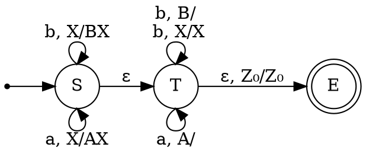
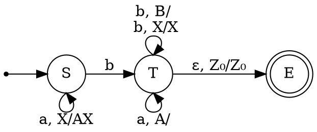

Напомним, что стековый автомат считается недетерминированным, если в нём присутствует хотя бы одна пара переходов $\langle q_0, \gamma_1, \Delta\rangle\to \langle q_1, \Delta'_1\rangle$, $\langle q_0, \gamma_2,\Delta\rangle\to \langle q_2, \Delta'_2\rangle$ такая, что $\Delta_1 = \Delta_2 \land (\gamma_1 = \gamma_2\lor \gamma_1 = \varepsilon \lor \gamma_2 = \varepsilon)$. Заметим, что это определение имеет чисто синтаксическую природу: нас не волнует, может ли вообще появиться символ $\Delta$ на вершине стека в состоянии $q_0$. Даже если такое сочетание невозможно ни на каком пути исполнения МП-автомата, он всё равно считается недетерминированным. Более того, недетерминированные переходы очень часто можно удалить посредством более аккуратной обработки однородных блоков букв в слове.

**Пример**

Язык $\mathcal{L}_0 = \{ww' | \text{при стирании из }w'\text{ некоторого количества букв }b\text{ получается } w^R\}$ легко распознать "в лоб по определению" с помощью недетерминированного МП-автомата.

В нём есть несколько неоднозначных переходов: из состояния $S$ в состояние $T$; обработка букв в состоянии $T$, а также выход из него в состояние $E$. Однако оказывается, что от двух последних можно избавиться. Действительно, можно потребовать, чтобы вместо перехода $b, X/X$ из состояния $T$ в себя был переход вида $b, A/A$, и дополнительно добавить в состояние $E$ петлю вида $b, Z_0/Z_0$. Тогда к реверсу первой части слова будут относиться лишь буквы, принадлежащие началам $b$-блоков из второй части слова.
Интуитивно понятно, что неоднозначность при переходе из $S$ в $T$ не получится; мы вернёмся к этому вопросу чуть позже. 
Если рассматривать только слова языка $\mathcal{L}_0$, имеющие вид $a^n b w'$, $|w'|_a = n$, то, изменив "глупый" МП-автомат для $\mathcal{L}_0$ максимально лениво, можно получить вот такой:

В этом МП-автомате формально присутствует неоднозначность, хотя, как мы уже видели, всю неоднозначность дальше перехода от $S$ к $T$ можно устранить, к тому же стековый символ $B$ вообще не может появиться на стеке этого автомата, поэтому переход из $T$ в себя по такому символу смысла не имеет. Наш пример показывает, что недетерминизм в МП-автомате для некоторого языка - ещё не гарантия того, что построить детерминированный МП-автомат для этого языка невозможно.
Как мы можем понять, что недетерминизм в некотором состоянии МП-автомата устранить не получится? Мы должны попробовать "обмануть" его детерминированные аналоги: то есть, представив, что у языка есть детерминированный МП-автомат, заставить его неправильно обрабатывать стек после такого перехода. Рассмотрим пример такой обманки для перехода $S \to T$ в МП-автомате для $\mathcal{L}_0$.
Предположим, наш автомат прочитал префикс $aba^n b aa b a^{n}b$, оптимистично предположив, что переход от чтения стека к его опустошению произошёл после чтения префикса $aba^n b a$. Если слово продолжится единственной буквой $a$, то предположение окажется верным. Однако любое изменение числа букв $a$ приведёт к обратному эффекту. Поэтому можно добавить их так много, чтобы никакой конечный автомат не мог бы обработать эту разницу.
В соответствии с идеей предыдущего абзаца, построим два слова, поведение стека на которых конфликтует: 
$$aba^n ba\textcolor{blue}{aba^{n}b} \begin{cases} a - \text{ в синей части снимаем со стека}\\ aaba^{n}baaba^nba - \text{в синей части всё ещё кладём}\end{cases}$$
Если бы существовал детерминированный МП-автомат, распознающий язык $\mathcal{L}_0$, то ему бы пришлось каким-то образом сохранить информацию о синей части слова к моменту чтения буквы $a$ в первом из двух слов, иначе, если после этой буквы не окажется конца строки, автомат не сумеет правильно пересчитать середину слова. Иначе говоря, если к моменту чтения буквы $a$, следующей за общим префиксом, мы могли бы обойтись конечным числом состояний, то, варьируя $n$ в пределах, больших, чем это число состояний, мы бы заставили МП-автомат принять какое-то из слов вида $aba^n baaba^{n}baaba^{m}baaba^n ba$, где $m> n$, а они не принадлежат $\mathcal{L}_0$. Кроме того, если бы к моменту чтения этой буквы $a$ мы бы не использовали всю информацию о синей части префикса, то сумели бы распознать слово вида $aba^n baaba^{m}b a$, $m>n$, а такие слова тоже не принадлежат языку $\mathcal{L}_0$.
Лемма Ю позволяет формализовать подобные рассуждения.

>[!Theorem] Лемма Ю
>Пусть $\mathcal{L}$ --- детерминированный контекстно-свободный язык. Тогда существует такая натуральная константа $p$ (длина детерминированной накачки), что для каждой пары слов $xy\begin{cases}z_1\\z_2\end{cases}$ из $\mathcal{L}$ таких, что $|y|\geq p$, справедливо хотя одно из двух утверждений.
>1. Префикс $xy$ накачивается в обычном смысле одинаково для обеих слов --- то есть разбивается на $u_1 u_2 u_3 u_4 u_5$, $|u_2 u_3 u_4|\leq p$, $|u_2 u_4|\geq 1$. так что $\forall i (u_1 u_2^i u_3 u_4^i u_5 z_1\in\mathcal{L}\land u_1 u_2^i u_3 u_4^i u_5 z_2\in\mathcal{L})$.
>2. Или часть $y$ накачивается синхронно с обоими суффиксами, --- то есть $y = y_1 y_2 y_3$, $z_1 = u_1 u_2 u_3$, $z_2 = w_1 w_2 w_3$, $|u_2 w_2|\geq 1$, $|y_2|\geq 1$, $\forall i (x y_1 y_2^i y_3 u_1 u_2^i u_3\in\mathcal{L}\land x y_1 y_2^i y_3 w_1 w_2^i w_3\in\mathcal{L})$.

Для опровержения детерминированности языка используется отрицание этой леммы.

>[!Example] Отрицание леммы Ю
>Язык $\mathcal{L}$ не детерминирован, если при любом выборе константы $p$ найдётся пара слов $xy\begin{cases}z_1\\z_2\end{cases}$ из $\mathcal{L}$ таких, что $|y|\geq p$ и не выполняется **ни одно** из утверждений:
>1. префикс $xy$ накачивается одинаково для обеих слов. 
>2. часть $y$ накачивается синхронно с обоими суффиксами. 
>
>То есть при любом разбиении $xy = u_1 u_2 u_3 u_4 u_5$, $|u_2 u_3 u_4|\leq p$, $|u_2 u_4|\geq 1$ найдётся такое значение $i$, что $u_1 u_2^i u_3 u_4^i u_5 z_1\notin\mathcal{L}$ **или** $u_1 u_2^i u_3 u_4^i u_5 z_2\notin\mathcal{L}$. И при любом разбиении $y = y_1 y_2 y_3$, $z_1 = u_1 u_2 u_3$, $z_2 = w_1 w_2 w_3$, $|u_2 w_2|\geq 1$, $|y_2|\geq 1$ найдётся такое значение $i$, что $x y_1 y_2^i y_3 u_1 u_2^i u_3\notin\mathcal{L}$ **или** $x y_1 y_2^i y_3 w_1 w_2^i w_3\notin\mathcal{L}$.

Можно сказать, что первое условие накладывает условие на то, чтобы к концу чтения префикса мы бы не могли обойтись заведомо конечной памятью о нём, а второе --- чтобы нельзя было накопить память в стеке однозначным образом.