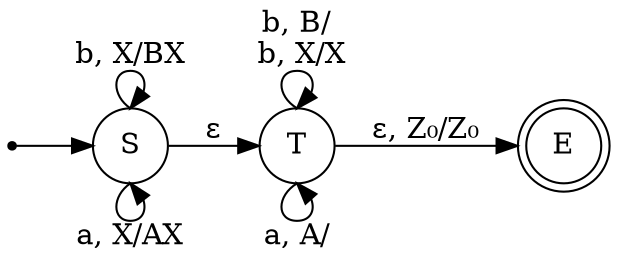
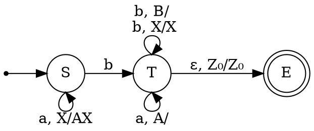
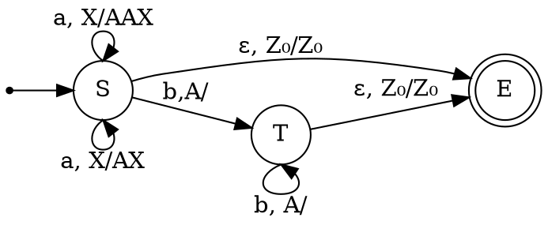
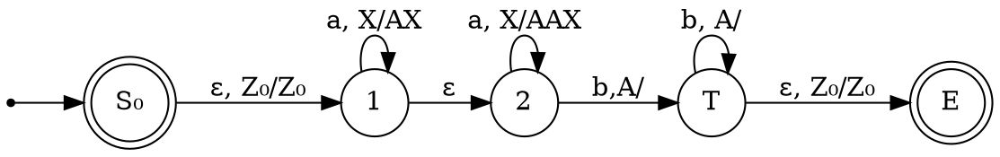

Напомним, что стековый автомат считается недетерминированным, если в нём присутствует хотя бы одна пара переходов $\langle q_0, \gamma_1, \Delta\rangle\to \langle q_1, \Delta'_1\rangle$, $\langle q_0, \gamma_2,\Delta\rangle\to \langle q_2, \Delta'_2\rangle$ такая, что $\Delta_1 = \Delta_2 \land (\gamma_1 = \gamma_2\lor \gamma_1 = \varepsilon \lor \gamma_2 = \varepsilon)$. Заметим, что это определение имеет чисто синтаксическую природу: нас не волнует, может ли вообще появиться символ $\Delta$ на вершине стека в состоянии $q_0$. Даже если такое сочетание невозможно ни на каком пути исполнения МП-автомата, он всё равно считается недетерминированным. Более того, недетерминированные переходы очень часто можно удалить посредством более аккуратной обработки однородных блоков букв в слове.

**Пример**

Язык $\mathcal{L}_0 = \{ww' | \text{при стирании из }w'\text{ некоторого количества букв }b\text{ получается } w^R\}$ легко распознать "в лоб по определению" с помощью недетерминированного МП-автомата.

В нём есть несколько неоднозначных переходов: из состояния $S$ в состояние $T$; обработка букв в состоянии $T$, а также выход из него в состояние $E$. Однако оказывается, что от двух последних можно избавиться. Действительно, можно потребовать, чтобы вместо перехода $b, X/X$ из состояния $T$ в себя был переход вида $b, A/A$, и дополнительно добавить в состояние $E$ петлю вида $b, Z_0/Z_0$. Тогда к реверсу первой части слова будут относиться лишь буквы, принадлежащие началам $b$-блоков из второй части слова.
Интуитивно понятно, что неоднозначность при переходе из $S$ в $T$ не получится; мы вернёмся к этому вопросу чуть позже. 
Если рассматривать только слова языка $\mathcal{L}_0$, имеющие вид $a^n b w'$, $|w'|_a = n$, то, изменив "глупый" МП-автомат для $\mathcal{L}_0$ максимально лениво, можно получить вот такой:

В этом МП-автомате формально присутствует неоднозначность, хотя, как мы уже видели, всю неоднозначность дальше перехода от $S$ к $T$ можно устранить, к тому же стековый символ $B$ вообще не может появиться на стеке этого автомата, поэтому переход из $T$ в себя по такому символу смысла не имеет. Наш пример показывает, что недетерминизм в МП-автомате для некоторого языка - ещё не гарантия того, что построить детерминированный МП-автомат для этого языка невозможно.
Как мы можем понять, что недетерминизм в некотором состоянии МП-автомата устранить не получится? Мы должны попробовать "обмануть" его детерминированные аналоги: то есть, представив, что у языка есть детерминированный МП-автомат, заставить его неправильно обрабатывать стек после такого перехода. Рассмотрим пример такой обманки для перехода $S \to T$ в МП-автомате для $\mathcal{L}_0$.
Предположим, наш автомат прочитал префикс $aba^n b aa b a^{n}b$, оптимистично предположив, что переход от чтения стека к его опустошению произошёл после чтения префикса $aba^n b a$. Если слово продолжится единственной буквой $a$, то предположение окажется верным. Однако любое изменение числа букв $a$ приведёт к обратному эффекту. Поэтому можно добавить их так много, чтобы никакой конечный автомат не мог бы обработать эту разницу.
В соответствии с идеей предыдущего абзаца, построим два слова, поведение стека на которых конфликтует: 
$$aba^n ba\textcolor{blue}{aba^{n}b} \begin{cases} \textcolor{red}{a} - \text{ в синей части снимаем со стека}\\ \textcolor{red}{a}\overbrace{aba^{n}baaba^nba}^{w^R} - \text{в синей части всё ещё кладём}\end{cases}$$
Если бы существовал детерминированный МП-автомат, распознающий язык $\mathcal{L}_0$, то ему бы пришлось каким-то образом сохранить информацию о синей части слова к моменту чтения красной буквы $a$, иначе, если после этой буквы не окажется конца строки, автомат не сумеет правильно пересчитать середину слова. Иначе говоря, если к моменту чтения буквы $a$, следующей за общим префиксом, мы могли бы обойтись конечным числом состояний, то, варьируя $n$ в пределах, больших, чем это число состояний, мы бы заставили МП-автомат принять какое-то из слов вида $aba^n baaba^{n}baaba^{m}baaba^n ba$, где $m> n$, а они не принадлежат $\mathcal{L}_0$. Кроме того, если бы к моменту чтения красной буквы $a$ мы бы не использовали всю информацию о синей части префикса, то либо не сумели бы распознать слово $ab a^n baab a^n ba$, либо сумели бы распознать слово вида $aba^n baaba^{m}b a$, а такие слова тоже не принадлежат языку $\mathcal{L}_0$, если $m>n$. 
Лемма Ю позволяет манипулировать с подобными рассуждениями более аккуратно.

>[!Theorem] Лемма Ю
>Пусть $\mathcal{L}$ --- детерминированный контекстно-свободный язык. Тогда существует такая натуральная константа $p$ (длина детерминированной накачки), что для каждой пары слов $xy\begin{cases}z_1\\z_2\end{cases}$ из $\mathcal{L}$ таких, что $|y|\geq p$ и $z_1$, $z_2$ начинаются с одинаковых букв, справедливо хотя одно из двух утверждений.
>1. Префикс $xy$ накачивается в обычном смысле одинаково для обеих слов --- то есть разбивается на части $u_1 u_2 u_3 u_4 u_5$ такие, что $|u_2 u_3 u_4|\leq p$, $|u_2 u_4|\geq 1$. так что $\forall i (u_1 u_2^i u_3 u_4^i u_5 z_1\in\mathcal{L}\land u_1 u_2^i u_3 u_4^i u_5 z_2\in\mathcal{L})$.
>2. Или часть $y$ накачивается синхронно с обоими суффиксами, --- то есть $y = y_1 y_2 y_3$, $z_1 = u_1 u_2 u_3$, $z_2 = w_1 w_2 w_3$, причём $|y_2 y_3|\leq p$, $|u_2 w_2|\geq 1$, $|y_2|\geq 1$, $\forall i (x y_1 y_2^i y_3 u_1 u_2^i u_3\in\mathcal{L}\land x y_1 y_2^i y_3 w_1 w_2^i w_3\in\mathcal{L})$.

Для опровержения детерминированности языка используется отрицание этой леммы.

>[!Example] Отрицание леммы Ю
>Язык $\mathcal{L}$ не детерминирован, если при любом выборе константы $p$ найдётся пара слов $xy\begin{cases}z_1\\z_2\end{cases}$ из $\mathcal{L}$ таких, что $|y|\geq p$ и $z_1,z_2$ начинаются с одинаковых букв, причём не выполняется **ни одно** из утверждений:
>1. префикс $xy$ накачивается одинаково для обеих слов. 
>2. часть $y$ накачивается синхронно с обоими суффиксами. 
>
>То есть при любом разбиении $xy = u_1 u_2 u_3 u_4 u_5$, $|u_2 u_3 u_4|\leq p$, $|u_2 u_4|\geq 1$ найдётся такое значение $i$, что $u_1 u_2^i u_3 u_4^i u_5 z_1\notin\mathcal{L}$ **или** $u_1 u_2^i u_3 u_4^i u_5 z_2\notin\mathcal{L}$. И при любом разбиении $y = y_1 y_2 y_3$, $z_1 = u_1 u_2 u_3$, $z_2 = w_1 w_2 w_3$, $|y_2 y_3|\leq p$, $|u_2 w_2|\geq 1$, $|y_2|\geq 1$ найдётся такое значение $i$, что $x y_1 y_2^i y_3 u_1 u_2^i u_3\notin\mathcal{L}$ **или** $x y_1 y_2^i y_3 w_1 w_2^i w_3\notin\mathcal{L}$.

Можно сказать, что первое условие накладывает условие на то, чтобы к концу чтения префикса мы бы не могли обойтись заведомо конечной памятью о нём, а второе --- чтобы нельзя было накопить память в стеке однозначным образом.
Применим отрицание леммы Ю к уже найденным словам из языка $\mathcal{L}_0$. Чтобы уменьшить перебор подслов в накачках, вспомним, что детерминированные языки замкнуты относительно пересечений с регулярными языками, и пересечём наш язык с регулярным языком $aba^+ baab a^+ba \underbrace{(aba^+baaba^+ba)?}_{\text{опциональная часть}}$. Получится объединение языков $\mathcal{L}_{0a}\cup\mathcal{L}_{0b}$:
$$\begin{cases}\mathcal{L}_{0a} = \bigl\{aba^{n_1}baaba^{n_2}ba\mid n_1+n_2\text{ чётно и }n_1\geq n_2>0\bigr\}\\ 
\mathcal{L}_{0b}=\bigl\{aba^{n_1}baaba^{n_2}baaba^{n_3}baaba^{n_4}ba\mid n_1+n_2+n_3+n_4\text{ чётно}, n_1,n_2,n_3,n_4>0\\
\;\quad\quad \quad \text{ и либо }n_1\geq n_2 + n_3 + n_4 + 6,\text{ либо }n_1 = n_4 \land n_2\geq n_3\bigr\}\end{cases}$$
Позволим себе вольность называть первой половиной слова, принадлежащего объединению этих языков, ту его максимальную часть, в которой не больше половины всех имеющихся в слове букв $b$. Тогда эти языки можно кратко описать как языки, соответствующие регулярному ограничению, в которых число букв $a$ чётно и в первой половине слова их больше, чем во второй.
Пусть $p$ - длина недетерминированной накачки из леммы Ю. Положим $x=ab\overbrace{a^p}^{\eta_1}baab$, $y=\underbrace{a^p}_{\eta_2} b$, $z_1 = a$, $z_2 = aaba^pbaaba^pba$.
1. Предположим, что накачивается только $xy$. Из-за ограничений, наложенных регулярным выражением, это означает, что могут меняться только блоки $\eta_1$ либо $\eta_2$. Рассмотрим произвольную нулевую накачку в этих блоках в слове $xyz_2$. Получим слово: $aba^{p-k_1}baaba^{p-k_2}baaba^pbaaba^pba$. $k_1+k_2>0$. Очевидно, оно не будет принадлежать языку $\mathcal{L}_{0b}$ из-за нехватки букв $a$ в первой половине слова. Поэтому накачка только в префиксе невозможна.
2. Предположим, что часть $y$ можно накачать синхронно с суффиксами. В случае слова $xyz_1$, это означает, что накаченное слово при $i=2$ примет вид $aba^pbaaba^{p+k_1}ba^{1+k_2}$, $k_1>0$, $k_2\in\{0,1\}$. Такое слово опять-таки не может принадлежать $\mathcal{L}_{0a}$ из-за нехватки букв $a$ в его первой половине.
Мы предъявили контрпример к гипотезе о существовании детерминированной накачки у языка-пересечения $\mathcal{L}_0$ с регулярным. Значит, это пересечение, равно как и сам язык $\mathcal{L}_0$, не являются детерминированными.

В примере с языком $\mathcal{L}_0$ мы подобрали такие слова, в которых на недетерминированном переходе в МП-автомате принималось решение, продолжать ли класть на стек буквы или уже пора их начать снимать. Это весьма типичный вид недетерминизма, но он не единственен. Иногда момент перехода от наполнения стека к опустошению достаточно ясен, но непонятно, как именно его следует наполнять, поскольку один и тот же символ входа может обрабатываться несколькими способами. В качестве примера языка с такого типа недетерминизмом приведём язык $\mathcal{L}' = \bigl\{a^n b^m\mid n\leq m\leq 2\cdot n\bigr\}$. Простейший недетерминированный МП-автомат, который его распознаёт, довольно легко построить "в лоб".

Недетерминизм на переходе $S\to E$ легко устраняется введением дополнительного начального состояния, являющегося одновременно и финальным и принимающим только пустое слово. А вот с переходами из $S$ в себя всё сложнее: очень трудно заранее угадать, сколько букв $b$ нужно поставить в соответствие одной букве $a$ - одну или две. Однако можно существенно уменьшить число недетерминированных переходов при распознавании слов, объявив, что буквы $a$ делятся на два блока: в первом каждая буква $a$ соответствует по весу одной букве $b$, во втором - двум. Тем самым в МП-автомате останется ровно один недетерминированный переход.

Теперь уже кажется, что от этого перехода избавиться не удастся. Покажем, что наш язык недетерминирован. Для этого естественно, в предположении о длине детерминированной накачки $p$, выбрать слова на самой левой и самой правой границах диапазона степеней $b$:
$$a^{p+1}\underbrace{b^p}_y\begin{cases}\overbrace{b}^{z_1}\\\underbrace{b^{p+2}}_{z_2}\end{cases}$$
Сразу же понятно, что накачка $y$ вместе с любыми фрагментами $z_1$ и $z_2$ не приведёт к словам из языка - такой накачкой можно будет вывести степень буквы $b$ из диапазона $[p+1,2p+2]$, притом что степень $a$ не меняется. Поэтому остаётся разобраться только со случаем накачки только в префиксе.
Нулевая накачка $xyz_1$: чтобы слово $a^{p+1-i} b^{p+1-j}$ принадлежало $\mathcal{L}'$, необходимо, чтобы выполнялось условие $i\geq j$. 
Положительная накачка $xyz_1$: чтобы слово $a^{p+1+i} b^{p+1+j}$ принадлежало $\mathcal{L}'$, необходимо, чтобы выполнялось условие $j\geq i$.
Поэтому $i=j$. Теперь рассмотрим нулевую накачку $xyz_2$ - слово $a^{p+1-i} b^{2p+2-i}$. Чтобы оно принадлежало $\mathcal{L}'$, необходимо, чтобы выполнялось условие $2p+2-i\leq 2(p+1-i)$. Но это влечёт $i\leq 0$, что невозможно.