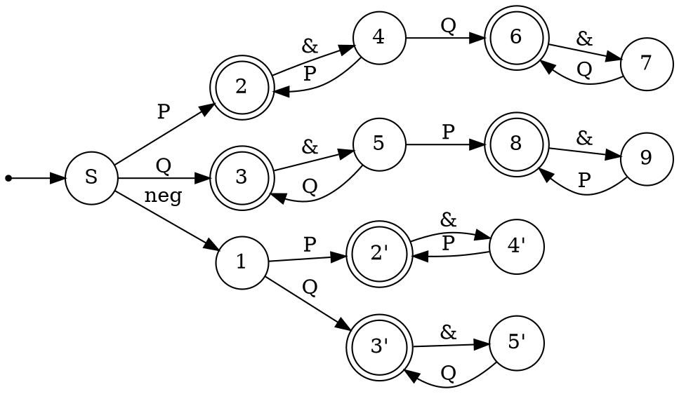
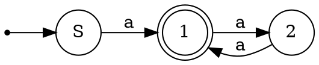
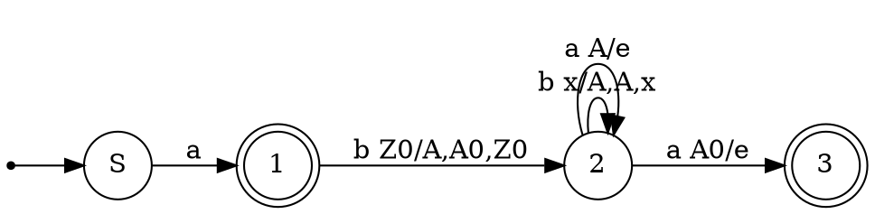
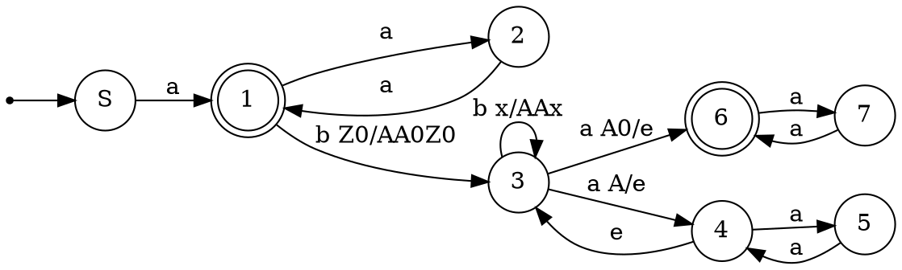
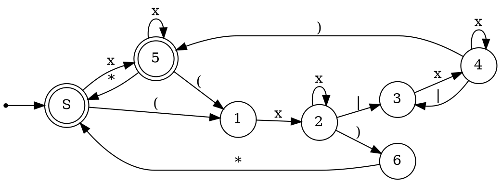

В РК было 3 типа заданий:![[Pasted image 20241112182939.png]]
# Что нужно для РК?
Мозги(Опционально)
![[Теорема Майхилла-Нероуда]]![[Лемма о накачке для КС-языков]]
Элементы не академических регулярок
+ $r_1(?<= r_2)r_3 \sim (.^*r_2 \cap r_1) r_3$ - (look behind) ретроспективная проверка
+ $(?= r_1)r_2 \sim (r_1.^* \cap r_2)$ - (look ahead) опережающая проверка
# Разбор вариантов

## Вариант 4
### 1. Язык тождественно истинных логических формул без скобок, со связками только V, & и ¬ (с обычным приоритетом операций) и константами Т, F.
### 2.  Язык $$\{w | |w|_ab = |w|_baa & |w|_abb ‡ |w|_bba & w \in \{a, b\}^+\}$$.
### 3. Язык всех не завершающихся систем переписывания строк из одного правила. Алфавит: {f,g, →}.

## Вариант 8
### 1. Язык правильно построенных логических формул над алфавитом $\{(,),P, Q, \land, \neg\}$, таких что в их каждом подслове длинны 3, кроме, возможно, единственного, первая и последняя буквы совпадают
Решение:
Рассмотрим сначала возможные "правильные" подслова(P или Q буду обозначать за X)
+ X&X - правильное
+ &X& - правильное(при условии, что до и после будет идти выражение)
+ ((( - правильное, при условии, что после все скобки будут закрыты
+ ))) - аналогично
Других правильных подслов нет, что нетрудно вывести.
Теперь рассмотрим возможные единственные "неправильные" подслова:
+ $\neg X\&X$ - может быть
+ $X\&\neg X\&X$ - не может быть, так как аж 3 подслова будут неправильные
+ с скобками неправильные подслова будут порождаться как открывающей так и закрывающей скобкой
+ $P\&P\&Q\&Q\&Q$ - также подходит, так как только одно слово неправильное

Соответственно, условие задает язык слов, либо конкатенаций P, либо конкатенаций Q, либо отрицание и последующие одинаковые конкатенации, либо конкатенации с единственным переходом к другой букве.

Построим автомат:

### 2. Грамматика 
$S \to SSa$
$S\to SbSS$
$S \to a$
Решение:
Сначала Рассмотрим ограниченные грамматики
1)$S \to SSa|a$
Эта грамматика задает язык нечетных количеств букв а

2)$S->SbSS|a$
Эта грамматика задает язык слов, начинающихся с a, после которого могут быть слова, начинающиеся с b и количество букв a в 2 раза больше количества букв b.

Cоответсвенно, можно объединить обе грамматики, и тогда получим нужный нам автомат

Данный недетерминированный автомат в свою очередь разбирает все слова из языка
### 3. Язык $\{w_1 w_2 w_3 | w_1 w_3 = h(w_2) \& w_2 \in \{a,b\}^*\}$, где h - это гомоморфизм, определяемый как $h(a) = aa$, $h(b)=ab$
Решение:
Гипотеза - язык не КС. Будем доказывать, через противоречие по [[Лемма о накачке для КС-языков|лемме о накачке]].
Пусть p - длинна накачки.
Рассмотрим слово $w=a^{4p}(ab)^{2p}a^{2p}b^{2p}a^{2p}b^{2p}a^{4p}(ab)^{2p}$. Это слово имеет ровно одно разбиение на $w_1, w_2, w_3$.
При попытке накачать какое-либо из этих подслов, ломается баланс между словами.
При попытке накачать w1 и w2 ломается баланс между началом w1 и началом w2. При попытке накачать w2 и w3 ломается баланс между концом w2 и концом w3. $\implies$ Слово нельзя накачать $\implies$ по лемме о накачке язык не КС. $\square$ 
## Вариант 9
### 1. Язык, описывающий регулярные выражения не больше чем с одним уровнем вложенности скобок, причем без избыточных скобок, с учетом ассоциативности конкатенации и альтернативы (т.е., например, (ab) - недопустимо, (a|b)b или (ab)$^*$ - допустимо). Входное регулярное выражение может содержать $*$, | и латинские буквы.
Ограничу количество переходов: x - переход по латинской букве. 

### 2. Язык слов $\{w v u_1 w v a^* | [w \in a^*b] \& [v \in ba^*] \& u_i \in \{a,b\}^*\}$
На первый взгляд может показаться, что язык является регулярным и задается регуляркой
$a^*bba^*.^*a^*bba^*a^*$
Но это не так. В словах языка требуется повторение фрагментов $wv$.

### 3. Древесный язык арифметических выражений с бинарными операциями $+, -$, а также константой 1, вычисляющий положительные числа
## Вариант 11
### 1. Выражение 
$$((ab^*|baa)bb)^*(?= (ba|ab)^*aa^*abb^*b) (?<= (a|bb)^*aa(aa|bb)^*) (aa|bb|ab)^*$$
Выражения lookahead и look behind можно спокойно переставить без потери смысла.
$$((ab^*|baa)bb)^* (?<= (a|bb)^*aa(aa|bb)^*) (?= (ba|ab)^*aa^*abb^*b) (aa|bb|ab)^*$$
Рассмотрим выражения отдельно:
$$(?= (ba|ab)^*aa^*abb^*b) (aa|bb|ab)^* = (ab)^*(?= aa^*abb^*b) (aa|bb|ab)^* = 
(ab)^*(aa)^+(ab |\epsilon)bb(aa|bb|ab)^*$$
$$ ((ab^*|baa)bb)^* (?<= (a|bb)^*aa(aa|bb)^*) = ((ab^*|baa)bb)^* baabb  $$
Итого финальная регуляка:
$$ ((ab^*|baa)bb)^* baabb (ab)^*(aa)^+(ab |\epsilon)bb(aa|bb|ab)^*$$
### 2. Язык слов $\{wv_0a^{n+1}w^Rv_1wv_2 | w, v_i \in \{a,b\}^* \& |w| > 0\}$.
### 3. Язык $\{a^{n\log _2n}b^n\}$.

## Вариант 17
### 1. Язык необязательно правильных последовательностей из скобок, в которых ни одна открывающая скобка не стоит непосредственно сразу перед двумя закрывающими, и при этом таких, что ни одно подслово из трех символов не содержит символы только одного типа.
### 2. Язык логически формул с кванторами ∀...(...) и ∃...(...), связкой &, единственным унарным предикатом Р и переменными х и у. Переменная не может входить в формулу не как аргумент предиката и не будучи связанной квантором. То есть, выражение $x & Р(х)$ некорpeктнo, выражение $∀x(∀x(P(y) & Р(х)))$ некорpeктнo, выражение $∀x(∀x(Р(х)))$ корpeктнo.
### 3. Является ли VPL язык, в котором есть правильные скобочные последовательности и закомментированные посредством тегов $/*$ и $*/$ произвольные скобочные последовательности? В промежутке между двумя комментариями всегда должна стоять ПСП, то есть, вот такое слово языку не принадлежит: $((/*(*/))/*)*/$.

## Вариант 27
### 1. Выражение $$((? = (a|bb)^*(a (ab|ba)^*a)^*a)(a|b))^+ (? <= bb(a|b)^*)(a|b)^* $$
Сначала упрощаем первую часть, $$((? = (a|bb)^*(a (ab|ba)^*a)*a)(a|b))^+ = ((? = (a|bb)^*(a (ab|ba)^*a)^*a)(a|b))^+ = ((?= a)(a|b))^+ = a^+$$
Далее разбираемся с look behind, $$a^+(? <= bb(a|b)^*) = \varepsilon$$
Финальная регулярка: $(a|b)^*$
### 2. Язык правильных регулярных выражений, обязательно принимающих, в числе прочего, пустое слово. Регулярные выражения могут содержать буквы а, b, а также операции альтернативы, итерации Клини и круглые скобки.
Контекстно свободная грамматика
Стартовый символ: S  
S → SS | C | ɛ  
C → B | C* | A  
B → ALA | (B)  
A → aE | bE  
E → a | b | aE | bE | ɛ
L → |
### 3. Язык $\{w_1 v w_2 | w_i, v \in \{a, b\}^+  \&  |w_1|_a = |w_2|_b \& |w_1|_b = |w_2|_b\}$.
Немного перепишем ограничение на количество букв a и b, учитывая конъюнкцию. Получим, что $|w_1|_a = |w_2|_b = |w_1|_b$ . Пусть p - длинна накачки.
Рассмотрим слово $w=w_1vw_2=a^nb^na^mb^ta^kb^n$. Если будем накачивать w1 и v, то ломается зависимость в w2 по b. Если будем накачивать v и w2, то будет ломаться зависимость в w1 по b. Значит язык не КС, так как лемма о накачке не выполняется.

## Вариант 28
### 1. Язык слов, являющихся перестановкой подслов правильных скобочных последовательностей. Скобки двух типов: квадратные и круглые
### 2. Язык $\{v_0uv_1u^Rv_2 | |u| > 1 \& v_0 \in (aa|ba)^* \& v_2 \in (bb|a)*\}$. Алфавит {a,b}
### 3. Язык КС-грамматик, в которых языки нетерминалов S и A совпадают. Алфавит {S, A, a, b, $\to$, ;}, где ; - разделитель между правилами