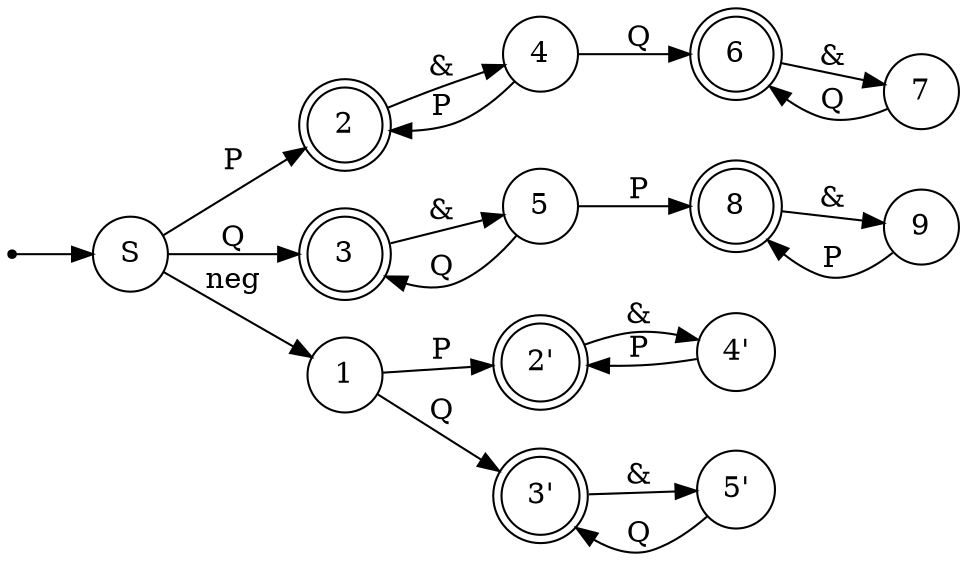

В РК было 3 типа заданий:![[Pasted image 20241112182939.png]]
# Что нужно для РК?
+ Мозги(Опционально)
+ ![[Теорема Майхилла-Нероуда]]
+ [[Лемма о накачке для КС-языков]]

$r1(?<= r2)r3 \equiv(.^*r2 \cap r1) r3$ - (look behind) ретроспективная проверка
 

# Разбор вариантов
## Вариант 8
### 1. Язык правильно построенных логических формул над алфавитом $\{(,),P, Q, \land, \neg\}$, таких что в их каждом подслове длинны 3, кроме, возможно, единственного, первая и последняя буквы совпадают
Решение:
Рассмотрим сначала возможные "правильные" подслова(P или Q буду обозначать за X)
+ X&X - правильное
+ &X& - правильное(при условии, что до и после будет идти выражение)
+ ((( - правильное, при условии, что после все скобки будут закрыты
+ ))) - аналогично
Других правильных подслов нет, что нетрудно вывести.
Теперь рассмотрим возможные единственные "неправильные" подслова:
+ $\neg X\&X$ - может быть
+ $X\&\neg X\&X$ - не может быть, так как аж 3 подслова будут неправильные
+ с скобками неправильные подслова будут порождаться как открывающей так и закрывающей скобкой
+ $P\&P\&Q\&Q\&Q$ - также подходит, так как только одно слово неправильное

Соответственно, условие задает язык слов, либо конкатенаций P, либо конкатенаций Q, либо отрицание и последующие одинаковые конкатенации, либо конкатенации с единственным переходом к другой букве.

Построим автомат:

### 2. Грамматика 
$S \to SSa$
$S\to SbSS$
$S \to a$
Решение:

### 3. Язык $\{w_1 w_2 w_3 | w_1 w_3 = h(w_2) \& w_2 \in \{a,b\}^*\}$, где h - это гомоморфизм, определяемый как $h(a) = aa$, $h(b)=ab$
Решение:
Гипотеза - язык не КС. Будем доказывать, через противоречие по [[Лемма о накачке для КС-языков|лемме о накачке]].
Пусть p - длинна накачки.
Рассмотрим слово $w=a^{4p}(ab)^{2p}a^{2p}b^{2p}a^{2p}b^{2p}a^{4p}(ab)^{2p}$. Это слово имеет ровно одно разбиение на $w_1, w_2, w_3$.
При попытке накачать какое-либо из этих подслов, ломается баланс между словами.
При попытке накачать w1 и w2 ломается баланс между началом w1 и началом w2. При попытке накачать w2 и w3 ломается баланс между концом w2 и концом w3. $\implies$ Слово нельзя накачать $\implies$ по лемме о накачке язык не КС. $\square$ 
## Вариант 9
### 1. Язык, описывающий регулярные выражения не больше чем с одним уровнем вложенности скобок, причем без избыточных скобок, с учетом ассоциативности конкатенации и альтернативы (т.е., например, (ab) - недопустимо, (a|b)b или (ab)$^*$ - допустимо). Входное регулярное выражение может содержать $*$, | и латинские буквы.
### 2. Язык слов $\{w v u_1 w v a^* | [w \in a^*b] \& [v \in ba*] \& u_i \in \{a,b\}^*\}$
### 3. Древесный язык арифметических выражений с бинарными операциями $+, -$, а также константой 1, вычисляющий положительные числа
## Вариант 11
### 1. Выражение 
$$((ab^*|baa)bb)^*(?= (ba|ab)^*aa^*abb^*b) (?<= (a|bb)*aa(aa|bb)*) (aa|bb|ab)*$$
### 2. Язык слов $\{wv_0a^{n+1}w^Rv_1wv_2 | w, v_i \in \{a,b\}^* \& |w| > 0\}$.
### 3. Язык $\{a^{n\log _2n}b^n\}$.

## Вариант 28
### 1. Язык слов, являющихся перестановкой подслов правильных скобочных последовательностей. Скобки двух типов: квадратные и круглые
### 2. Язык $\{v_0uv_1u^Rv_2 | |u| > 1 \& v_0 \in (aa|ba)^* \& v_2 \in (bb|a)*\}$. Алфавит {a,b}
### 3. Язык КС-грамматик, в которых языки нетерминалов S и A совпадают. Алфавит {S, A, a, b, $\to$, ;}, где ; - разделитель между правилами