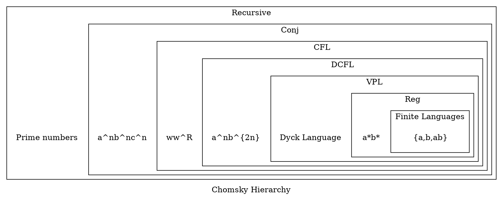

# Замкнутость различных классов языков относительно операций

| Класс\операция        | $\mathcal{L}_1 \cap \mathcal{L}_2$ | $\mathcal{L}_1 \cup \mathcal{L}_2$, $\Sigma_1\cap\Sigma_2\neq\emptyset$ | $\mathcal{L}_1 \cup \mathcal{L}_2$, $\Sigma_1\cap\Sigma_2=\emptyset$ | $L_1L_2$, $\Sigma_1\cap\Sigma_2\neq\emptyset$ | $\mathcal{L}_1\mathcal{L}_2$, $\Sigma_1\cap\Sigma_2=\emptyset$ | $\mathcal{L}^*$ | $\mathcal{L}\cup Reg$ | $\mathcal{L}\cap Reg$ | $\overline {\mathcal{L}}$ | $h(\mathcal{L})$ | $h(\mathcal{L})$ нестирающие | $h^{-1}(\mathcal{L})$ | $h^{-1}(\mathcal{L})$ нестирающие | $\mathcal{L}^R$ |
| --------------------- | ---------------------------------- | -------------------------------------------------------------------------- | ----------------------------------------------------------------------- | ------------------------------------------------ | ----------------------------------------------------------------- | --------------- | --------------------- | --------------------- | ------------------------- | ---------------- | ---------------------------- | --------------------- | --------------------------------- | --------------- |
| Конечные языки        | +                                  | +                                                                          | +                                                                       | +                                                | +                                                                 | -               | -                     | +                     | -                         | +                | +                            | -                     | +                                 | +               |
| $Reg$                 | +                                  | +                                                                          | +                                                                       | +                                                | +                                                                 | +               | +                     | +                     | +                         | +                | +                            |                       |                                   | +               |
| $VPL$                 |                                    |                                                                            |                                                                         |                                                  |                                                                   |                 |                       |                       |                           |                  |                              |                       |                                   |                 |
| $LR(0)$               |                                    |                                                                            |                                                                         |                                                  |                                                                   |                 |                       |                       |                           |                  |                              |                       |                                   |                 |
| $DCFL=$$=LR(k)=LR(1)$ |                                    |                                                                            |                                                                         |                                                  |                                                                   |                 |                       |                       |                           |                  |                              |                       |                                   |                 |
| $LL(k)$               |                                    |                                                                            |                                                                         |                                                  |                                                                   |                 |                       |                       |                           |                  |                              |                       |                                   |                 |
| $CFL$                 | -                                  | +                                                                          | +                                                                       | +                                                | +                                                                 | +               |                       |                       |                           |                  |                              |                       |                                   |                 |
| $LinCFL$              |                                    |                                                                            |                                                                         |                                                  |                                                                   |                 |                       |                       |                           |                  |                              |                       |                                   |                 |
| $LinConj$             |                                    |                                                                            |                                                                         |                                                  |                                                                   |                 |                       |                       |                           |                  |                              |                       |                                   |                 |
| $Conj$                | +                                  | +                                                                          | +                                                                       | +                                                | +                                                                 | +               | +                     | +                     |                           |                  |                              |                       |                                   |                 |
| Ограниченные языки    |                                    |                                                                            |                                                                         |                                                  |                                                                   |                 |                       |                       |                           |                  |                              |                       |                                   |                 |
| $Rec$                 |                                    |                                                                            |                                                                         |                                                  |                                                                   |                 |                       |                       |                           |                  |                              |                       |                                   |                 |

Расшифровка сокращений
- Reg - [[регулярный язык |регулярные языки]]
- VPL(Visibly Pushdown Languages)
- DCFL - детерминированные контекстно свободные языки
- CFL(Contest Free Languages) - [[КС-язык|контекстно свободные языки]]
- LinCFL - линейные контекстно свободные языки
- $\text{LinConj} = \text{trellis automata}$ - линейные конъюнктивные языки
- Conj - конъюнктивные языки
- Rec - рекурсивные языки

# Док-во замкнутости конечных языков
Для операций $\mathcal{L}_1\cap \mathcal{L}_2$, $\mathcal{L}_1\cup \mathcal{L}_2$ имеет место объединение и пересечение конечных множеств, что есть конечное множество.

Элементы $\mathcal{L}_1\mathcal{L}_2$ мы можем отобразить в элементы множества $\mathcal{L}_1 \times \mathcal{L}_2$, которое для конечных $\mathcal{L}_1,\mathcal{L}_2$ является также конечным множеством, из чего следует замкнутость.

Конечные языки не замкнуты относительно $\mathcal{L}^*, \mathcal{L}\cup Reg, \overline{\mathcal{L}}$  так как эти операции дают бесконечные множества языков: замыкание Клини дает бесконечное множество слов, объединение с бесконечным регулярным дает бесконечное множество слов, и дополнение к языку также дает счетное множество слов.

Пересечение $\mathcal{L}\cap Reg$ дает также конечное множество, так как $\mathcal{L}\cap Reg \subseteq \mathcal{L}$, поэтому получившийся язык будет иметь размер не больше исходного.

Конечные языки замкнуты относительно $\mathcal{L}^R$,$h(\mathcal{L})$ и нестирающие $h^{-1}(\mathcal{L})$ , так как они не увеличивают число слов: каждое слово либо уникально, либо совпадает с другим образом.

Для стирающих обратных морфизмов $h^{-1}(\mathcal{L})$ уже не выполняется замкнутость в классе конечных языков. Возьмем пример простейшего стирающего морфизма для языка над алфавитом $\{a,b\}$. 
Пусть 
$$h(x) = \begin{cases} a, \text{если } x = a \\ \varepsilon , \text{если } x = b\end{cases}$$
И рассмотрим простейший конечный язык, состоящий из одного слова $\{a\}$. Тогда, при применении к нему обратного морфизма мы получим уже регулярный язык $b^*ab^*$. В общем случае, стирающие обратные морфизмы позволяют произвольным образом добавлять стираемые символы между любыми символами прообраза слова. Таким образом мы получаем бесконечный язык, поэтому замкнутость не выполняется.
# Док-во замкнутости для регулярных языков

Регулярные языки замкнуты относительно пересечения $\mathcal{L}_1 \cap \mathcal{L}_2$. Для этого рассмотрим ДКА $A_i$ для $\mathcal{L}_i$. $A = A_1 \cap A_2$ - новый "автомат-пересечение"
Состояния автомата - пары состояний $(s_1, s_2)$из $A_1$, $A_2$
Переходы состояний - переходы $(s_1, s_2) \xrightarrow{a} (f_1,f_2)$ в случае если $s_1 \xrightarrow{a} f_1$ и $s_2 \xrightarrow{a} f_2$
Финальные состояния - состояния, где каждый составляющий пары - финальное состояние в своем автомате.
Таким образом построенный автомат будет одновременно отслеживать состояния двух автоматов сразу, и будет принимать слово только тогда, когда оно принимается в обоих автоматах. %%вроде как если рассмотреть категорию автоматов, с морфизмами - а не знаю какими :( , то такой "автомат-пересечение" - произведение автоматов%%

Регулярные языки **замкнуты** относительно $\mathcal{L}_1\mathcal{L}_2, \mathcal{L}_1 \cup \mathcal{L}_2, \mathcal{L}^*$ по структурному определению регулярных языков - использовать соответсвенно конкатенацию, альтернативу и замыкание Клини для представления в виде регулярного выражения.(автоматически выполняется и $\mathcal{L}\cup Reg \sim \mathcal{L}_1 \cup \mathcal{L}_2$)

Для замкнутости относительно **дополнения** к языку $\overline{ \mathcal{L}}$, воспользуемся представлением регулярного языка в виде ДКА. Для построения дополнения к языку, инвертируем все состояния - финальные в нефинальные и наоборот. Таким образом все слова, что раньше принимались автоматом перестанут приниматься, а те что отвергались - начнут. Тем самым мы построили автомат для дополнения $\Rightarrow$ дополнение регулярно.

Регулярные языки замкнуты относительно морфизмов, так как мы можем в регулярном выражении в соответствии с морфизмом каждое вхождение символов исходного алфавита заменить на его образ, тем самым мы получим регулярное выражение, которое разбирает новый язык.

%%обратные морфизмы%%

Для доказательства замкнутости регулярных языков относительно обращения воспользуемся ДКА, распознающим заданный язык $\mathcal L$. Пусть ДКА задан как $(\Sigma, Q, q_0, F, \delta)$, где $\Sigma$ - алфавит, $Q$ - множество состояний, $q_0 \in Q$ - начальное состояние, $F \subset Q$ - множество конечных состояний, $\delta: Q \times \Sigma \to Q$ - функция переходов в автомате, тогда
Строим НКА, распознающий обращенный язык по следующему принципу:
- В ДКА обращаем все стрелки;
- Делаем новым единственным финальным состоянием $q_0$;
- Добавляем новое начальное состояние $q_0'$ и строим от него переходы к всем состояниям $q \in F$ по пустому слову $\varepsilon$.

Таким образом построенный нами НКА будет распознавать обращенный регулярный язык. 
Почему построение верно?
Потому что при распознавании обращенного слова новым автоматом мы будем проходить путь по графу автомата, соответствующий обращенному пути в исходном автомате. При этом путь будет идти от одного из финальных состояний в начальное. Новое начальное состояние нужно лишь для соответствия определению автомата, по сути оно говорит, что мы недетерминировано выбираем одно из начальных состояний.

# Док-во замкнутости для CFL
CFL **не замкнуты** относительно пересечения - контрпример -
Языки $\{a^nb^nc^*\mid n \in \mathbb N\}$ и $\{a^*b^nc^n\mid n \in \mathbb N\}$ при пересечении дают не кс язык $\{a^nb^nc^n \mid n \in \mathbb N\}$.

CFL языки **замкнуты** относительно $\mathcal{L}_1\mathcal{L}_2$ по структурной индукции.
Пусть $S_1$ и $S_2$ - стартовые нетерминалы языков $\mathcal{L}_1,\mathcal{L}_2$. Тогда новый стартовый нетерминал для $\mathcal{L}_1\mathcal{L}_2$ определяется следующим образом:
$$S' \to S_1S_2$$
Аналогично для $\mathcal{L}_1 \cup \mathcal{L}_2$ только используем $S' \to S_1 \mid S_2$.

CFL языки **замкнуты** относительно $\mathcal{L}^*$ по структурной индукции.
Для стартового нетерминала S новый стартовый нетерминал:
$$S' \to SS' \mid \varepsilon$$

# Док-во замкнутости для Conj
Свойства $\mathcal{L}_1\mathcal{L}_2, \mathcal{L}_1 \cup \mathcal{L}_2, \mathcal{L}_1 \cap \mathcal{L}_2, \mathcal{L}^*$ вытекают из структурных конструкторов.

>[!error]
> Замкнутость относительно морфизмов получается по той же схеме, что и предыдущие классы языков - каждый терминал в грамматике заменяем на соответсвующую замену морфизма.

%%
Для доказательства обращения, рассмотрим контекстную грамматику в нормальной форме: правила имеют либо КС вид, либо вид $N_1 \to N_2 \& N_3$. Тогда обращение можно построить очень просто - обращаем все КС правила, а раскрытие конъюнктивных правил оставляем такое же. Полученная конъюнктивная грамматика будет разбирать обращенный язык.
Док-во корректности построения
%%

