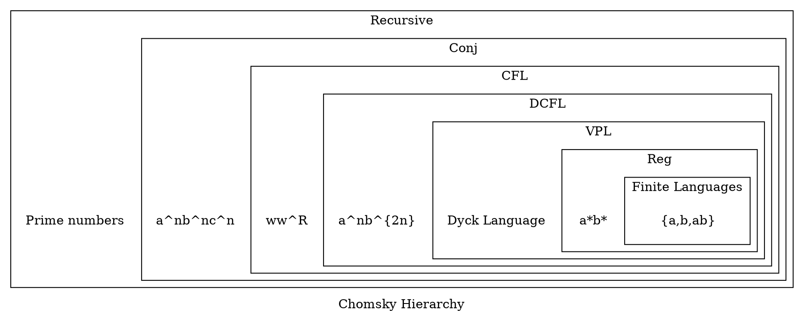

# Замкнутость различных классов языков относительно операций

| Класс\операция        | $L_1 \cap L_2$ | $L_1 \cup L_2$, $\Sigma_1\cap\Sigma_2\neq\emptyset$ | $L_1 \cup L_2$, $\Sigma_1\cap\Sigma_2=\emptyset$ | $L_1L_2$, $\Sigma_1\cap\Sigma_2\neq\emptyset$ | $L_1L_2$, $\Sigma_1\cap\Sigma_2=\emptyset$ | $L^*$ | $L\cup Reg$ | $L\cap Reg$ | $\overline L$ | $h(L)$ | $h(L)$ нестирающие | $h^{-1}(L)$ | $h^{-1}(L)$ нестирающие | $L^R$ |
| --------------------- | -------------- | ------------------------------------------------------ | --------------------------------------------------- | ------------------------------------------------ | --------------------------------------------- | ----- | ----------- | ----------- | ------------- | ------ | ------------------ | ----------- | ----------------------- | ----- |
| Конечные языки        | +              | +                                                      | +                                                   | +                                                | +                                             | -     | -           | +           | -             | +      | +                  | -           | +                       | +     |
| $Reg$                 | +              | +                                                      | +                                                   | +                                                | +                                             | +     | +           | +           | +             | +      |                    |             |                         |       |
| $VPL$                 |                |                                                        |                                                     |                                                  |                                               |       |             |             |               |        |                    |             |                         |       |
| $LR(0)$               |                |                                                        |                                                     |                                                  |                                               |       |             |             |               |        |                    |             |                         |       |
| $DCFL=$$=LR(k)=LR(1)$ |                |                                                        |                                                     |                                                  |                                               |       |             |             |               |        |                    |             |                         |       |
| $LL(k)$               |                |                                                        |                                                     |                                                  |                                               |       |             |             |               |        |                    |             |                         |       |
| $CFL$                 | -              | +                                                      | +                                                   | +                                                | +                                             | +     |             |             |               |        |                    |             |                         |       |
| $LinCFL$              |                |                                                        |                                                     |                                                  |                                               |       |             |             |               |        |                    |             |                         |       |
| $LinConj$             |                |                                                        |                                                     |                                                  |                                               |       |             |             |               |        |                    |             |                         |       |
| $Conj$                | +              | +                                                      | +                                                   | +                                                | +                                             | +     | +           | +           |               |        |                    |             |                         |       |
| Ограниченные языки    |                |                                                        |                                                     |                                                  |                                               |       |             |             |               |        |                    |             |                         |       |
| $Rec$                 |                |                                                        |                                                     |                                                  |                                               |       |             |             |               |        |                    |             |                         |       |

Расшифровка сокращений
- Reg - [[регулярный язык |регулярные языки]]
- VPL(Visibly Pushdown Languages)
- DCFL - детерминированные контекстно свободные языки
- CFL(Contest Free Languages) - [[КС-язык|контекстно свободные языки]]
- LinCFL - линейные контекстно свободные языки
- $\text{LinConj} = \text{trellis automata}$ - линейные конъюнктивные языки
- Conj - конъюнктивные языки
- Rec - рекурсивные языки

# Док-во замкнутости конечных языков
Для операций $L_1\cap L_2$, $L_1\cup L_2$ имеет место объединение и пересечение конечных множеств, что есть конечное множество.

Элементы $L_1L_2$ мы можем отобразить в элементы множества $L_1 \times L_2$, которое для конечных $L_1,L_2$ является также конечным множеством, из чего следует замкнутость.

Конечные языки не замкнуты относительно $L^*, L\cup Reg, \overline L$  так как эти операции дают бесконечные множества языков: замыкание Клини дает бесконечное множество слов, объединение с бесконечным регулярным дает бесконечное множество слов, и дополнение к языку также дает счетное множество слов.

Пересечение $L\cap Reg$ дает также конечное множество, так как $L\cap Reg \subseteq L$, поэтому получившийся язык будет иметь размер не больше исходного.

Конечные языки замкнуты относительно $L^R$,$h(L)$ и нестирающие $h^{-1}(L)$ , так как они не увеличивают число слов: каждое слово либо уникально, либо совпадает с другим образом.

Для стирающих обратных морфизмов $h^{-1}(L)$ уже не выполняется замкнутость в классе конечных языков. Возьмем пример простейшего стирающего морфизма для языка над алфавитом $\{a,b\}$. 
Пусть 
$$h(x) = \begin{cases} a, \text{если } x = a \\ \varepsilon , \text{если } x = b\end{cases}$$
И рассмотрим простейший конечный язык, состоящий из одного слова $\{a\}$. Тогда, при применении к нему обратного морфизма мы получим уже регулярный язык $b^*ab^*$. В общем случае, стирающие обратные морфизмы позволяют произвольным образом добавлять стираемые символы между любыми символами прообраза слова. Таким образом мы получаем бесконечный язык, поэтому замкнутость не выполняется.
# Док-во замкнутости для регулярных языков

Регулярные языки замкнуты относительно пересечения $L_1 \cap L_2$. Для этого рассмотрим ДКА $A_i$ для $L_i$. $A = A_1 \cap A_2$ - новый "автомат-пересечение"
Состояния автомата - пары состояний $(s_1, s_2)$из $A_1$, $A_2$
Переходы состояний - переходы $(s_1, s_2) \xrightarrow{a} (f_1,f_2)$ в случае если $s_1 \xrightarrow{a} f_1$ и $s_2 \xrightarrow{a} f_2$
Финальные состояния - состояния, где каждый составляющий пары - финальное состояние в своем автомате.
Таким образом построенный автомат будет одновременно отслеживать состояния двух автоматов сразу, и будет принимать слово только тогда, когда оно принимается в обоих автоматах. %%вроде как если рассмотреть категорию автоматов, с морфизмами - а не знаю какими :( , то такой "автомат-пересечение" - произведение автоматов%%

Регулярные языки **замкнуты** относительно $L_1L_2, L_1 \cup L_2, L^*$ по структурному определению регулярных языков - использовать соответсвенно конкатенацию, альтернативу и замыкание Клини для представления в виде регулярного выражения.(автоматически выполняется и $L\cup Reg \sim L_1 \cup L_2$)

Для замкнутости относительно **дополнения** к языку $\overline L$, воспользуемся представлением регулярного языка в виде ДКА. Для построения дополнения к языку, инвертируем все состояния - финальные в нефинальные и наоборот. Таким образом все слова, что раньше принимались автоматом перестанут приниматься, а те что отвергались - начнут. Тем самым мы построили автомат для дополнения $\Rightarrow$ дополнение регулярно.

Регулярные языки замкнуты относительно морфизмов, так как мы можем в регулярном выражении в соответствии с морфизмом каждое вхождение символов исходного алфавита заменить на его образ, тем самым мы получим регулярное выражение, которое разбирает новый язык.

# Док-во замкнутости для CFL
CFL **не замкнуты** относительно пересечения - контрпример -
Языки $\{a^nb^nc^*\mid n \in \mathbb N\}$ и $\{a^*b^nc^n\mid n \in \mathbb N\}$ при пересечении дают не кс язык $\{a^nb^nc^n \mid n \in \mathbb N\}$.

CFL языки **замкнуты** относительно $L_1L_2$ по структурной индукции.
Пусть $S_1$ и $S_2$ - стартовые нетерминалы языков $L_1,L_2$. Тогда новый стартовый нетерминал для $L_1L_2$ определяется следующим образом:
$$S' \to S_1S_2$$
Аналогично для $L_1 \cup L_2$ только используем $S' \to S_1 \mid S_2$.

CFL языки **замкнуты** относительно $L^*$ по структурной индукции.
Для стартового нетерминала S новый стартовый нетерминал:
$$S' \to SS' \mid \varepsilon$$

# Док-во замкнутости для Conj
Свойства $L_1L_2, L_1 \cup L_2, L_1 \cap L_2, L^*$ вытекают из структурных конструкторов.

Замкнутость относительно морфизмов получается по той же схеме, что и предыдущие классы языков - каждый терминал в грамматике заменяем на соответсвующую замену морфизма.

%%
Для доказательства обращения, рассмотрим контекстную грамматику в нормальной форме: правила имеют либо КС вид, либо вид $N_1 \to N_2 \& N_3$. Тогда обращение можно построить очень просто - обращаем все КС правила, а раскрытие конъюнктивных правил оставляем такое же. Полученная конъюнктивная грамматика будет разбирать обращенный язык.
Док-во корректности построения
%%

