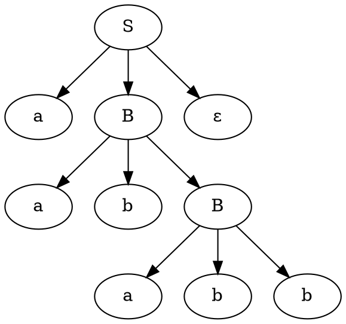
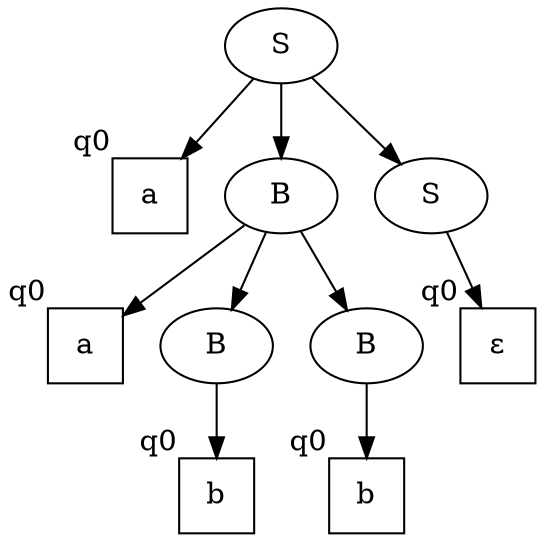
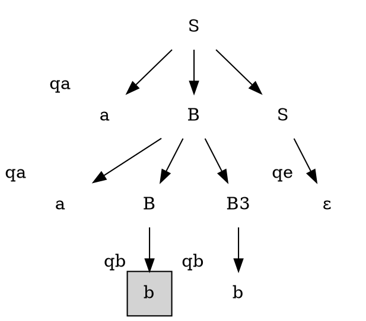
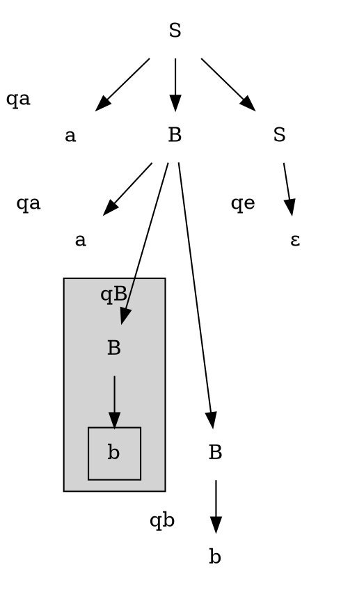
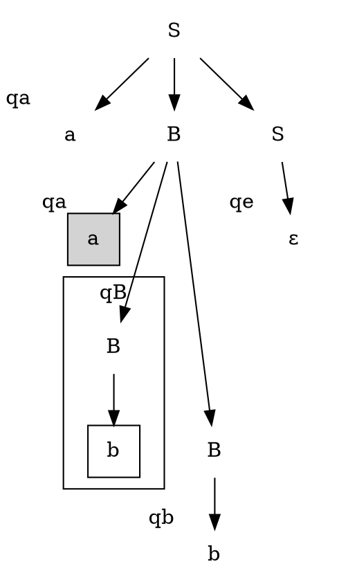
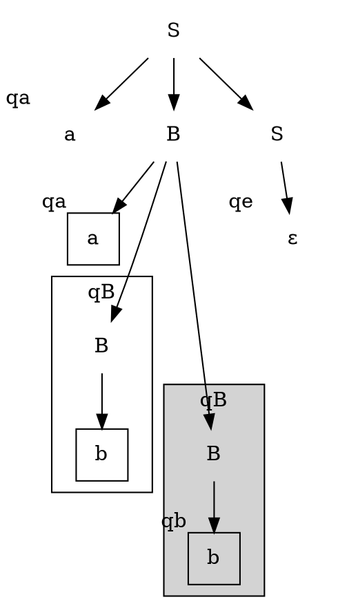
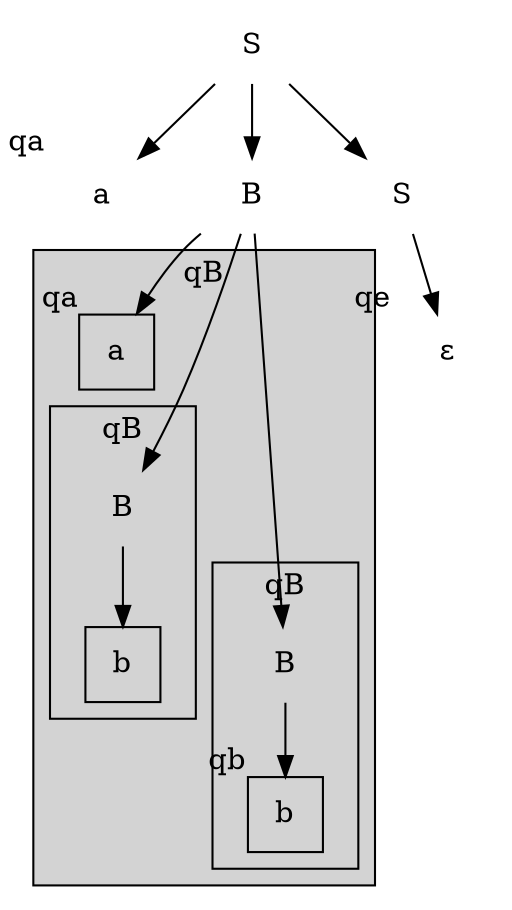

Мы уже знаем, что КС-грамматики состоят из 
$$\{N, \Sigma, S, R\}$$
N - множество нетерминалов
$\Sigma$ - множество терминалов
$S$ - стартовый нетерминал
$R$ - множество правил вывода вида $N \times (N \cup \Sigma)^*$
$$A \to \varphi_1...\varphi_k$$
Поэтому разбор по грамматики в сути своей является построением дерева вывода слова по грамматики. Вы об этом уже знаете с первого курса, но повторить стоит.

Рассмотрим граммматику
$$\begin{aligned}
S \to aBS \mid \varepsilon \\
B \to b \mid aBB
\end{aligned}$$
Рассмотрим разбор слова `aababb`.
Так как в b может раскрываться только нетерминал B, то сразу очевидно, что
$$aa\underbrace{b}_Ba\underbrace{b}_B\underbrace{b}_B$$
Дальше видим ситуацию, что одна a зажата между двумя развертками B, поэтому она может раскрываться по двум случаям(как S или как B).

Получаем несколько деревьев, порождающих слово `aababb`.

>[!note] Определение
> Дерево разбора - это дерево, в листьях которого находятся терминалы, ветвления помечены нетерминалами, при этом каждое ветвление, помеченное нетерминалом $A \in N$, может иметь только потомков $\beta_1...\beta_k$, где $A \to \beta_1...\beta_k \in R$
> И корень помечен стартовым нетерминалом

Как мы могли бы еще описывать такие структуры? Понятно, что это дерево, которое получается из грамматики. Но если посмотрим, на эти все рассуждения, то можем заметить, что если бы мы имели более выразительный язык автоматов, то мы бы получили автомат. Получается, мы можем рассмотреть автоматы, порождающие деревья вывода.

Рассмотрим соответствующее расширение.

>[!note] Определение
>Сигнатура - набор пар $\{<f_i, n_i>\}$, где $f_i$ - функциональный символ, а $n_i$ - арность или местность, обозначающая количество аргументов, которое может он принимать.

Теперь будем действовать аналогично тому, как мы действовали с конечными автоматами, только теперь будут подаваться на вход автоматов не отдельные строки, а некоторые функциональные символы.

Есть 2 типа таких автоматов: **top-bottom** автоматы и **bottom-top** автоматы, в первом варианте автомат идет от корня к листьям, а в втором от листьев к корню, но они в сути своей ничем не отличаются в смысле выразительной силы, но только в **недетерминированном** варианте. Для детерминированного разбора bottom-top имеет большую выразительную силу, поэтому обычно рассматривают bottom-top автоматы. 

Далее будем рассматривать bottom-top автоматы.

>[!note] Определение
Конфигурация автомата $\mathcal A$  - дерево сигнатуры $T[S]$, в котором есть $\square$ - "дыра", говорящая то, что в этом месте еще что-то не вычислили.

Рассмотрим дерево разбора слова `aabb` для грамматики, рассмотренной ранее. 

Здесь начальные состояния помечены квадратными вершинами, и подписаны стартовым состоянием $q_0$. Поскольку их много и они на листьях по умолчанию, то листовые конструкторы или конструкторы имеющие арность 0, считаются стартовыми состояниями. Поэтому мы говорим, что

> [!note] Определение
> Конструктор $C_0$, такой что $\operatorname{ar}(C_0) = \emptyset$ - это **стартовый конструктор** bottom-top автомата.
> Записывается, как 
> $$C_0 \to q_i(C_0)$$
> где $q_i$ - состояние bottom-top автомата. На практике это состояние согласовывают с конструктором(терминальным символом).

Поэтому для нашего дерева мы получим следующую конструкцию

Дальше нам нужно научиться собирать дерево из своих листьев. Здесь нам как раз и понадобятся "дыры", причем все "дыры" считаются независимыми, контекстно-свободными. Как это выглядит?
Если у нас есть некоторый конструктор $f_k$ арности $k$ от $q_1...q_k$, то мы можем вычислить состояние, которое мы наблюдаем над ветвлением:
$$f_k(q_1(X_1), ... q_k(X_k)) \to q_f(f_k(X_1...X_k))$$
И наша конфигурация говорит, что "тут мы начинаем продвигаться выше по дереву".
Перерисуем нашу конфигурацию

Пусть мы начинаем двигаться от вершины, помеченной квадратом. Теперь смотрим, какие у нас есть конструкторы и относящиеся к ним правила переписывания.
$$\begin{aligned}
a &\to q_a(a)\\
b &\to q_b(b)\\
\varepsilon &\to q_\varepsilon(\varepsilon)\\
B(q_b(X)) &\to q_B(B(X))\\
B(q_a(X_1), q_B(X_2), q_B(X_3)) &\to q_B(B(X_1, X_2, X_3)) \\
S(q_\varepsilon(X)) &\to q_S(S(X))\\
S(q_a(X_1), q_B(X_2), q_S(X_3)) &\to q_S(S(X_1, X_2, X_3))
\end{aligned}$$

 Получим

Далее подняться не можем, так как нам нужно собрать другие ребра. Переместимся на листок `a`.

переместимся на листок b. И аналогично поднимемся на одну ступеньку выше.

Теперь мы можем подняться на вершину выше с помощью правила $B(q_a(X_1), q_B(X_2), q_B(X_3)) \to q_B(B(X_1, X_2, X_3))$.

Далее точно также поднимаемся по остальным ребрам. Если над корнем мы получили $q_S$, то значит слово действительно порождается нашей грамматикой. 

> [!warning] Но здесь есть нюанс с сигнатурой.
>  Мы видим, что конструктор $S$ может быть как одноместным, так и трехместным. Такую неоднозначность нужно учитывать: либо мы заводим разные нетерминалы, для разных арностей, либо мы меняем грамматику, чтобы везде была однаковая арность. Для теоретических целей мы можем сказать, что всегда можно перейти к [[Нормальная форма Хомского|нормальной форме Хомского]], и получим, что все конструкторы имеют арность 2. 

Если в грамматике G есть правило вида 
$$\begin{aligned}
A_i \to \varphi_i \\
A_i \to \varphi_j
\end{aligned} \qquad |\varphi_i| \neq |\varphi_j|$$
Тогда заводим нетерминалы $A_{i,|\varphi_i|}, A_{i, |\varphi_j|}$ используемые произвольно вместо $A_i$, и имеющие сигнатуры соответствующей длинны.
Так наша грамматика перепишется в следующий вид
$$\begin{aligned}
S &\to S_1 \mid S_3 \\
S_1 &\to \varepsilon \\
S_3 &\to aB_1S_1\mid a B_3 S_1 \mid a B_1 S_3\mid aB_3S_3 \\
B_1 &\to b \\
B_3 &\to a B_1 B_1 \mid a B_1 B_3 \mid a B_3 B_1 \mid a B_3 B_3
\end{aligned}$$
Такое преобразование является некоторого рода "костылем", нужным для избавления от конструкторов разной арности. Это преобразование является чисто техническим для соответствия определению. Как уже говорилось, можно также перейти к эквивалентной грамматике в [[Нормальная форма Хомского|нормальной форме Хомского]].