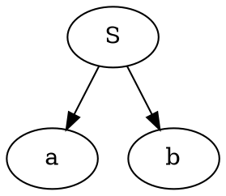
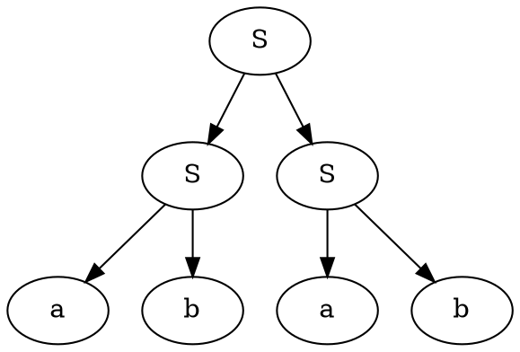
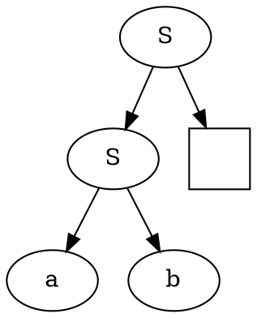
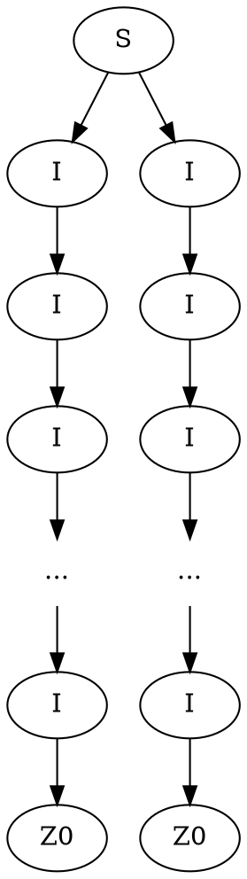
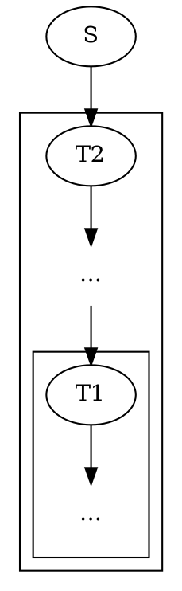

Мы получили [[Нормальная форма Хомского|нормальную форму Хомского]], задаваемую правилами переписывания вида:
$$\begin{matrix}
A \to BC \\
A \to a
\end{matrix}$$
В нормальной форме Хомского:
- нет $\varepsilon$-правил
- нет цепных правил
- нет смешения терминалов и нетерминалов в правилах раскрытия.
- нет длинных правил

Она нам была нужна, чтобы достаточно красиво строить деревья посредством конечных автоматов над деревьями, описывающих деревья разбора соответствующий грамматик. Так как язык является КС тогда и только тогда когда есть порождающая его КС-грамматика. А деревья разбора КС-грамматики обязательно описываются каким-то древесным автоматом. Тогда деревья разбора любого КС языка обязательно описываются каким-то древесным автоматом. Но обратное верно не всегда. 

>[!tip] Классический контрпример древесного не КС языка.
>$$\{S[S(a,b), S(a,b)], S[a,b]\}$$
>Древесный язык в этом случае состоит всего из двух деревьев
>```dot
> digraph{
>	S -> a,b
>}
>```
>```dot
>digraph{
>	S1,S2,S3[label=S]
>	a1,a2[label=a]
>	b1,b2[label=b]
>	S1->S2,S3
>	S2 -> a1, b1
>	S3 -> a2, b2 
>}
>```
>Причем конструкторы в втором дереве на разных уровнях совпадают. Если бы это было дерево разбора для какой-нибудь грамматики, в силу того что оно КС свободно, то мы могли бы разворачивать $S \to SS$ сколько угодно раз, что противоречит описанию языка. 
>Но этот язык очевидно порождается древесным автоматом, но он уже будет различать уровень вложенности 1 и уровень вложенности 2. Построим этот автомат($q_*$ - состояние-ловушка):
>$$\begin{matrix}
>a \to q_a(a)\\
>b \to q_b(b)\\
>S(q_a(X), q_b(Y)) \to q_F(S(X,Y))\\
>S(q_F(X), q_F(Y)) \to q_{F'}(S(X,Y))\\
>S(q_{F'}(X), q_x(Y)) \to q_*(S(X,Y))\\
>S(q_b(X), q_x(Y)) \to q_*(S(X,Y))\\
>S(q_x(X), q_a(Y)) \to q_*(S(X,Y))\\
>S(q_*(X), q_x(Y)) \to q_*(S(X,Y))\\
>\text{если один из аргументов S в qf а второй нет - то ловушка}
>\end{matrix} \quad q_F, q_{F'} \in \mathcal F$$

Нормальная форма Хомского позволяет очень интересно анализировать КС языки с помощью порождающих деревьев. Но перед этим нужно сформулировать [[Теорема Майхилла-Нероуда|теорему Майхилла-Нероде]] для древесных языков. %%здесь было лирическое отступление на обсуждение лабораторной номер 1 2024 года%%

>[!note] Теорема Майхилла-Нероде для древесных автоматов
>Построим отношение на деревьях $\equiv_R$, такое что для любых деревьев с единственной переменной $x$(лиственной) u,v
>$$t_1 \equiv_R t_2 \Leftrightarrow \forall u[x] \left(u[x \to t_1] \in \mathcal L \Leftrightarrow u[x \to t_2] \in \mathcal L\right)$$ 
>То есть замена поддеревьев не меняет принадлежность языку.
>
>**Теорема М-Н**
>Язык $\mathcal L$ древесно-автоматный $\Leftrightarrow$ имеет конечное число классов эквивалентности по $\equiv_R$

Посмотрим примеры таких поддеревьев.
$$S \to SS \mid ab$$
И рассмотрим 2 дерева




Тогда воспользуемся дырой и попробуем туда подставить деревья

или запись в форме терма $S(S(a,b), X)$. Нам будет абсолютно не важно что подставить вместо X, и это не поменяет принадлежность языку. Вместо X подходят все деревья разбора S. Тем самым все деревья разбора S образуют класс эквивалентности относительно $\equiv_R$. Какие есть еще классы эквивалентности в этом языке?
1) деревья разбора $S$;
2) листок $a$;
3) листок $b$;
4) любое нелегальное поддерево или ловушка.

Теперь рассмотрим чуть расширенную грамматику 
$$\begin{matrix}
S_0 \to S \mid T\\
S \to SS \mid ab \mid ST \mid TS \mid TT \\
T \to TT \mid ab \mid ST \mid SS \mid TS
\end{matrix}$$
Тогда получим классы эквивалентности:
1) $\operatorname{tree}[T] \equiv_R \operatorname{tree}[S]$
2) $\operatorname{tree}[S_0]$
3) a
4) b
5) trap

Мы получили, что нетерминалы S и T симулируют друг друга. Это ровно то отношение бисимуляции, которое мы знаем из автоматов. Значит T и S взаимнозаменимы в любом месте в грамматике. 

Классы эквивалентности по $\equiv_R$ определяют состояния в минимальном древесном автомате. Так как если два нетерминала эквивалентны, то их можно слить заменив фактор-нетерминалом.

> Фактор-автомат это и есть минимальный автомат.
> _© Вова Пирко_

> Более того, эти классы эквивалентности задают неподвижные точки относительно конгруэнтности и являются пределами в теоретико-категорном смысле. 
> _© Антонина Непейвода _

Теперь рассмотрим просто дерево.

Получается имеем 3 конструктора $S_2, I_1, Z_0$.
Определим следующий язык $L = \{S(I^k(Z_0), I^k(Z_0)) \mid k \in \mathbb N\}$, то есть язык, который имеет одинаковую глубину поддеревьев. Вопрос: является ли он древесно-автоматным?
При ограниченном k - да является, так как мы получим конечный язык. Иначе мы получаем бесконечное число классов эквивалентности по М-Н.

>[!done] Док-во, что язык не древесно автоматный
>Пусть язык L - древесно-автоматный. Тогда он содержит n классов эквивалентности. Возьмем $k>n$. Тогда на пути в дереве к листку $Z_0$, мы встретим два $I_1$, принадлежащих одному классу эквивалентности. Пусть они соответствуют состоянию автомата $q_i$.
>Как мы обрабатываем верхнюю вершину? Мы видим, что дочерняя вершина находится в состоянии $q_i$ и что они эквивалентны. Внутрь поддерева мы смотреть не можем.
>Но так как меньшее поддерево(обозначим как $T_2$) соответсвует также состоянию $q_i$, то большее поддерево(обозначим за $T_1$) заменить на $T_2$ без потери принадлежности языку. Но при такой замене, мы получим несбалансированные поддеревья слева и справа от $S_2$. Таким образом получаем противоречие. Следовательно, классов эквивалентности бесконечное число.
>
>#### Альтернативное доказательство.
> Пусть поддерево $I^k(Z_0)$ порождает какой-то класс эквивалентности. Пусть этому же классу эквивалентности принадлежит $I^n(Z_0), n \neq k$, тогда можно спокойно заменить его в любом месте исходногго дерева. Но при такой замене, мы получим несбалансированные слева и справа поддеревья. Поэтому этому классу эквивалентности принадлежит только единственное поддерево $I^k(Z_0)$.
>Таким образом мы получаем, что язык разбивается на бесконечное число классов эквивалентности, соответсвующее натуральному k $\{I^k(Z_0)\}$ и отдельно классы эквивалентности для $Z_0$ и $S_2$, но мы их можем не рассматривать, так как уже получили бесконечное число классов эквивалентности.

Используя эту идею, мы можем вывести метод для анализа древесных языков, и кроме того, этот метод подойдет для анализа на контекстную-свободу языков. 
Пусть язык $\mathcal L$ - древесно-автоматный и пусть $\tau$ содержит путь длинны большей чем $|\{\equiv_{/R}\}|$, количество классов эквивалентности, тогда $\exists$ $\tau_1, \tau_2$ из одного класса эквивалентности, такие что $\tau_1$ содержится в $\tau_2$

Тогда мы их можем свободно взаимозаменять в дереве. То есть
$$\tau_2 \to \tau_1 \in \mathcal L$$
$$\tau_1 \to \tau_2 \in \mathcal L$$
Причем для второго варианта, мы эту замену можем повторять сколько угодно раз и принадлежность языку не должна измениться! А теперь посмотрим на КС грамматики и их деревья разбора. Так как каждое дерево разбора образует элемент древесного языка, то для любого достаточно длинного слова можно придумать такое его разбиение, что есть 2 боковых элемента, есть 2 элемента $\tau_2$, которые могут повторяться сколько угодно раз, и элемент $\tau_1$, который остается всегда.
$$w_1 \tau_2 \tau_1 \tau_2' w_2$$
Если $\mathcal L$ - контекстно свободный язык и $\omega \in \mathcal L$. Если $|\omega| > N$(оценка на число нетерминалов в грамматике), то тогда мы можем разбить 
$$\omega = \omega_0 \underbrace{\omega_1}_{\tau_2} \underbrace{\omega_2}_{\tau_1} \underbrace{\omega_3}_{\tau_2} \omega_4$$
и при этом выполнено: (Если мы синхронно проитерируем $\omega_1,\omega_3$ сколько угодно раз(от 0 до бесконечности), то мы останемся в языке)
$$\forall k (\omega_0 \omega_1^k \omega_2 \omega_3^k \omega_4 \in \mathcal L)$$
Если $\tau_2,\tau_1$ - самые близкие к листьям поддеревья, то тогда мы знаем, что этот путь от листа до $\tau_2,\tau_1$ ограничен по длине числом классов эквивалентности.  И тогда высота дерева определяет длину выводимого слова. Таким образом мы получаем оценку на длину $\omega_1\omega_2\omega_3$.
То есть, если $h(\tau_2) < K+1$, то $|\omega_1\omega_2\omega_3| < N$. Можно для обоих длин взять одну и ту же оценку.

Таким образом бонусом к [[Теорема Майхилла-Нероуда|теореме Майхилла-Нероуда]] о древесных языках мы получаем широко известную [[Лемма о накачке для КС-языков|лемму о накачке для контекстно-свободных языков]].

1) мы научились искать классы эквивалентности по бисимуляции
2) научились оценивать древесные языки, которые даже не являются языками вывода контекстно-свободных грамматик. Мы получили более сильный метод, чем если бы изучали только отдельно лемму о накачке. 


Вообще, в анализе классов языков [[Теорема Майхилла-Нероуда|теорема Майхилла-Нероуда]] является базой, зная которую, мы знаем почти все о языка, так как она задает самую широкую факторизацию, при попытке факторизовать дальше которой мы начинаем терять информацию. Лемма о накачке в свою очередь являются некоторыми частностями, которые выводятся из [[Теорема Майхилла-Нероуда|теоремы Майхилла-Нероуда]] и не дает характеризации.

Как пример рассмотрим следующий язык
$$\mathcal L = \{ww \mid w \in \{a,b\}^*\}$$
То что он не контекстно-свободный можно доказать с помощью леммы о накачке. 
Рассмотрим слово $\omega = a^n b^n a^n b^n$, где $n > 2^{k+1}$, k - число классов эквивалентности по М-Н в [[Bottom-top automata|BTA]].
Тогда в этом слове встретятся 2 эквивалентных поддерева(или что одно и то же эквивалентных нетерминала). 
==СХЕМА==

Так как мы ограничили высоту подеревьев $T2$, то нетерминал может породить подслово длинной не более чем n.

Если $T2$ прождает подслово в первой половине, то ...
%% если мы накачаем это подслово, то получим неравные слова для какого-то k%%

Если $T2$ порождает подслово в второй половине, то мы можем просто перевернуть слово и получим ту же ситуацию. 