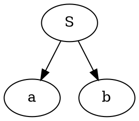
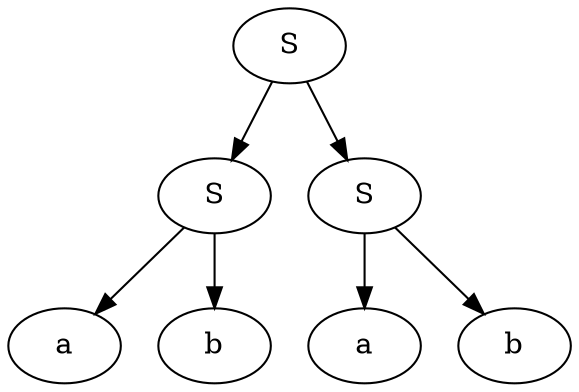
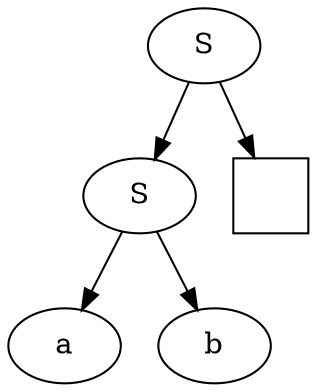
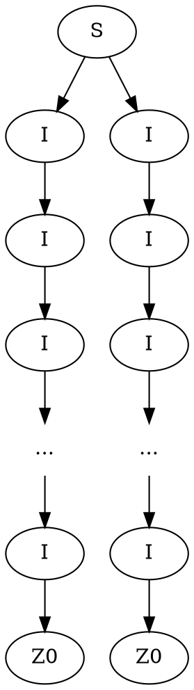

Мы получили [[Нормальная форма Хомского|нормальную форму Хомского]], задаваемую правилами переписывания вида:
$$\begin{matrix}
A \to BC \\
A \to a
\end{matrix}$$
В нормальной форме Хомского:
- нет $\varepsilon$-правил
- нет цепных правил
- нет смешения терминалов и нетерминалов в правилах раскрытия.
- нет длинных правил

Она нам была нужна, чтобы достаточно красиво строить деревья посредством конечных автоматов над деревьями, описывающих деревья разбора соответствующий грамматик. Так как язык является КС тогда и только тогда когда есть порождающая его КС-грамматика. А деревья разбора КС-грамматики обязательно описываются каким-то древесным автоматом. Тогда деревья разбора любого КС языка обязательно описываются каким-то древесным автоматом. Но обратное верно не всегда. 

>[!tip] Классический контрпример древесного не КС языка.
>$$\{S[S(a,b), S(a,b)], S[a,b]\}$$
>Древесный язык в этом случае состоит всего из двух деревьев
>```dot
>digraph{
>	S -> a,b
>}
>```
>```dot
>digraph{
>	S1,S2,S3[label=S]
>	a1,a2[label=a]
>	b1,b2[label=b]
>	S1->S2,S3
>	S2 -> a1, b1
>	S3 -> a2, b2 
>}
>```
>Причем конструкторы в втором дереве на разных уровнях совпадают. Если бы это было дерево разбора для какой-нибудь грамматики, в силу того что оно КС свободно, то мы могли бы разворачивать $S \to SS$ сколько угодно раз, что противоречит описанию языка. 
>Но этот язык очевидно порождается древесным автоматом, но он уже будет различать уровень вложенности 1 и уровень вложенности 2. Построим этот автомат($q_*$ - состояние-ловушка):
>$$\begin{matrix}
>a \to q_a(a)\\
>b \to q_b(b)\\
>S(q_a(X), q_b(Y)) \to q_F(S(X,Y))\\
>S(q_F(X), q_F(Y)) \to q_{F'}(S(X,Y))\\
>S(q_{F'}(X), q_x(Y)) \to q_*(S(X,Y))\\
>S(q_b(X), q_x(Y)) \to q_*(S(X,Y))\\
>S(q_x(X), q_a(Y)) \to q_*(S(X,Y))\\
>S(q_*(X), q_x(Y)) \to q_*(S(X,Y))\\
>\text{если один из аргументов S в qf а второй нет - то ловушка}
>\end{matrix} \quad q_F, q_{F'} \in \mathcal F$$

Нормальная форма Хомского позволяет очень интересно анализировать КС языки с помощью порождающих деревьев. Но перед этим нужно сформулировать теорему Майхилла-Нероде для древесных языков. %%здесь было лирическое отступление на обсуждение лабораторной номер 1 2024 года%%

>[!note] Теорема Майхилла-Нероде для древесных автоматов
>Построим отношение на деревьях $\equiv_R$, такое что для любых деревьев с единственной переменной $x$(лиственной) u,v
>$$t_1 \equiv_R t_2 \Leftrightarrow \forall u[x] \left(u[x \to t_1] \in \mathcal L \Leftrightarrow u[x \to t_2] \in \mathcal L\right)$$ 
>То есть замена поддеревьев не меняет принадлежность языку.
>
>**Теорема М-Н**
>Язык $\mathcal L$ древесно-автоматный $\Leftrightarrow$ имеет конечное число классов эквивалентности по $\equiv_R$

Посмотрим примеры таких поддеревьев.
$$S \to SS \mid ab$$
И рассмотрим 2 дерева




Тогда воспользуемся дырой и попробуем туда подставить деревья

или запись в форме терма $S(S(a,b), X)$. Нам будет абсолютно не важно что подставить вместо X, и это не поменяет принадлежность языку. Вместо X подходят все деревья разбора S. Тем самым все деревья разбора S образуют класс эквивалентности относительно $\equiv_R$. Какие есть еще классы эквивалентности в этом языке?
1) деревья разбора $S$;
2) листок $a$;
3) листок $b$;
4) любое нелегальное поддерево или ловушка.

Теперь рассмотрим чуть расширенную грамматику 
$$\begin{matrix}
S_0 \to S \mid T\\
S \to SS \mid ab \mid ST \mid TS \mid TT \\
T \to TT \mid ab \mid ST \mid SS \mid TS
\end{matrix}$$
Тогда получим классы эквивалентности:
1) $\operatorname{tree}[T] \equiv_R \operatorname{tree}[S]$
2) $\operatorname{tree}[S_0]$
3) a
4) b
5) trap

Мы получили, что нетерминалы S и T симулируют друг друга. Это ровно то отношение бисимуляции, которое мы знаем из автоматов. Значит T и S взаимозаменимы в любом месте в грамматике. 

Классы эквивалентности по $\equiv_R$ определяют состояния в минимальном древесном автомате. 

> Фактор-автомат это и есть минимальный автомат.
> _© Вова Пирко_

Более того, эти классы эквивалентности задают неподвижные точки относительно конгруэнтности и являются пределами в теоретико-категорном смысле. 

Теперь рассмотрим просто дерево.

Получается имеем 3 конструктора $S_2, I_1, Z_0$.
Определим следующий язык $L = \{S(I^k(Z_0), I^k(Z_0)) \mid k \in \mathbb N\}$, то есть язык, который имеет одинаковую глубину поддеревьев. Вопрос: является ли он автоматным?
При ограниченном k - да является, так как мы получим конечный язык. Иначе мы получаем бесконечное число классов эквивалентности по М-Н.
>[!done] Док-во, что язык не древесно автоматный
>Пусть язык L - древесно-автоматный. 